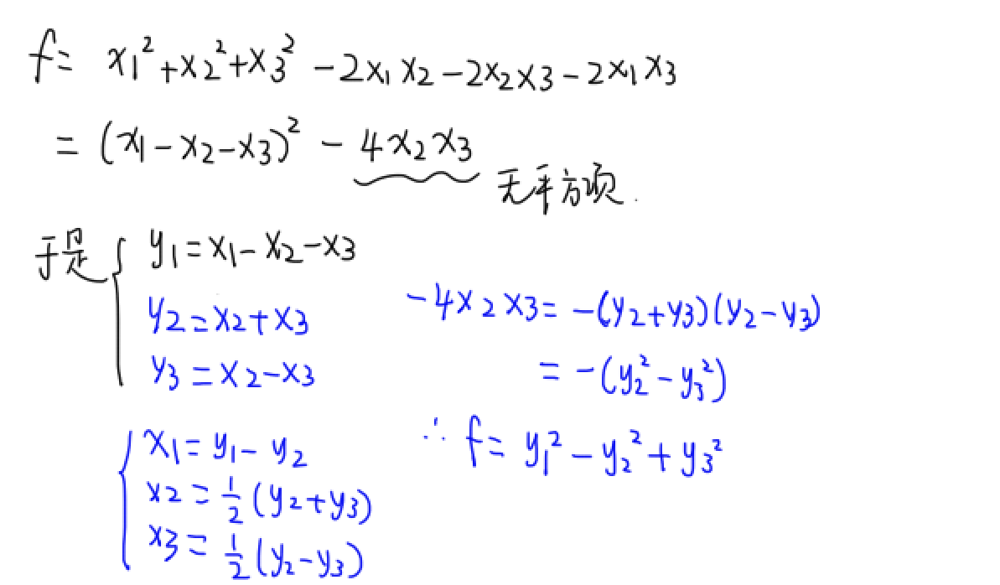

### 〇、基本知识

设A为mxn矩阵，αi是n维列向量，则向量组
$$
(A\alpha_1,A\alpha_2,...,A\alpha_s)=A(\alpha_1,\alpha_2,...,\alpha_s)
$$

设α为n维列向量，若$\alpha^T\alpha=k$，则$\alpha\alpha^T$的特征值为k和n个0

见到$\alpha \alpha^T$，设法让它自乘，然后用结合律提出常数$\alpha^T\alpha$

### 一、行列式

行列式的加法可拆性：两行列式只有一列不同，可以直接相加

分块矩阵
$$
\left|
\begin{matrix} O & A\\
B & O
\end{matrix}
\right|
=(-1)^{mn}|A||B|
$$
副对角线行列式：
$$
|A|=(-1)^{\frac{n(n-1)}{2}}\prod_{i=1}^n a_{i}
$$
有限阶（四阶以下）具体行列式：

- 高斯消元法，求主对角线
- 爪型：用主对角线元素消掉一个侧边

##### 具体行列式计算

经常是n阶

- 加边法
- 递推法：异爪型
- 三对角矩阵：按第一行展开（按第一列也一样），建立递推式，然后找规律写出递推n次的结果
- **行和相等**：2到n列加到第一列，提出行和，每行减去第一行，消掉第一列的1
- 第一数学归纳法：n=1成立，设n=k成立，验证n=k+1成立
- 第二数学归纳法：n=1,n=2成立，设n<k都成立，证明n=k成立（写递推式）

##### 抽象型行列式计算：只有两个方向

（1）凑行列式乘法|AB|=|A||B|

|A+B|类型：想办法拆成行列式乘积

利用**E恒等变形**：AA^-1=E; AA^T=E

（2）利用特征值乘积

利用A相似于B，B是特征值已知的矩阵（如对角矩阵），得到A的所有特征值，乘积就是|A|

---

### 二、代数余子式的计算

一定要想到代数余子式的定义

求代数余子式：

- 行替换：计算aA11+bA12+cA13：构造行列式，用a,b,c替换第一行

- 求伴随矩阵：A*=|A|A^-1，里面全是代数余子式

- 利用特征值求迹
  $$
  A_{11}+A_{22}+A_{33}=\tr(A^*)=\sum{λ_i^*}=\sum\frac{|A|}{λ_i}
  $$
  

---

### 三、矩阵运算

矩阵的数乘是每个元素都乘k，行列式的倍乘只是一行。所以$|kA|=k^n|A|$

#### 矩阵结论

#### 求$A^n$的五种方法

（1）试算法

（2）若A为方阵，且r(A)=1，则A可以拆成一个列向量和一个行向量的乘积ab^T
$$
A^n=\alpha \beta^T\alpha \beta^T...\alpha \beta^T\\
=\alpha (\beta^T\alpha)^{n-1} \beta^T\\
=[tr(A)]^{n-1}A
$$

（3）分解A=B+E，$A^n=(B+E)^n$，二项展开。B矩阵某次方后为0

（4）初等变换

（5）相似对角化：先求特征值，特征向量。特征向量拼成P
$$
P^{-1}AP=\Lambda，A=P\Lambda P^{-1}\\
A^n=P^{-1}\Lambda^nP
$$
补充：分块矩阵运算，把块看成单个元素也适用
$$
\left[
\begin{matrix} B & O\\
O & C
\end{matrix}
\right]^{n}=

\left[
\begin{matrix} B^{n} & O\\
O & C^{n}
\end{matrix}
\right]
$$

$$
\left[
\begin{matrix} B & O\\
O & C
\end{matrix}
\right]^{-1}=
\left[
\begin{matrix} B^{-1} & O\\
O & C^{-1}
\end{matrix}
\right]
$$

$$
\left[
\begin{matrix} O & B\\
C & O
\end{matrix}
\right]^{-1}=
\left[
\begin{matrix} O & C^{-1}\\
B^{-1} &O
\end{matrix}
\right]
$$

#### 矩阵求逆

定义法：凑出来AB=E

初等变换法

伴随矩阵法：
$$
A^{-1}=\frac{A^*}{|A|}
$$
分块矩阵求逆：左乘同行，右乘同列，再加负号
$$
\left[
\begin{matrix} 
B & O\\
D & C
\end{matrix}
\right]^{-1}=
\left[
\begin{matrix} B^{-1} & O\\
-C^{-1}DB^{-1} & C^{-1}
\end{matrix}
\right]
$$
判断可逆矩阵：若AB=E，则|A|≠0，A可逆！

#### ※ 初等矩阵，初等变换

初等矩阵：单位矩阵只经过**一次**初等变换得到！

初等变换：左行右列，多次初等变换要乘多个矩阵。

注意：

- 初等变换的本质就是左右乘初等矩阵，因此**相同类型的初等变换必然是有先后顺序的**
- 由于矩阵乘法的结合律，矩阵进行一个行变换和一个列变换没有固定顺序

矩阵等价：A可以经过初等变换得到B

矩阵等价的充要条件：AB同形，**r(A)=r(B)**

如果A可经过列变换得到B，则r(A)=r(B)=r(A|B)。（实际上就是B的每列b都使得非齐次线性方程组Ax=b有解，自然三秩相同）

初等矩阵的性质
$$
E_{ij}^{-1}=E_{ij};E_{ij}^{-1}(k)=E_{ij}(-k);E_{i}^{-1}(k)=E_{i}(\frac{1}{k})
$$

$$
E_{ij}^{*}=-E_{ij};E_{ij}^{*}(k)=E_{ij}(-k);E_{i}^{*}(k)=kE_{i}(\frac{1}{k})
$$

注：Eij(k)代表把第i列的k倍加到第j列，或者把第j行的k倍加到第i行（两种说法ij是反的！！）

#### 正交矩阵

- $A^T=A^{-1}$
- |A|^2=1
- |A|=±1

正交矩阵每行、每列都是单位向量

**列向量两两正交（标准正交向量组）**，因此r(A)=n

已知A -1+B-1，或者AT+BT，一种恒等变形方法：左右外提，可求行列式
$$
A+B=EA+BE=BB^{-1}A+BA^{-1}A=B(B^{-1}+A^{-1})A
$$

#### 伴随矩阵

已知A\*,可求|A|：$|A^*|=|A|^{n-1}$

(AB)\*=B\*A*

求分块矩阵的伴随矩阵：可以用待定系数法

#### 转置矩阵

不可交换性：AA^-1=A^-1A, AA\*=A*A，但是A^TA≠AA^T

若A^TA=0，则必然A=0

#### 常见变换技巧

$$
AB=A+B \\ AB-A-B+E=E\\ A(B-E)-(B-E)=E\\ (A-E)(B-E)=E
$$

由行列式乘法，|A-E|和|B-E|肯定不为0
$$
(A-E)B=A\\A(B-E)=B
$$
从而，|A|和|B|如果一个不为0，则另一个也不为0

一种变换方法：A^2-A=0, (A+3E)(A-4E)+12E=0

---

### 四、矩阵的秩

常见例子：下面这个矩阵的秩为2，因为最大非0子式为2阶。S=n-r=3-2=1，求基础解系时可选第一列或第二列作为自由变量（化阶梯型时0和1在第一个阶梯）
$$
\left[
\begin{matrix} 0 & 1 & 2\\
0 & 0 & 3\\
0 & 0 & 0\\
\end{matrix}
\right]
$$

- 加一行/一列，秩>=原来
- 可逆矩阵相当于若干初等矩阵的乘积，而初等变换不改变秩，所以任意矩阵乘可逆矩阵秩不变
- 重要性质：AB的每个列向量都是A的所有列向量的线性组合；AB的每个行向量都是B的所有行向量的线性组合
  - 设A,B非零矩阵，AB=0，即代表Ax=0有非零解，即A的列向量组线性相关
  - AB=B^TA^T=0，即代表B^Tx=0有非零解，即B的行向量组线性相关

##### 秩相关15公式

**注：以下的n都是A的列数**

特别注意分块矩阵的秩（6，7）

##### 一些公式的证明

1.r(AB)<=min{r(A),r(B)}

方法一：因为Bx=0的解一定属于ABx=0的解，因此Bx=0基础解系大小<=ABx=0基础解系大小，即n-r(B)<=n-r(AB)，故r(AB)<=r(B)。又r(AB)=r(B^TA^T)<=r(A^T)=r(A)，证毕。

方法二：因为AB的列向量可由A的列向量表出，AB的行向量可由A的行向量表出，故r(AB)<=r(A), r(AB)<=r(B)

8.当AB=0，r(A)+r(B)<=n

AB=0说明B的每个列向量都是Ax=0的解，因此r(B)<=A基础解系的大小，即n-r(A)

---

### 五、线性方程组

线性方程组每个方程是对一个维度的约束，**维数=方程数**，而矩阵的**列数=向量的个数=变量的个数**。方程数<变量个数必然有解

A=(α1,α2,...,αn)，Ax=b

#### 0.证明是基础解系

基础解系的3个必要条件：

- 代入方程组，是解
- 线性无关（必须满秩）
- 个数S=n-r

#### 1.齐次线性方程组Ax=0

首先，肯定有解，x全为0

设**n为A的列数**，即变量的个数！！！

<h2>牢记：</h>

- r(A)=n，即|A|≠0，有唯一0解

- r(A)<n，即|A|=0，有无穷多非0解，有n-r个线性无关解

注意n是A的列数，也就是未知量个数

求解方法：

- 将A化阶梯型，找到所有的自由变量列；
- 每次将一个自由变量设为1，其余为0，并求出非自由变量的一种取值，得到n-r个ξi
- 所有的ξ称为**基础解系**（是一组解向量！！！）；齐次的通解就是kiξi的和（是一个式子！！！）

因为固定住自由变量，其他的非自由变量可以张成一个r维空间，这个空间中任何线性组合都是方程组的解，所以基础解系的大小是n-r。

其他：对于AB=0，若B非零矩阵，则说明B的所有列向量都是Ax=0的非零解，|A|=0

#### 2.非齐次线性方程组Ax=b

<h2>牢记：</h>

- 无解：r(A)≠r(A|b)，b不能由A线性表出

- 唯一解：r(A)=r(A|b)=n，即|A|≠0

- 无穷多解：r(A)=r(A|b)<n，即|A|=0

解的结构：**非齐通解=齐次通解+非齐特解**

求解方法：

- 首先把b当成0，求出齐次通解$\sum{k_iξ_i}$。
- 再将(A|b)化阶梯型，求一个非齐特解，方法是令所有自由变量为0，找一个特解η，最终非齐通解就是$η+\sum{k_iξ_i}$。【k为任意常数】

对于方形A，克拉默法则：先计算|A|≠0，则直接算出唯一解xj=Dj/D；若|A|=0，再算基础解系

**解的性质：**

- 齐次解的线性组合仍是齐次的解
- 两个非齐解相减是齐次的特解

命题：若Aa1=b, Aa2=b, Aa3=b，则A(a1+2a2+3a3)=6b，(a1+2a2+3a3)/6也是Ax=b的非齐特解

#### 3.求解矩阵方程AX=B

若AX=B有解，则r(A)=r(A|B)

- 若A可逆，直接移项，X=A^-1B

- 若A不可逆，**相当于需要解n个非齐次线性方程组Axi=bi**

  - 把B看成n个列向量b1,...,bn，算出来的所有xi按列拼成X即可。

  - 计算时，将(A|B)拼起来，注意一定是原始的AB！！！然后才能做相同的行变换，化阶梯型。
  - 每个xi的齐次通解是相同的，只是系数不同

- 若无法化成基本形式（一般是二阶矩阵），用待定元素法

若AX=B无解，则说明肯定存在B的一列β，使得r(A)<r(A|β)，从而必然有r(A)<r(A|B)

#### 4.求两方程组公共解

三种情况

- 已知两方程组：直接上下拼起来，写成一个矩阵
- 已知两个基础解系：令各维度相等
- 已知一个方程组，一个基础解系：把基础解系直接带入方程组，求出未知数

#### 5.同解方程组求参数

Ax=0和Bx=0同解，说明它们的基础解系所含解向量个数必然相同，因此必有**三秩相同**：
$$
r(A)=r(B)=r(\frac{A}{B})
$$
A/B即把两个方程组联立成一个大方程组

补充：

1. Ax=0 与 A^TAx=0是同解方程组（x^TA^TAx=(Ax)^TAx），这可以推出r(A)=r(A^TA)

#### 6.克拉默法则

A是方阵，求解Ax=b：

解x的第一个维度
$$
x_1=\frac{|A_1|}{|A|}
$$
其中|A1|是将A的第一列换成b再计算行列式

---

### 六、向量组

#### 1.线性表出，线性相关，线性无关

线性表出：β=α1k1+...+αnkn，系数可以全0

向量组的线性表出：A中每个向量都能被B的向量线性表出，则A可以由B线性表出

- 被表出的秩不大
- 若3维的向量组B的秩=3，则B可以表出任意3维向量

线性相关：k1α1+...knαn=0，**ki不全为0**

线性无关：k1α1+...knαn=0，ki全为0

性质：

- 有0向量必然线性相关（0前系数随意）
- 向量数（变量数）>维数（方程数），必然线性相关
- 向量组部分向量相关，整体必相关；整体无关，部分必无关
- **向量组无关，每个向量延长维度必然无关；原来相关，缩短维度必相关**
- 向量少的向量组表出多的，则多的必相关
- 用秩：向量组的秩<n，必然线性相关；r=n，线性无关

注意：

- 向量组的向量两两无关推不出整体无关，例如a=(0,0,1), b=(0,1,0), c=(0,1,1)

进阶性质：

- 若A的行向量组线性无关，则必有r(A)=行数m（见李永乐P103例4.18）
- 若r(A)=n，不能推出r(A|b)=n，因为A可能行数大于n，这样r(A|b)可以大于r(A).（见李永乐P102 例4.17）
- 一个向量组线性相关，不代表任意一个向量都可由其他向量线性表出，只能推出**至少存在一个向量**能被其他线性表出，而不能指定哪一个！！
- 同理，一个向量组线性无关的充要条件是任何一个向量都不能被其余的线性表出

证明线性相关，先看向量数、维数：若向量数>维数，用秩；向量数=维数，用行列式

证明线性无关的两种方法：

（1）用定义：先列式k1α1+...knαn=0，（两边同乘A，A^2）式子相消证明ki=0

（2）用秩，r(A)=n

证明线性表出或不能线性表出：看能否经过变换得到k1α1+...knαn=β

#### 2.向量组等价

定义：两个向量组能互相线性表出。注意A和B的向量个数不一定相同

向量组等价的充要条件：三秩相同，r(A)=r(B)=r(A|B)

矩阵等价：A,B必须同形，且r(A)=r(B)=r(A|B)。而向量组等价不需要两个向量组列数相同，所以矩阵等价是向量组等价的特例

#### 3.向量组问题转化成线性方程组问题

- α1...αn**线性相关**<=>**Ax=0有非零解**, r(A)<n
- 线性无关等价于Ax=0只有零解
- β能被α1...αn**线性表出**<=>**Ax=β有解**, r(A)=r(A|β)
- β1...βn能被α1...αn**线性表出**<=>**AX=B有解**, r(A)=r(A|B)
- β1...βn不能被α1...αn**线性表出**<=>**AX=B无解**, r(A)<r(A|B)

#### 4.极大线性无关组

向量组内最大的线性无关的向量集合，大小为向量组的秩

求法：A化阶梯型，找**秩为台阶数的子矩阵**。注意不是每个台阶找一列即可，因为随便找的话最后一个分量可能为0！例如

$$
\left[
\begin{matrix} 1 & 2 & 3 & 4\\
 & 5 & 6 & 7\\
 &  & 8 & 0\\
\\
\end{matrix}
\right]
$$
就只能选1,2,3列作为极大无关组，第4列最后一个分量为0

想证明一个向量组B能被向量组A线性表出，即证明B能被A的极大无关组线性表出。即B的所有向量能在A的极大无关组作为基组成的向量空间内存在

---

### 七、特征值与特征向量

#### 1.特征值，特征向量

若Aξ=λξ，则λ是A的特征值，ξ是A关于特征值λ的特征向量

具体矩阵求特征值：求解特征多项式|λE-A|=0

求特征向量：代入λ，求解(λE-A)x=0。注意：特征向量一定不为0

技巧：

- 若A为n阶矩阵，r(A)=1，则

$$
|λE-A|=(λ-\tr(A))λ^{n-1}
$$

- 对角矩阵/三角矩阵的特征值就是对角线上的元素
- 见到Ax=0，则x就是A属于特征值0的特征向量

#### 2.特征值的性质

特征值个数一定等于方阵阶数（包括重根）

|aA+bE|=0，则特征值=-b/a

**特征值的重要性质**
$$
\sum \lambda_i=\tr(A)\\
\prod \lambda_i=|A|
$$
只差一个特征值未知时可以直接求！

##### 各种矩阵的特征值、特征向量表

| A    | A^-1 | A*      | A^T    | P(A) | P^-1AP |
| ---- | ---- | ------- | ------ | ---- | ------ |
| λ    | 1/λ  | \|A\|/λ | λ      | P(λ) | λ      |
| ξ    | ξ    | ξ       | 不一定 | ξ    | P^-1ξ  |

证明方法：例如Aξ=λξ两边同时左乘A*，再用AA\*=|A|E变换即可得到

超重要技巧：λ带入A的多项式方程可以求出特征值，如A^2+A=0，则λ^2+λ=0, λ=0,-1

#### 3.特征向量的性质

对于普通矩阵：

- k重特征值最多有k个线性无关的特征向量
- 不同特征值的特征向量线性无关
- 相同特征值的特征向量线性组合（非0），仍是该特征值的特征向量。例如λ1=λ2可求出两个特征向量ξ1，ξ2，于是A属于λ1=λ2的特征向量为k1ξ1+k2ξ2（k1,k2不全为0）
- 不同特征值的特征向量线性组合不是任何特征值的特征向量

对于实对称矩阵：

- 相同特征值的特征向量线性无关
- **不同特征值的特征向量正交**。（抽象矩阵要计算特征向量，常用待定系数法设特征向量，然后和已知特征向量正交求出未知数。宇8.4（22））

做题技巧：

- 若矩阵每行和均为5，则有A(1,1,1)^T=5(1,1,1)^T，5就是特征值
- 若r(A)<n，则|A|=0，0必然是特征值
- A^2=5A, 则A(α1,α2,α3)=5(α1,α2,α3)，必然有Aα1=5α1,Aα2=5α2,Aα3=5α3

#### 4.用矩阵方程命题

- 若AB=0，B≠0，则说明Ax=0必有非0解（把B拆成n列，Abi=0bi），所有bi都是特征值为0的特征向量

- 因为相似矩阵的特征值相同，可利用相似对角化反求A，P^-1AP=B, A=PBP^-1

---

### 八、相似理论

#### 1.A与B相似的性质

$$
AP=PB, P^{-1}AP=B
$$

相似矩阵的性质：

- 相似具有传递性，经常通过A,B相似于同一个对角矩阵来证明AB相似
- **四大变量**相同：秩，行列式，迹，特征值（特征方程）相同
- 三大运算相似：转置，逆，伴随
- 幂相似：A^n~B^n
- 多项式相似：P(A)~P(B), A+kE~B+kE

命题：

- 题目中经常给出A和B相似，但*用四大变量相同无法求出B的所有参数时*，利用多项式相似法：

  求A的特征值，尝试计算r(λE-A)，通过**r(λE-B)=r(λE-A)**可以求出未知参数【李林6.6(22)】

- 已知A~B，Bξ=λξ，求A关于λ的特征向量：AP=PB. Bξ=λξ，于是P^-1APξ=λξ，故A(Pξ)=λ(Pξ)，A关于λ的特征向量为Pξ

- 给出Aα1=α2这种式子，写成A(α1,α2)=(α1,α2)B的形式，即AP=PB，则有A~B，即可转而研究B的特征值等

- 若已知A^2=kA，则有A(A-kE)=0，由于r(A)+r(A-kE)<=n，又有r(A)+r(kE-A)>=r(kE)=n，因此必然有r(A)+r(A-kE)=n。此时一般还有条件A≠0，从而r(kE-A)<n，A必然有k和0两个特征值

#### 2.相似对角化

$$
AP=P\Lambda,P^{-1}AP=\Lambda,P=[\xi_1,\xi_2,\xi_3]
$$

求解方法：先求特征值，特征向量。

特征向量按列拼成P(注意不需要带着系数k，只需要齐次特解)，特征值拼成对角矩阵

（1）**可相似对角化的充要条件**：

- **A有n个线性无关的特征向量**（才能拼成P）
- 每个k重特征值都有k个线性无关的特征向量（保证所有特征向量线性无关，才能拼成P）

（2）充分条件：A有n个不同的特征值；A是实对称矩阵

补充：A^2=A, A^2=E, r(A)=1且tr(A)!=0

（3）必要条件：若A可相似对角化，则r(A)= A的非0特征值个数

（4）否定条件：A≠0，A^k=0；

A特征值全为k，A≠kE

#### 3.实对称矩阵的性质

若A是实对称矩阵，则A*, A^-1也是实对称矩阵

实对称矩阵特征向量的性质：

- 一般的矩阵
  - 如果两特征值不等，则对应的特征向量线性无关
  - 两特征值相等，特征向量可能线性无关也可能相关
- 实对称矩阵不同特征值对应的特征向量正交【见到实对称就应该想到这点！】（必然线性无关）
  - 两特征值相等，特征向量也线性无关（可能正交）。所以实对称矩阵必然有n个线性无关的特征向量

**实对称矩阵一定有n个线性无关的特征向量，必然可以相似对角化**

实对称矩阵A不仅可以使用P进行普通的相似对角化，还可以通过基础解系的正交化、单位化（施密特正交化），可以找到**正交矩阵Q**（Q由正交单位列向量组拼成），使得

$$
Q^{T}AQ=\Lambda,Q=[\eta_1^o,\eta_2^o,\eta_3^o]
$$

也就是说，相似对角化的方法不止一种。这样就不用求矩阵逆了，更快

#### 4.正交矩阵

$$
Q^T=Q^{-1},QQ^T=E
$$

求Q的方法：

- 首先求A的特征值，不同的特征值对应的特征向量肯定正交，直接单位化
- 相同特征值的特征向量不一定正交，需要用施密特正交化来化成正交，然后单位化
- 最后将这些正交单位化的特征向量按特征值顺序拼成Q

正交矩阵的性质

- 正交矩阵一定是可逆矩阵
- 若P,Q是正交矩阵，则$P^T,P^{-1},P^*,-P,PQ$均为正交矩阵

---

### 九、二次型

#### 二次型的定义

二次型就是二次齐次多项式

$$
f(x)=x^TAx
$$
A称为二次型f(x)的矩阵，一定是**实对称矩阵**

写出A的方法：对角线系数是xi^2的系数，非对角线元素aij和aji是多项式中xixj系数/2

二次型的秩就是A的秩（前提是A是实对称），若A非实对称，则A'=(A+A^T)/2，再求秩

#### 标准形，规范形

标准形：只有平方项，没有交叉项

- 证明A的标准形是y1^2+2y2^2，即证A的两个特征值为1和2

规范形：系数只有0,1,-1的标准形

#### 正负惯性指数

正负惯性指数：标准形中，正负平方项的个数

惯性定理：无论怎样的可逆线性变换，将二次型化为标准形或规范形，正负惯性指数都不变

求正负惯性指数：（参考B站castelu的视频《请不要给自己加戏》）

- 将A合同变换，得到对角矩阵；
- 或者求出A的所有特征值的正负（不一定要求出来特征值，可以根据二次函数图像来判断）
- **如果f恒>=0，则f的负惯性指数=0**（A称为半正定矩阵），此时矩阵的秩=正惯性指数

#### 坐标变换，合同变换

坐标变换（可逆线性变换）：有**可逆矩阵C**，使得x=Cy，称为x到y的坐标变换

合同变换：有可逆矩阵C，使得C^TAC=B，称为A到B的合同变换，也称**A合同于B**

- 二次型化标准形实际上就是做一个合同变换，使得**B为对角矩阵**
  $$
  x^TAx=(Cy)^TACy=y^T(C^TAC)y=y^TBy
  $$
  可以看出合同变换的本质是x到y的坐标变换

- **合同变换本质上是对矩阵A的行和列做相同的初等变换**（如第2列+=第1列，第2行+=第1行）

- 若C是正交矩阵，有C^T=C^-1，此时合同变换也是**正交变换**，A和B不仅合同，而且相似

**合同的充要条件：A和B正负惯性指数都相同**，因此若题目中有坐标变换x->y，则可以利用B的正负惯性指数和A的特征值作为条件求出A中的未知数（李永乐P155例6.12）

- 合同有传递性

- 两个实对称矩阵若相似必合同，因为特征值相同，惯性指数必然相同

#### 二次型化标准形

##### 配方法

配方法的本质是通过配方凑出标准形来，并进行换元，是一种普遍的化标准形方法

（1）若f含平方项：

根据完全平方公式：
$$
(a+b+c)^2=a^2+b^2+c^2+2ab+2ac+2bc
$$

- 先观察包含x1的项x1^2, x1x2, x1x3，凑出一个
  $$
  a(x_1^2+bx_2^2+cx_3^2)^2
  $$
  然后减掉它比原式多的部分

- 剩下的式子再观察含x2的项，针对x2,x3凑平方

- 最后只剩下x3^2的项

（2）若f不含平方项：令
$$
y1=x1+x2\\y2=x1-x2\\y3=x3
$$

将f转为y的函数后，再令zi=平方项，注意z3=y3

最后反解出xi=...zi

##### 正交变换法

正交变换法的本质就是求出合同变换的一种特例，使得Q是正交矩阵

先写出二次型矩阵A，然后求出特征值和特征向量，将特征向量**正交化、单位化**，拼成正交矩阵Q

（实对称矩阵A的不同特征值对应特征向量必然正交，这样有时不用正交化）

- 正交变换法得到的对角矩阵元素一定都是特征值，而配方法得到的只能表示正负

$$
x=Qy,Q^{T}AQ=\Lambda\\
Q=[\eta^o_1,\eta^o_2,\eta^o_3]\\
标准形f(x)=x^TAx=y^T\Lambda y=
\lambda_1 y_1^2+\lambda_2 y_2^2+\lambda_3 y_3^2
$$

别忘了正交矩阵还有性质：
$$
Q^T=Q^{-1}
$$
注：标准形前面的系数顺序不固定，但要与对角矩阵列的顺序相对应！

题目让写出正交变换，则写出x=Qy这个式子即可

#### 二次型化规范形

思想就是先化标准形，再变换为规范形

规范形：系数只有0,1,-1的标准形

（1）配方法化二次型为规范形：（李永乐P153例6.10（1））

- 先配方化标准形x=P1y
- 然后把每个y单位化得到z（y=P2z），于是整个变换就是x=P1P2z

（2）正交变换法化二次型为规范形：（李永乐P153例6.10（2））

- 先x=Qy化标准形，单位正交基拼成Q
- 然后步骤与配方法一致：把每个y单位化得到z（y=Pz），于是整个变换就是x=QPz

两种方法化标准形可能不同，但规范形一定相同

#### 正定矩阵

$$
f=x^TAx
$$
定义：**对任意的列向量x≠0带入f，都有f>0**，则称二次型的矩阵A为**正定矩阵**，二次型称为正定二次型

正定二次型**f=0只有0解**

A是正定矩阵的充要条件（5个）：

大前提：首先A必须是实对称矩阵，才能有下面的条件

- 化为标准形后正惯性指数=n
- A合同于E，存在可逆矩阵C使得C^TAC=E
- A所有特征值>0
- A所有**顺序主子式**△i>0（最直接的证法）

必要条件：

- aii>0
- |A|>0

证明正定矩阵的题目：

- 对于具体型，直接算顺序主子式
- 对于抽象型，先证实对称，再求特征值/与E合同
- 定义法：直接两边左乘x^T,右乘x，x^TAx>0（注：只要x不等于0，则有x^Tx>0）

正定矩阵的性质

- 若A,B正定，则$A+B,AB对角分块，kA(k>0),A^{-1},A^*,A^m,C^TAC$均正定

#### 施密特正交化

正交变换法求出不正交的特征向量后化为正交
$$
\beta_1=\alpha_1\\
\beta_2=\alpha_2-\frac{(\alpha_2,\beta_1)}{(\beta_1,\beta_1)}\beta_1
$$

#### 考法

（2020，22）已知A,B合同，求一个可逆矩阵P，使得P^TAP=B

配方法：

1. 设f=x^TAx，g=y^TBy
2. 首先将A配方得到x=P1z
3. 将B配方，得到z=P2y
4. 于是x=P1P2y，P=P1P2

正交变换法（最无脑）

- 找到正交矩阵P1和P2，使得A,B都合同于同一个对角矩阵
- $P_1^TAP_1=\Lambda=P_2^TBP_2$
- $(P_1P_2^T)^TA(P_1P_2^T)=B$

### 总结

#### 各种矩阵

正交矩阵：A^TA=E，每行列都是单位正交基

正定矩阵：正惯性指数=n的实对称矩阵，可以合同变换为E

#### 各种变换

- 初等变换：乘一个初等矩阵。注意矩阵初等变换后和原来不一定相似！！！
- 相似变换：P^-1AP=B。当用特征向量拼成P时，B是特征向量组成的对角矩阵
- 正交变换：单位正交基拼成正交矩阵Q，Q^TAQ=Q^-1AQ=B，是相似变换和合同变换的合体

- 坐标变换：x=Cy

- 合同变换：和坐标变换同理，C^TAC=B

#### 各种关系

- 矩阵的等价：A行列初等变换得到B，PAQ=B（P,Q可逆）
  
  - r(A)=r(B)
  
  - 若A可由初等列变换得到B，则有r(A)=r(B)=r(A|B)
  - 矩阵经初等变换后，不一定相似，因为行可以乘除常数
  
- 矩阵的相似：P^-1AP=B。

  - 两矩阵相似一定等价。

  - 但不一定相似于一个对角矩阵，因为A,B可能无法相似对角化（没有n个线性无关的特征向量拼成P）

  - 特征值相同

  - 相似矩阵不一定同解，因为相似矩阵实际上是对原矩阵同时进行了行变换和列变换，而同解矩阵只能行变换。例如
    $$
    \left[
    \begin{matrix} 
     2 &  & \\
      & 1 & 1\\
       & 1 & 1\\
    
    \end{matrix}
    \right]\sim
    \left[
    \begin{matrix} 
     2 &  & \\
      & 2 & \\
       &  & 0\\
    
    \end{matrix}
    \right]
    $$

- 矩阵的合同：A,B都是实对称矩阵，C^TAC=B（C可逆）

  - 惯性指数相同
  - 都合同于一个对角矩阵
  - 秩相同
  - 实对称矩阵相似必合同，因为相似要求特征值都一样，合同只要求特征值的正负性一样，是相似的弱化
  - 合同不一定相似，当且仅当C是正交矩阵时，A合同且相似于对角矩阵

#### 超重要技巧

- C=AB是A列向量的线性组合，B行向量的线性组合

- λ带入A的多项式方程可以求出特征值

- 实对称矩阵不同特征值对应的特征向量正交

#### ※ 抽象矩阵求相似问题

希望把AP凑成PB形式，关键是在倒数第二步用题目所给条件，将$A^n\alpha$用P的列线性组合来表示

（宇四1.22）设$A^3\alpha=0,P=(\alpha,A\alpha,A^2\alpha)$，求$P^{-1}AP$
$$
AP=A(\alpha,A\alpha,A^2\alpha)=(A\alpha,A^2\alpha,A^3\alpha)
\\=(A\alpha,A^2\alpha,0)
\\=(\alpha,A\alpha,A^2\alpha)\left(
\begin{matrix} 
& & \\
1 & &\\
& 1 &
\end{matrix}
\right)=PB
$$
（2020,23）已知$A^2\alpha+A\alpha-6\alpha=0,P=(\alpha,A\alpha)$，求$P^{-1}AP$
$$
AP=A(\alpha,A\alpha)=(A\alpha,A^2\alpha)
\\=(A\alpha,6\alpha-A\alpha)
\\=(\alpha,A\alpha)\left(
\begin{matrix} 
0 & 6\\
1 & -1
\end{matrix}
\right)=PB
$$
