#### 〇、基本知识

##### 基本公式

$$
1-a^n=(1-a)(1+a+...+a^{n-1})\\
a^3+1=(a+1)(a^2-a+1)\\
等比数列求和S_n=\frac{a_1-a_nq}{1-q}\\
\sin(a+b)=\sin a\cos b+\cos a\sin b\\
\cos(a+b)=\cos a\cos b-\sin a\sin b\\
\tan(a+b)=\frac{\tan a+\tan b}{1-\tan a\tan b}\\
1+\cos 2\theta=2\cos^2\theta\\
1-\cos 2\theta=2\sin^2\theta
$$

韦达定理：x1+x2=-b/a, x1x2=c/a

##### 重要图像

对于双纽线，当$\theta=\frac{\pi}{4}$时，必然r=0，因此原点处y=x是一条切线，夹角pi

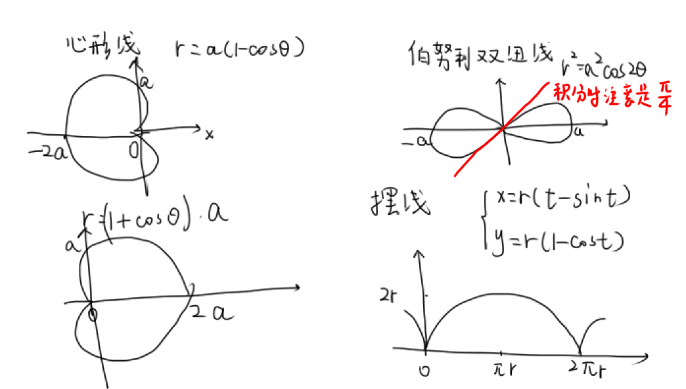

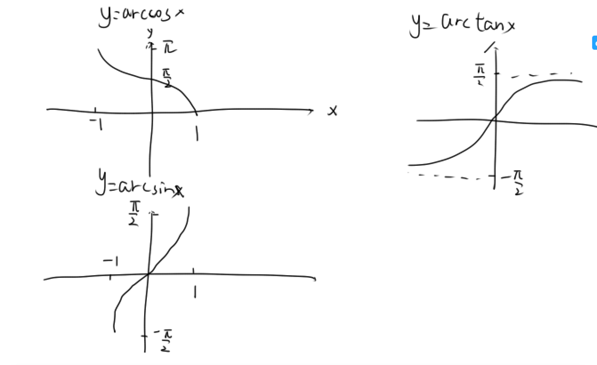

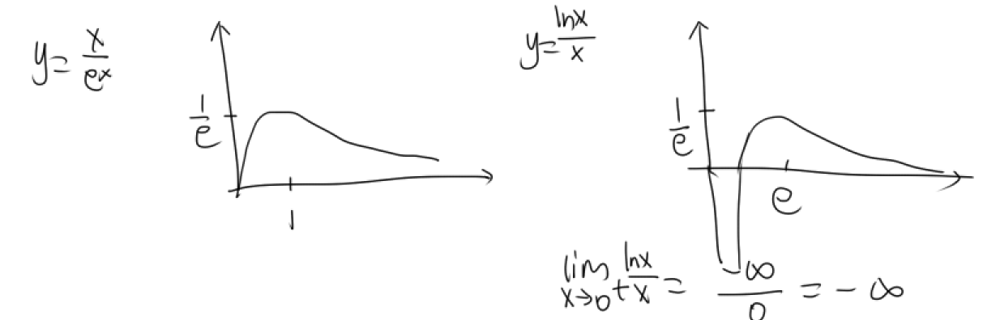

#### 一、函数极限与连续

##### 常见极限

7种未定式
$$
\frac{0}{0},\frac{\infty}{\infty}：洛必达\\
\infty \cdot 0：化为\frac{0}{\frac{1}{\infty}}再洛\\
1^{\infty},0^0,\infty^{\infty}：取对数\\
\infty-\infty：通分/有理化
$$
重要极限
$$
\lim_{x\to 0}\frac{\sin x}{x}=1\\
\lim_{x\to 0}(1+x)^{\frac{1}{x}}=e\\
\lim_{x\to 0}\sqrt[n]{a^n+b^n+c^n}=\max\{a,b,c\}
$$
xlnx：
$$
\lim_{x\to 0^+}x^\alpha \ln x=0(\alpha>0)
$$

##### 函数的性质

单调性

f'(0)>0，推不出一定存在0的某邻域，在邻域上f单增（武P7）

常用中值定理，找到f(ξ)和f(x)的关系，确定单调性

奇偶性

函数求导，奇偶性改变；函数从0到x积分，奇偶性改变

周期函数求导仍是周期函数

周期函数f(x)的原函数是周期函数<=>f(x)在任何一个周期上积分为0

有界性

闭区间连续必然有界，开区间左右端点极限存在

f'(x)在区间上有界，则f(x)有界，反之不成立，如f(x)=x^(1/2), f'(x)=1/(2x^(1/2))

##### 等价无穷小

$$
\sqrt[n]{1+x}-1\sim \frac{x}{n}
$$

- 千万别在x->∞时候用
- 只有x->0且**x≠0**时才能代换，例如xsin1/x虽然趋于0，但在0的去心邻域内有值为0的点，故不能代换

##### 常见泰勒

$$
\sin x\sim x-\frac{x^3}{6};\arcsin x\sim x+\frac{x^3}{6}\\
\tan x\sim x+\frac{x^3}{3};\arctan x\sim x-\frac{x^3}{3}\\
\ln(1+x)\sim x-\frac{x^2}{2}\\
\star (1+x)^a\sim 1+ax+\frac{\alpha(\alpha-1)}{2}x^2\\
a^x-1\sim x\ln a\\
\frac{1}{1-x}\sim 1+x+x^2
$$

偶函数在x=0处泰勒展开只有偶次项（因为奇数阶导为奇函数，值为0）

##### 极限的性质

极限存在：左极限=右极限

连续：该点处极限=函数值

极限的保号性：若lim f(x)>0只能保证x0的去心邻域内f(x)>0，不能保证x0处！因为极限和函数值无关

抽象函数求极限：先单调有界

##### 求极限

- 化简方法：见到根号相减，分子有理化

- 夹逼定理

- 洛必达：0/0，无穷/无穷

- 拉格朗日中值定理：若分子是形式相同的两个式子相减，可以考虑拉格

- 但是中值定理不能直接用xi和x相消：
  $$
  \lim_{x\to 0}\frac{\int_0^x \sin t^2dt}{x^3}=\lim_{x\to 0}\frac{x\sin\xi^2 }{x^3}\neq1
  $$
  洛必达可知，该极限的值应为1/3

技巧：

- 分子的被积函数若是趋于0，也可以在积分里等价替换

- 见到
  $$
  \sqrt{x...}-x
  $$
  立刻提出x，然后用泰勒

- 若f(x)~x^m, g(x)~x^n，则
  $$
  \int^{g(x)}_{0} f(t)dt\sim x^{(m+1)n}
  $$
  
- 对于分子是x-ln(1+tanx)这种极限，比洛必达简单的方法：加减项拆开求极限，[x-tanx]+[tanx-ln(1+tanx)]

- 若极限包含变上限积分，灵活使用洛必达和积分中值定理！！！

##### 洛必达法则

要求洛之后极限必须存在

若f(x)n阶可导，则最多只能洛到出现n-1阶导数；若n阶导连续，则可以洛n次

因为对n-1阶再求导，n阶导函数不一定连续，从而极限不一定存在

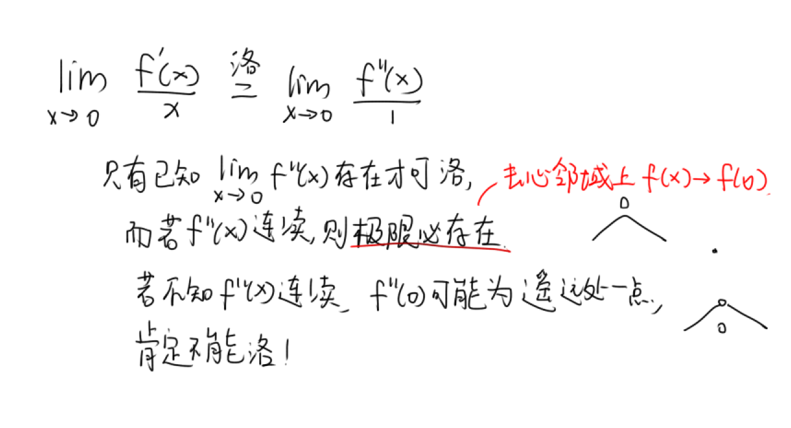

##### 函数连续

连续函数的四则运算及复合仍连续，其余的各种复合是没有结论的

学会举反例！！！（f(x)恒等于1，φ(x)=(x>=0)?1:-1）

介值定理

零点定理

##### 间断点

分母为0：无穷间断点

分母为无穷：极限存在，可去间断点

注意：对于
$$
f(x)=\frac{x-1}{x-1}
$$
即使分子分母可以约分，x=1也是无定义点，只是左右极限相同=1，因此x=1是可去间断点

#### 二、数列极限

互补为0构造反例

##### 1.求n项和的数列极限

（武忠祥P29）

若分母的两部分数量级相同，则用定积分定义，如n+i

数量级不同，则用夹逼定理，如n+lni

##### 2.单调有界定理证极限

如果容易证单调，则直接用单调有界准则：单增有上界，则数列极限存在，即收敛

##### 证单调

- an+1和an作差、作商，构造函数研究单调性

- 用拉格朗日中值定理

- 若有递推函数
  $$
  x_{n+1}=f(x_n)
  $$
  
  - 若f单增，去比较前两项大小：
    - 若x1<=x2，则{xn}单增；
    - x1>=x2，则{xn}单减
  - 若f单减，{xn}没有单调性

##### 证有界

- 利用基本不等式
  $$
  x_{n+1}=\sqrt{x_n(3-x_n)}\le \frac{1}{2}(x_n+3-x_n)=\frac{3}{2}
  $$
  
- 数学归纳法。假设xn>0，推出xn+1=f(xn)>0

- an=f(x,n)，可以推出非负性

##### 3.先求后证法

若不容易证单调或者没有单调性，则先求极限后用定义证明（先求后证法）

先假设极限存在，并求出A。如果能算出
$$
\frac{|x_{n+1}-A|}{|x_n-A|}<k<1
$$
则可建立$|x_{n+1}-A|<k|x_n-A|<...<k^n|x_1-A|=0$，A是极限

这里若A简单则直接带入，A复杂，则带入A的表达式（例5）

#### 三、一元函数微分的概念

##### 可导的充要条件

可导<=>左右导数存在且相等

导数定义
$$
f'(x_0)=\lim_{\Delta x\to 0}\frac{f(x_0+\Delta x)-f(x_0)}{\Delta x}
\\f'(x_0)=\lim_{x\to x_0}\frac{f(x)-f(x_0)}{x-x_0}
$$
但是要用定义求未知量x的导数只能用delta形式：
$$
f'(x)=\lim_{\Delta x\to 0}\frac{f(x+\Delta x)-f(x)}{\Delta x}
$$
微分：A△x为微分，也叫主部。其中A=y'(x0)
$$
\Delta y=A\Delta x+o(\Delta x),dy|_{x=x_0}=Adx
$$

一元函数可导=可微，因为导数只有一个方向逼近；多元就不行

一元函数△x=dx

性质：

- 若f(x)在x0处可导，g(x)在x0处连续但不可导，则f(x)g(x)在x0处可导<=>f(x0)=0.常用来解含绝对值（不可导）乘积的问题

注意：

- f在x0处可导推不出f'(x)在x0处极限存在，经典例子
  $$
  f=x^2sin\frac{1}{x}
  $$
- f'(0)>0不能推出一定存在邻域使得这段邻域上f单增，经典反例：总存在x=1/2nπ，f'<0
  $$
  f=x^2sin(\frac{1}{x})+\frac{x}{2},x\ne0\\
  f=0,x=0
  $$

  

题型：

- 利用导数定义求极限，主要是凑△x：（武P51例1）

$$
f'(x_0)=\lim_{\Delta x->0}\frac{f(x_0+\Delta x)-f(x_0)}{\Delta x}
$$

- 对于[f(x)-f(-x)]/x，直接用反例f(x)=|x|
- 利用导数定义求可导性，凑导数定义，需要△x->0，可正可负。武P53例2
- f(x)=φ(x)|x-a|，φ(a)=0<=>f'(a)存在

#### 四、一元函数微分的计算

函数求导奇偶性对调

##### 对数求导法

幂指函数，大根号。注意取对数加绝对值

复合函数求导的简便方法：若f'(u0),g'(x0)都存在，u0=g(x0)，则f(g(x))在x0处导数=f'(u0)g'(x0)

##### 反函数求二阶导

用dx做桥梁对y求导

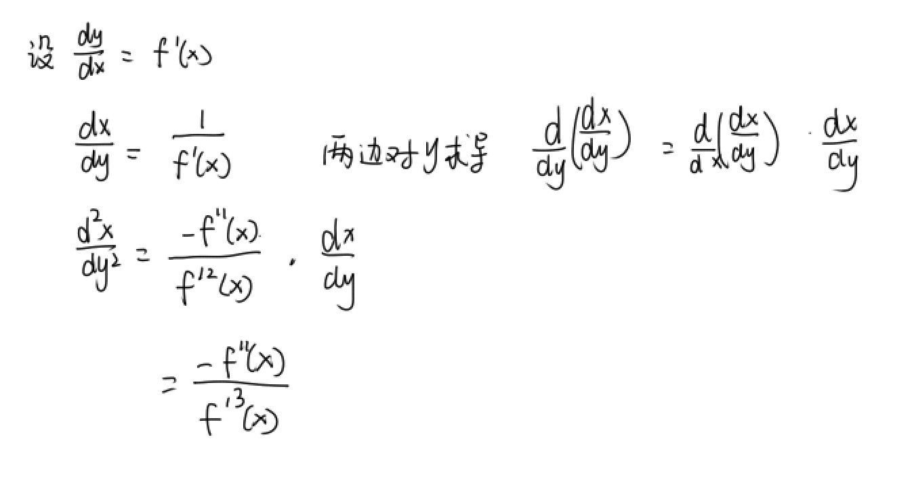

##### n阶导数

（1）归纳法：对于有理函数，找规律
$$
\star[\ln(1+kx)]^{(n)}=(-1)^{(n-1)}\frac{(n-1)!}{(1+kx)^n}k^n\\
\left[\frac{1}{x}\right]^{(n)}=(-1)^{n}\frac{n!}{x^{n+1}}
$$
（2）三角公式：每导一次，里面多一个Pi/2
$$
(\sin kx)^{(n)}=k^n\sin(kx+\frac{n\pi}{2})\\
(\cos x)^{(n)}=\cos(x+\frac{n\pi}{2})
$$
扩展：如f(x)=-sin4x，则n阶导为-4^nsin(4x+npi/2)

√（3）莱布尼茨公式：两函数相乘，二项式展开
$$
(uv)^{(n)}=\sum_{k=0}^n C_n^k u^{(k)}v^{(n-k)}
$$
专门用来处理含多项式n次方的f(x)求n阶导问题

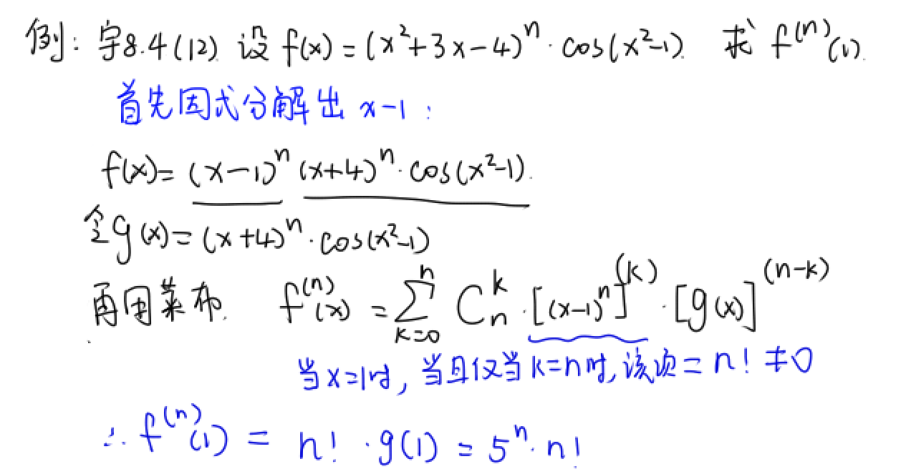

（4）泰勒展开法：将f的一部分泰勒展开，再将f泰勒展开，令系数相等。适用于知道部分的泰勒展开时

#### 五、一元微分几何应用

##### 极值

驻点：导数为0的点的横坐标（极值点也是横坐标）

极值的必要条件：驻点or不可导点

极值的三个充分条件

- x0**去心邻域内**可导。驻点两侧f'(x)异号（对于不可导点也可判定）
- 一阶导=0，二阶导存在且≠0，f''>0极小值
- 1到n-1阶导均为0，n阶导≠0，n为偶数

对于极坐标方程，先消掉r，然后再算导数

##### 最值

先求出极值点，以及端点函数值，比较

若区间内部只有一个极值点，必然是最值点

##### 凹凸性

拐点：凹弧和凸弧的分界点，是个点(x0,y0)

拐点的必要条件：若二阶可导，则f''(x0)=0

拐点的充分条件

- x0**去心邻域内**二阶可导，左边二阶导和右边异号，则(x0,y0)是拐点
- x0处三阶可导。二阶导为0，三阶导不为0，则(x0,y0)是拐点，但不判断是哪种拐点
- n为奇数

给f(x)图像，则左右凹凸性不同的点是拐点

给f‘(x)图像，则左右单调性不同的点是拐点

##### 渐近线

1.铅垂渐近线：找无定义点

2.水平渐近线：y=c
$$
\lim_{x\to\infty}f(x)=c
$$
注意：只要满足上式即有水平渐近线，f(x)可以与y=c相交！【y=0的水平渐近线是y=0】

3.斜渐近线：a，b能求出来则有斜渐近线。注意正负无穷可能不同
$$
a=\lim_{x\to\infty} \frac{f(x)}{x}\\
b=\lim_{x\to\infty} f(x)-ax
$$

无穷小法求斜渐近线：若f(x)能写成
$$
f(x)=ax+b+\alpha(x)\\
并且\lim_{x\to \infty}\alpha(x)=0
$$
则f(x)有斜渐近线y=ax+b

##### 方程根的个数问题

求导，单调性

- 用**罗尔推论**证明根数上限：若f在区间上n阶导≠0，则f(x)=0在区间上最多有n个实根。

  有时需要对f求导后再用罗尔推论

- 用零点定理证明根数下限

  多项式f(x)最高次数为奇数，则至少有一个实根，因为左右趋向正负无穷

- 当无法用零点定理时，考虑**求f的原函数F**作为构造函数，F(a)=F(b)=0，再用罗尔定理证明有根

- 见到二阶导以上的条件，用泰勒（武P75例8）

- 如果有参数k，求k的取值范围：

  - 尽量分离参数，使得求导后能消掉k（武P74例5）
  - 或者先画出f(x)图像，用y=k去截f(x)

##### 曲率和曲率圆

$$
曲率k=\frac{|y''|}{[1+(y')^2]^{\frac{3}{2}}}
$$
曲率半径R=1/k

当题目中给了f(x)在x0处的曲率圆方程时，表明f和曲率圆在该点的一二阶导数均相同，不用算曲率

#### 六、一元微分证明不等式

最常用：

- 函数单调性，一阶导无法判断就求二阶导
- 对于边界点可能要算极限来确定正负

常数变量化：

- 含f(x1),f(x2)的不等式，常将x1替换为x，构造函数，里面x2是常数
- 若想在区间[a,b]上用单调性，则把b换成x（武P76例2）
- 拉格

挖掘题目隐含信息：

- f''(x)>0，说明f和f'均连续
- $\lim_{x->0}f(x)/x=1$，说明$\lim_{x->0}f(x)=0$

见到二阶导以上，考虑泰勒，在条件多的点处展开

和中值定理问题一样，构造函数时可考虑公式法
$$
f'(x)+g(x)f(x)=0，则令F(x)=e^{\int g(x)dx}f(x)
$$

#### 七、中值定理证明题

大前提：[a,b]上连续，(a,b)上可导

##### 中值定理

平均值定理、介值定理中区间都是闭区间[a,b]。反例如y=x^2的对称两点

费马定理（可导函数极值点的必要条件）：若x0是f的极值点，且f'(x0)存在，则f'(x0)=0.

罗尔定理：f(a)=f(b)，必有f'(ξ)=0

拉格朗日中值定理：构造F(x)=f(x)-[f(b)-f(a)]/(b-a)(x-a)，用罗尔定理证
$$
f'(ξ)=\frac{f(b)-f(a)}{b-a}
$$
柯西中值定理：

$$
\frac{f'(ξ)}{g'(ξ)}=\frac{f(b)-f(a)}{g(b)-g(a)}
$$
传统的积分中值定理：ξ属于闭区间[a,b]。用最值定理+介值定理证
$$
\int_a^b f(x)dx=f(\xi)(b-a)
$$
加强的积分中值定理：ξ属于开区间(a,b)。用拉格证

##### 公式法

F[x,f(x),f'(x)]=0的问题

构造辅助函数的方法

（1）还原法：找F的原函数作为辅助函数

（2）微分方程法：求出F=0的通解H(x,y)=C，辅助函数就是H

（3）**公式法**

两边同乘$e^{\int g(x)dx}$，然后两边积分。可得：
$$
如果f'(x)+g(x)f(x)=0，令F(x)=f(x)e^{\int g(x)dx}\\
f'(x)+g(x)f(x)=h(x)，令F(x)=f(x)e^{\int g(x)dx}-\int h(x)e^{\int g(x)dx} dx
$$

例：宇8.4(20)

##### 两个中值点ξ,η问题

（1）不要求ξ≠η：等式两边分别用中值定理（拉格或柯西）

（2）要求ξ≠η：找中间点划分成两个子区间

​	找划分点的方法：

 - 根据第一问
 - **逆推法**：假设c是划分点，中值定理带入等式，然后求出满足等式和初始条件的c来（武P83例5）

##### 含高阶导的问题

找信息最多的点，在该点处用带拉格朗日余项的泰勒公式展开，并将其他点带入
$$
f(x)=f(0)+f'(0)x+\frac{f''(\xi)}{2!}x^2,\xi位于0与x之间
$$
注意：假设f(x)在x=0处泰勒展开，f(x)代入不同的x，余项的ξ也不同，因为ξ的范围是0与x之间！！！

经常使用绝对值不等式，以及令$|f''(ξ)|=\max\{|f''(ξ1)|,|f''(ξ2)|\}$

其他思想：多项式拟合

##### 介值定理的应用

- 介值定理与最值定理结合：（张宇真题大全解P66.142）

  已知f连续，f(ξ1)+f(ξ2)=2，则必然有f(ξ)=1。

  设f(x)的最大最小值是M，m，则必然有
  $$
  m\le\frac{f(ξ1)+f(ξ2)}{2}\le M
  $$
  ，根据介值定理，必然存在ξ∈[ξ1,ξ2]，使得f(ξ)=1

- 泰勒公式积分与最值定理，介值定理结合：（张宇真题大全解P67.144）

  因为泰勒里的ξ受x影响，因此利用最值定理
  $$
  m\le f''(ξ)\le M
  $$
  把积分中的f''(ξ)提出去，这样即可正常积分。再利用介值定理，证明存在f''(x0)=积分值

#### 八、一元积分的概念和性质

函数的原函数必定连续，因为连续是可导的必要条件

连续函数f的原函数可以表示成
$$
F(x)=\int_0^x f(t)dt +C
$$
偶函数f只有C=0时，原函数是奇函数

##### 三角函数积分

$$
\int \tan x dx=-\ln(\cos x)+C\\
\int \cot x dx=\ln|\sin x|+C\\
\star \int \sec x dx=\ln|\sec x+\tan x|+C\\
\star \int \csc x dx=\ln|\tan\frac{x}{2}|+C
$$

$$
\int \cot^2x dx=-\cot x-x+C
$$

降阶公式
$$
\int cos^nxdx=\frac{sinxcos^{n-1}x}{n}+\frac{n-1}{n}\int cos^{n-2}xdx\\
\int sin^nxdx=-\frac{cosxsin^{n-1}x}{n}+\frac{n-1}{n}\int sin^{n-2}xdx
$$
遇到sin^4x，化为1/4(1-cos2x)^2，再拆开积分

#### 九上、一元函数积分的计算

$$
\begin{align}
\star\int \frac{1}{\sqrt{x^2±a^2}}dx=\ln|x+\sqrt{x^2±a^2}|+C\\
\star\int \frac{1}{\sqrt{a^2-x^2}}dx=\arcsin\frac{x}{a}+C\\
\int \frac{1}{x^2+a^2}dx=\frac{1}{a}\arctan\frac{x}{a}+C\\
\int \frac{1}{x^2-a^2}dx=\frac{1}{2a}\ln\left|\frac{x-a}{x+a}\right|+C\\
\int \frac{1}{a^2-x^2}dx=\frac{1}{2a}\ln\left|\frac{x+a}{x-a}\right|+C\\
\end{align}
$$

注意特别性质：$\ln(x+\sqrt{x^2±a^2})$是奇函数，定积分可化简

##### 三大积分法

- 凑微分：当被积函数为sinxf(cosx)dx时，直接-f(cosx)d(cosx)
- 换元
- 分部积分

##### 有理函数积分

基本方法：分母因式分解。分母只有两种情况：$(x-a)^i$或$(x^2+ax+b)^i$
$$
\frac{1}{(x-1)^2(x^2+x+1)}=\frac{A}{(x-1)^2}+\frac{B}{x-1}+\frac{Cx+D}{x^2+x+1}
$$
凑微分降幂法：分母高次时，分子分母同乘x^n-1，来凑微分（P91例7）

加减拆项法：分子为1时，变为1+x^n-x^n，然后将被积函数拆成两项的和分别积

##### 三角有理式积分

一般方法：万能代换，适用于分母有sinx，cosx的一次方
$$
t=tan\frac{x}{2}, dx=\frac{2dt}{1+t^2}\\
sinx=\frac{2t}{1+t^2},cosx=\frac{1-t^2}{1+t^2}
$$
常用方法

R(-sinx,cosx)=-R(sinx,cosx)，关于sinx奇，令t=cosx

R(sinx,-cosx)=-R(sinx,cosx)，关于cosx奇，令t=sinx

R(-sinx,-cosx)=R(sinx,cosx)，都不奇，令t=tanx

##### 无理积分

（1）凑平方和：

见到$\int \sqrt{2x-x^2}dx$，去凑平方和$\int \sqrt{-(x-1)^2+1}d(x-1)$

根号在分母亦可凑平方和

（2）直接令根号=t

见到分母上有根号f(x)，考虑凑微分d(根号f(x))，然后分部积分

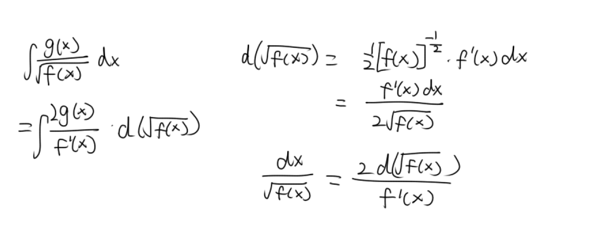

##### 分段函数求不定积分

- 方法一：原函数x0左右连续，求出C1.C2关系
- 方法二：利用变上限积分，直接求出原函数

##### 其他技巧

$$
\frac{1}{1+e^{f(x)}}+\frac{1}{1+e^{-f(x)}}\\=\frac{1}{1+e^{f(x)}}+\frac{e^{f(x)}}{1+e^{f(x)}}=1
$$

#### 九中、定积分

黎曼和
$$
\lim_{n\to\infty}\sum_{i=1}^n \frac{1}{n}f(\frac{i}{n})=\int_0^1f(x)dx\\
\lim_{n\to\infty}\sum_{i=1}^n \frac{x}{n}f(\frac{xi}{n})=\int_0^xf(t)dt
$$
奇偶性

周期性：若f周期为T，则任意起点周期上积分值都相等

##### 区间再现公式

找不到原函数，也没有奇偶性时考虑，尤其适用于三角积分
$$
\int_{a}^{b} f(x)dx=\int_{a}^{b}f(a+b-x)dx\\
\int_{a}^{b} f(x)dx=\frac{1}{2}\left[ \int_{a}^{b} f(x)dx+\int_{a}^{b}f(a+b-x)dx\right]
$$
区间再现公式推论
$$
\int_{0}^{\pi} xf(\sin x)dx=\frac{\pi}{2}\int_{0}^{\pi}f(\sin x)dx
$$

##### 点火公式

上限为pi/2
$$
\int_{0}^{\frac{\pi}{2}}\sin^nxdx=\int_{0}^{\frac{\pi}{2}}\cos^nxdx=\frac{n-1}{n}...\frac{1}{2}\frac{\pi}{2}(n为偶)\\
=\frac{n-1}{n}...\frac{2}{3} (n为奇)\\
$$
上限为pi
$$
\int_{0}^{\pi}\sin^nxdx=2\int_{0}^{\frac{\pi}{2}}\sin^nxdx\\

\int_{0}^{\pi}\cos^nxdx
=2\int_{0}^{\frac{\pi}{2}}\cos^nxdx(n为偶);0(n为奇)\\
$$
上限为4pi
$$
\int_{0}^{2\pi}\sin^nxdx
=\int_{0}^{2\pi}\cos^nxdx
=4\int_{0}^{\frac{\pi}{2}}\sin^nxdx(n为偶);0(n为奇)\\
$$

##### 积分中值定理

$$
\int_a^b f(x)dx=f(\xi)(b-a),\xi \in(a,b)
$$

##### 第二积分中值定理推论

$$
\int_a^b f(x)g(x)dx=f(\xi)\int_a^b g(x)dx,\xi \in(a,b)
$$

注意：

如果被积函数含n，则ξ也与n的取值有关，要写成ξ_n（P100）

用几何意义：被积函数是半圆形
$$
\int_0^a\sqrt{a^2-x^2}dx=\pi a^2/4
$$

##### 变上限积分

连续性：若f(x)可积（有限个第一类间断点），则变上限积分F(x)连续，也就是其**面积的值连续**

可导性：

- 当f连续或者有可去间断点时，F连续可导
- 当f有**跳跃间断点**时，F连续但不可导，因为**F的左导数是f的左极限**，F的右导数是f的右极限，左导数不等于右导数，故F不可导

奇偶性：变上限积分的奇偶性相反

##### 求极限

- 洛必达：若见到被积函数为f(x-t)，果断换元u=x-t
- 积分中值定理or第二积分中值定理：一般把非0的函数提出来（P108）
- 等价无穷小法：若f(x)~g(x)，则

$$
\int_0^xf(t)dt\sim\int_0^xg(t)dt
$$

##### 技巧

- 分部积分时，为了使分部出来的常数项为0，常要令dx=d(x-1)，武P104例11

- 被积函数包含|x-t|时，按照x将区间分段求积分

- 被积函数在区间上有无定义点时，必须按照该点拆成两段算反常积分！例如李林6.1(6)
  $$
  \int_0^1\frac{dx}{(4x-1)^3}在x=1/4处拆开
  $$
  

含三角函数的定积分

- 尽量通过换元使得上下限关于0对称，2018(17)

#### 九下、判断反常积分敛散性

武P114

三种方法：

- 如果能求原函数，先求出来代上下限
- 比较判别法的极限形式
- 和p积分比较

##### 1.无穷区间上的反常积分

比较判别法：通过放缩到p级数来判断敛散性。要证收敛，则找个比它大的收敛的p级数；要证发散，找个比它小的发散的p级数

p-级数：【此时分母的x是趋于正无穷的】
$$
\int_a^{+\infty}\frac{1}{x^p}dx
$$
- 当p>1，收敛；
- 当p<=1，发散

常见题目：
$$
I_1=\int_a^{+\infty}\frac{1}{x\ln^{p}x}dx=\int_a^{+\infty}\frac{1}{\ln^{p}x}d\ln x
$$
是无穷区间的反常积分，分子趋于正无穷。一种方法是向p级数靠拢，当p>1，收敛；当p<=1，发散。另一种方法是直接积分，算出结果是无穷则发散

修改一下上限：
$$
I_2=\int_0^{1}\frac{1}{\ln^{p}x}d\ln x
$$
x=1时lnx=0，I2是无界函数的反常积分，p>=1发散，p<1收敛

##### 比较判别法的极限形式

$$
\lim_{x\to +\infty}\frac{f(x)}{p(x)}=\lambda
$$

- 结果是不为0的常数，则同敛散
- 结果=0，p收敛，f必收敛
- 结果=∞，p发散，f必发散

##### 2.无界函数的反常积分

先找**瑕点**

首先必须找到上限或下限为瑕点的积分，没有就拆（武P116例1A），拆之后的两个反常积分都收敛，原积分才收敛

和p积分去比较，注意抓大头（最高次）去研究

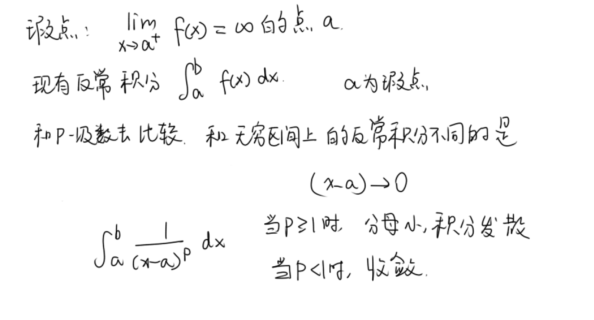

#### 十、一元积分几何应用

##### 1.面积

$$
S=\int_a^b dx \int_{f_1(x)}^{f_2(x)} dy
$$

##### 2.旋转体体积

关键是找到区域内点(x,y)到轴的距离r(x,y)，xy积分次序无关

武忠祥旋转体体积公式：
$$
V=2\pi\int_a^bdx\int_{f_1(x)}^{f_2(x)}r(x,y)dy
$$
若给的是图形的参数方程，那么直接先正常求y的积分，然后把x都换成t的表达式（2016.20）

特别地，y(x)绕x轴旋转体积为
$$
V=\int_a^b \pi y^2 dx
$$
。但注意如果是y1和y2所夹面积，被积函数不能直接用(y2-y1)^2，而是y2^2-y1^2
##### 3.旋转体侧面积

绕x轴旋转的旋转体侧面积
$$
S=\int_a^b2π|y(x)|\sqrt{1+y'(x)^2}dx
$$
绕y轴只需把x,y地位互换

##### 4.平均值

$$
\frac{1}{b-a}\int_a^b f(x)dx
$$

##### 5.弧长

$$
ds=\sqrt{1+y'(x)^2}dx\\
ds=\sqrt{r^2(\theta)+r'^2(\theta)}d\theta
$$
##### 6.形心

$$
\frac{\int xf(x)dx}{\int f(x)dx}
$$
##### 7.已知截面求体积

$$
\int S(x)dx
$$

#### 十一、积分等式、不等式

##### 积分比大小，积分不等式

- 上下限不同，被积函数相同（武P112例2）
  - 换元，使得上下限相同
  - 积分按区间拆开，使得包含上下限相同部分
  - 若题目提供了f单调的条件，令F(x)=变上限积分（**不管上限是什么，都写成x**），求导研究单调性
- 柯西积分不等式

$$
\left(\int_a^bf(x)g(x)dx\right)^2\le \int_a^bf^2(x)dx \int_a^bg^2(x)dx
$$

- 联系f和f'，考虑拉格或者牛莱公式，P113例5

#### 十二、一元积分物理应用

##### 抽水做功

h：微元上升高度

S：平行水面的截面积
$$
W=\int_{h_1}^{h_2} \rho g h\cdot S dy
$$

注意：水微元上升的位移与容器的位置无关

例：2011(20)，容器下半部分的水的位移仍然是2-y，而容器下半部分的位置是[-1,1/2]

##### 水对垂直物理侧面压力

压力=压强x面积

压强=ρgh，h为水深

条形面积=xdy
$$
F=\int_{h_1}^{h_2} \rho g h \cdot xdy
$$
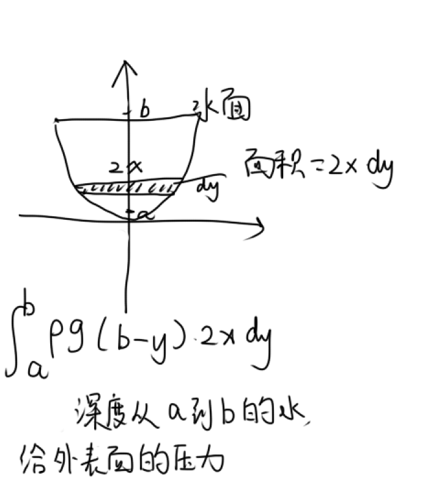

##### 引力

$$
F=GMm/r^2
$$

#### 十三、多元函数微分

##### 逻辑链

偏导连续->可微->偏导存在&&原函数连续

##### 求多元函数极限，证连续

（通常证其为0，使得f在原点连续）

- 先取绝对值，再放缩证明极限=0

  例如：
  $$
  \lim_{(x,y)\to (0,0)}\frac{x^2y}{x^2+y^2}=\lim_{(x,y)\to (0,0)}\left| \frac{x^2}{x^2+y^2}\right|y\le\lim_{(x,y)\to (0,0)}1 \cdot y=0
  $$
  
- 根据分子分母次数，分子次数高，则趋于0

- 可以使用等价无穷小，如sin(x^2+y^2)~x^2+y^2，但不能用洛必达

- 别看错了，sin里面可不是0，有界x无穷小=0
  $$
  \lim_{(x,y)\to (0,0)}(x^2+y^2)\sin\frac{1}{x^2+y^2}=0
  $$
  

##### 证明极限不存在

如果以两种路径逼近，极限结果不同，则极限不存在

多元函数连续：极限f(x,y)等于函数值f(x0,y0)。

##### 偏导数定义

只是x轴和y轴方向上的路径逼近
$$
f'_x(0,0)=\lim_{x\to 0}\frac{f(x,0)-f(0,0)}{x-0}
$$
求偏导时，**先代后导**，因为f'x与y无关，所以可先带入y0，再对x求导

##### 判断可微

（1）求出偏导数，在该点处连续则可微

（2）定义法：**注意A,B一定要用偏导数定义求！！！**

技巧：上下同阶一定不可微（令y=kx路径逼近）

##### ※ 多元函数F求偏导的两种情况

- 对于F(x,y,z)=0，**求Fx时**，z被当成常数，因为实际上是对F的第一个位置求偏导。例：2010(5)

- 对于F(x,y,z)=x+y+z=0，**两边对x求偏导**，z不能当成常数。F'x=1+z'x。例：2016(17)

##### 复合函数z(u,v)求偏导

z(u(x,y),v(x,y))链式法则,例：13.22

求高阶偏导：每次对中间函数求偏导都使用链式法则

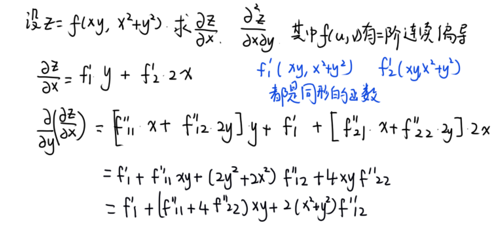

##### 隐函数求偏导，全微分

题目：z=z(x,y)由方程F(x,y,z)=0确定，求zx,zy

- 公式法=-F‘x/F’z

- 两边同时对x求偏导

- 全微分形式不变性：
  $$
  Fxdx+Fydy+Fzdz=0
  $$
  ，这种方法不用理变量间关系，只需对每个式子求全微分再联立（武161例4）

微分形式不变性就是不管是dx还是du，前面都是F对x或者u的偏导

隐函数求二阶偏导：先公式法求出一阶偏导，然后直接求二阶导。例：13.26

##### 多元函数极值最值

###### 无条件极值

对于显函数z=f(x,y)，先令f'x=0,f'y=0，求出驻点，再去算
$$
\Delta=AC-B^2
$$

- △>0：A<0极大值，A>0极小值
- △<0不是极值
- △=0时，在(0,0)任一邻域内取(e,-e)，若f(e,-e)>0,f(e,e)<0，则说明f(0,0)=0不是极值【极大值需要各个方向上邻域上的值都比它小】

###### 区域内最大最小值

- 先不管条件，求区域内部的驻点
- 然后把边界函数当成条件，拉格朗日乘数法**求边界上的条件极值**。当目标函数很复杂时，通常间接求一部分的最大最小值（如分母的一部分）
- 比较上面所有点的值

##### 拉格朗日乘数法中解方程组的技巧

硬核作差法：

- 用L'x=0和L'y=0两式联立消掉λ，得到一个只含x,y的多项式
- 因为多项式为0，所以可以因式分解得到若干种使多项式为0的情况
- 对于每种情况，带入L'λ=0求解一组或多组x,y即可。

对称作差法：

- 如果目标函数f和约束条件函数都关于x=y对称，则可以将L'x=0和L'y=0两式直接作差
- 得到(x-y)(...)=0，后面的项带入L'x=0或许可以证明一定不为0（需要赌运气），则x,y同等地位

参考：[拉格朗日乘数法求解有什么技巧吗？ - 煜神学长的回答 - 知乎](https://www.zhihu.com/question/68768731/answer/2081177602)

##### 已知偏导函数求原函数

利用混合偏导相等，分别对两个一阶偏导求偏导，令二者相等，再解微分方程可以求出未知函数（武P155例6）
$$
du=Pdx+Qdy\\
\frac{\part P}{\part y}=\frac{\part Q}{\part x}
$$
偏积分：注意对y偏积分时加上x的函数
$$
\int f'_y(x,y)dy=f(x,y)+\varphi(x)
$$

##### 偏导数的分部积分

把f'x(x,y)看成一个关于y的一元函数。对于定积分时，f''xy对y偏积分出来的φ(x)被消掉，因此可以不用写φ(x)了【2011.21】
$$
\int_a^b yf''_{xy}(x,y)dy=\int_a^b ydf'_x(x,y)\\
=yf'_x(x,y)|_{y=a}^{y=b}-\int_a^b f'_x(x,y)dy
$$

#### 十四、二重积分

二重积分只要积不下去就尝试交换积分次序，极坐标/参数方程求不出来就用直角坐标

先看被积函数的奇偶性，区域的对称性

二重积分比大小：1.作差 2.被积函数正负可知

积分换序：画图，后积先定限，限内画条线，先交写下限，后交写上限

当被积函数中有r,x/y,y/x，被积区域是圆时，适合极坐标
$$
dxdy=rdrd\theta
$$

##### 参数方程的二重积分

- 先写出直角坐标的积分
- 对x积分后，直接把x(y)换成x(t)
- dy=y'(t)dt后对t一重积分

例：李林6.3(21)

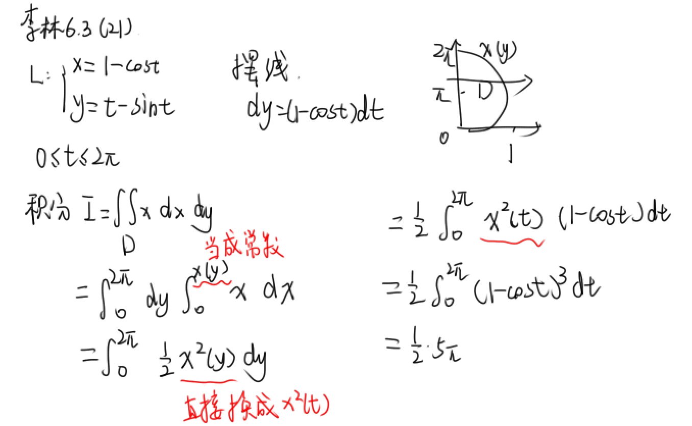

##### 直角坐标化极坐标

写出被积区域边界的极坐标方程，作为r的上限，例14.27

如y=2，则有rsinθ=2，即r<=2/sinθ

##### 轮换对称性

区域D**关于y=x对称**，交换被积函数中的x,y，积分值不变
$$
\iint_Df(x,y)dxdy=\iint_Df(y,x)dxdy
$$
轮换对称性的应用：换字母后，求和更简单

常见题目：若区域D关于y=x对称，则

- f(x,y)=xsin(x+y)/(x+y)，轮换后分子分母相消

- f(x,y)=x-y，积分为0
  $$
  \iint_D(x-y)dxdy=\frac{1}{2}\iint_D(x-y+y-x)dxdy=0
  $$
  

##### 圆心不在原点

假设圆心在(0,1)

不对xy积，将xy拆成x(y-1)+x，前一个积分值为0，后一个积分正常用极坐标即可

##### 二重积分中值定理

求极限
$$
\iint_Df(x,y)dS=f(\xi,\eta)S,(\xi,\eta)\in D
$$

#### 十五、微分方程

非齐次：等号右边f(x)不是0

##### 1.一阶微分方程

先写出y'表达式

- y'+p(x)y=0型，可分离变量

- 能够换元x/y，y/x，换元后可分离变量

$$
\frac{dy}{dx}=f(\frac{y}{x})\\
u=\frac{y}{x}, y=ux\\
\frac{dy}{dx}=u+x\frac{du}{dx}
$$

- y'+p(x)y=q(x)型：一阶非齐次线性微分方程，套公式

$$
y=e^{-\int p(x)dx}[\int q(x)e^{\int p(x)dx}dx+C]
$$

当dy/dx无法表示成y'+p(x)y=q(x)型时，可考虑互换xy，写出dx/dy，再向y'+p(x)y=q(x)型上凑，套公式（2012.12）

##### 2.二阶可降阶微分方程

- y''=f(x)：直接两次积分
- y''=f(x,y')：缺y。令y'=p, y''=p'，化为y'+p(x)y=q(x)型
- y''=f(y,y')：缺x。令

$$
y'=p, y''=\frac{dp}{dy}\frac{dy}{dx}=p\frac{dp}{dy}
$$

但是不是所有降阶的都能成功化为y'+p(x)y=q(x)型，这时候就考虑使用高阶微分方程的方法（2015.12）

##### 3.高阶常系数非齐次线性微分方程

y''+py'+qy=f(x)，f(x)≠0，pq是常数

###### 解的4个性质

- 非齐通解=齐次通解+非齐特解

- 两个非齐特解的差是齐次特解

- 两个线性无关的齐次特解的线性组合是齐次的通解

- 两个方程非齐特解的和=新方程的非齐特解。

  若y''+py'+qy=f1(x)和y''+py'+qy=f2(x)的特解分别为y1\*和y2\*，

  则y1\*+y2\*是y''+py'+qy=f1(x)+f2(x)的特解

解题：

- 已知两个非齐特解，相减是齐次特解，从而可以反推出齐次线性方程的表达式；令右边为f(x)，带入非齐特解即可解出非齐次线性方程的表达式（2016数二11）
- 已知三个线性无关的非齐特解，相减得到两个齐次特解，线性组合得到齐次通解，从而得到非齐通解

###### 先写出特征方程

$$
λ^2+pλ+q=0
$$

求解

###### 求齐次通解

y''+py'+qy=0

△>0, λ1,λ2是特征方程的两个实根
$$
y=C_1 e^{\lambda_1 x}+C_2 e^{\lambda_2 x}
$$
△=0, λ是特征方程的单根
$$
y=(C_1+C_2x)e^{\lambda x}
$$
△<0，α±βi是特征方程的两个复根
$$
y=e^{\alpha x}(C_1\cos\beta x+C_2\sin\beta x )
$$

一定要注明C是任意常数！

###### 求非齐特解

y''+py'+qy=f(x)

（1）

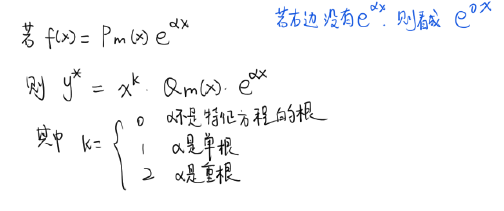

先设出Q1(x)=ax+b，再带回原方程解出a,b

（2）另一种f(x)

注意y*里的β照抄f的β

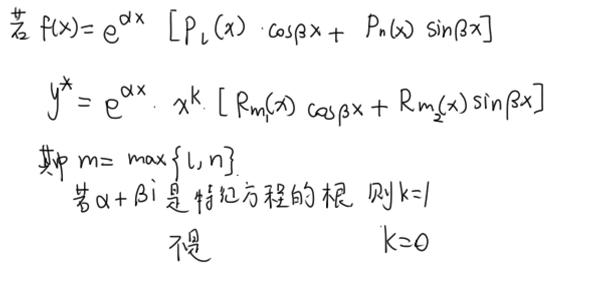

###### 三阶的情况

仍然是解特征方程，非齐特解也一样

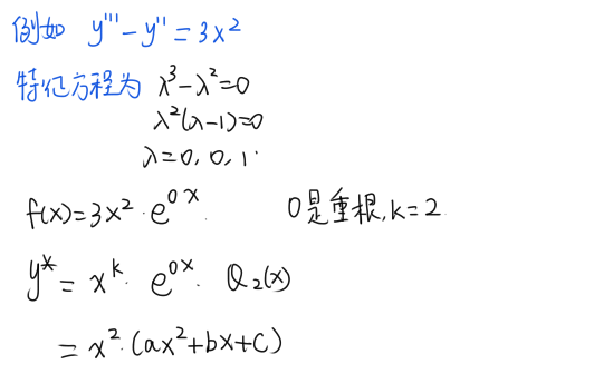

##### 一些总结

观察齐次通解和非齐特解的结构，可以看出，如果题目中给出某微分方程的解里只有e^ax，没有后面的多项式，肯定是齐次通解，否则是非齐特解

如果题目给两个非齐特解，则作差得到齐次特解，同时设出齐次方程，带入特解求出齐次方程的表达式。

题目给出含未知数的微分方程和解，首先要求导，带入微分方程试试

#### 题目总结

中值定理

李林6.1

2019.21
