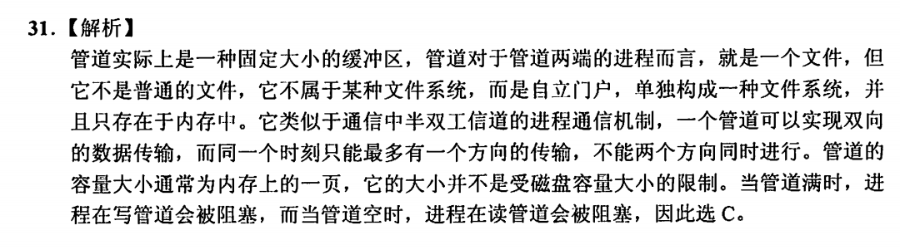
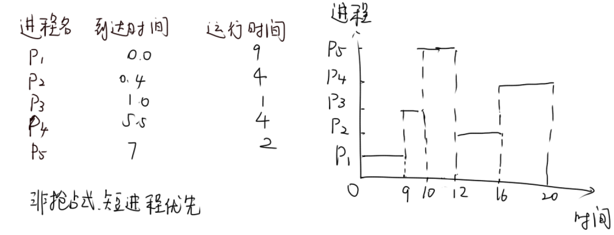
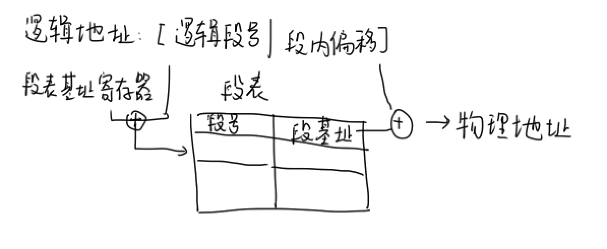
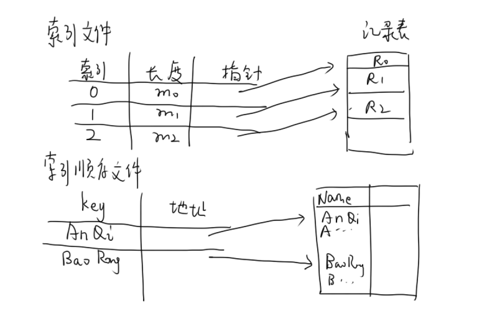
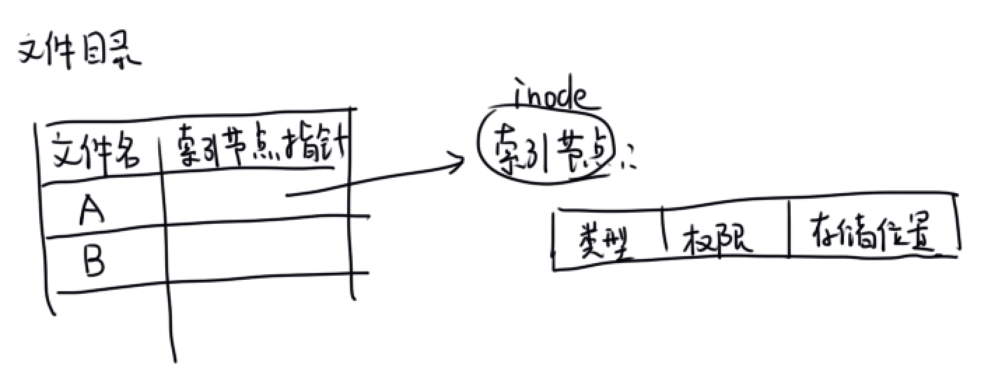
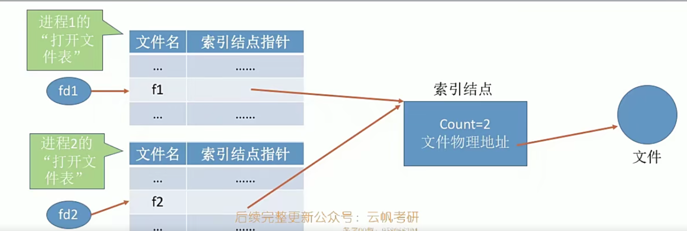
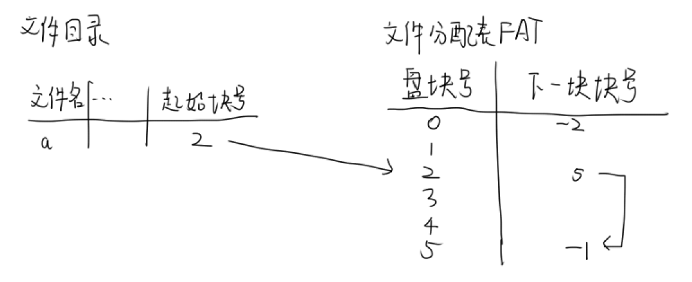
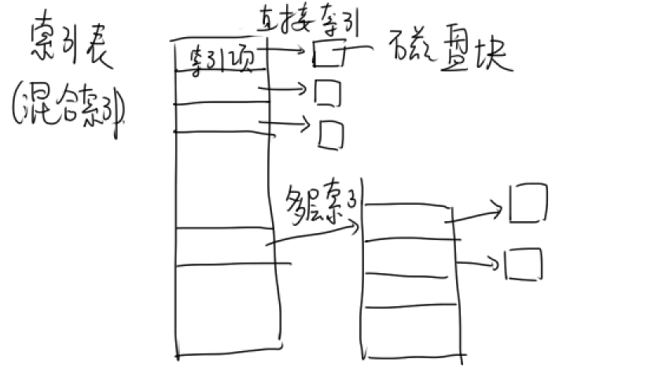
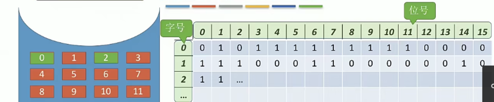
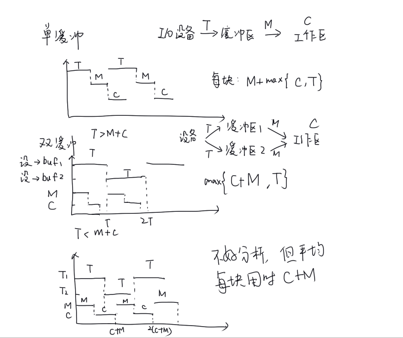

### 第一章——计算机系统概述

#### 1.1 操作系统的基本概念

系统软件，控制计算机硬件和软件资源

操作系统的特征：最主要的是并发和共享

（1）并发：分时交替。单处理机同时只能运行一个进程

（2）共享：系统资源可供多个并发的进程同时使用，同步互斥

（3）虚拟：物理实体->逻辑事物

（4）异步：多个程序执行速度不可预知，但结果一定

操作系统的功能：处理机管理，存储器管理，文件管理，设备管理

操作系统的接口：命令接口（联机：交互式，脱机：批处理），系统调用（程序接口，给编程人员的接口）

库函数来使用系统调用


#### 1.2 操作系统的发展和分类

发展流程：手工操作阶段->批处理阶段->分时系统->实时系统->PC操作系统

批处理系统：**将一批作业进入内存**，交给操作系统处理，用户脱机。优点：资源利用率高，**缺点：无交互能力**

- 单道批处理系统：内存中始终保持一道作业。如果程序运行时发出io请求，那CPU就要等待低速的io

- 多道批处理系统：允许多个程序同时进入内存，在CPU中交替运行。一个程序io的同时，CPU可以转而执行其他程序。但是用户不知道程序的运行情况，不能和计算机交互，只能通过提前写好的用户说明书来调试

分时操作系统：处理器的运行时间分成很短的时间片，轮流分配给各作业。多个用户共享一台主机，交互互不干扰

实时操作系统：订票、银行，严格及时


#### 1.3 操作系统的运行环境

##### 1.操作系统运行机制

CPU有两种状态：用户态时，只能执行非特权指令，内核态可以执行特权指令

操作系统内核包括：

- 时钟管理：计时，时间片轮转调度切换进程
- 中断机制
- 原语：不可被中断的原子进程
- 系统控制的数据结构（进程管理，存储器管理，设备管理），与硬件关系不紧密

用户态到内核态切换需要通过中断或异常，反过来则需要中断返回指令。

进程从用户态->内核态需要访管指令，中断处理程序在内核态运行。


##### 2.中断和异常

中断：CPU执行指令以外事件的发生导致中断，如时钟中断，io结束中断；

异常：CPU执行指令导致的中断，如缺页、算数溢出、地址越界、非法操作码

CPU响应中断后，中断处理过程：

- **中断隐指令**（硬件直接实现）做的事：（用户态）
  - 关中断：因为保护中断现场时不能被中断打扰
  - 保存断点：将当前PC值压栈
  - 中断服务程序寻址：将中断向量（中断服务程序的入口地址）放入PC
- **中断服务程序**做的事：（内核态）
  - 保存现场和**屏蔽字**：通用寄存器的值
  - 开中断：为了中断嵌套，接受新的中断
  - 执行中断服务程序
  - 关中断：保证恢复现场时不能被打扰
  - 恢复现场和屏蔽字
  - 开中断
  - 中断返回

##### 3.系统调用

程序调用操作系统提供的功能包括设备管理、文件管理、进程控制、进程通信、内存管理。

用户程序通过**trap陷入指令**发起系统调用，把CPU使用权主动交给内核，内核处理完后，再把CPU使用权还给用户程序


#### 1.4 操作系统的体系结构

##### 分层法

将操作系统分成若干层次，0为硬件（最底层），n为用户接口

每层只能调用相邻的更低层的服务

##### 模块化

将操作系统按功能划分为多个模块，各模块之间通过接口通信


##### 大内核与微内核

大内核：操作系统主要模块都作为整体运行在内核态。

- 性能高，但是增加系统服务时需要修改内核，接口复杂

微内核：内核态只有最基本的功能（进程管理等）

- 微内核基于用户/服务器模式，只有微内核运行在内核态，其他模块在用户态
- 可靠性高，但需要频繁切换，性能差


#### 1.5 程序运行环境

##### 进程的内存映像与地址空间

一个程序从硬盘调入内存就构成了进程的内存映像

内存映像从上到下（高地址到低地址）：

- 栈：用来实现哈函数调用
- 堆：存放动态分配的变量
- 数据段：全局变量和静态变量
- 代码段：程序的二进制代码

程序调入内存后，数据段和代码段大小固定

此外，还有进程控制块PCB存放在系统区


#### 1.6 操作系统引导过程

##### 操作系统引导

- CPU执行ROM中的boot程序，将BIOS程序（基本输入输出系统）的第一条指令放入指令寄存器，开始执行BIOS
- BIOS硬件自检，通过遍历方式寻找带有主引导记录的系统硬盘
- 加载主引导记录MBR，根据标识符找到引导硬盘
- 加载硬盘分区表，MBR找到哪个硬盘分区含有操作系统
- （加载硬盘活动分区，分区引导记录PBR，启动管理器。。。）
- 加载操作系统到内存中的系统区，属于RAM

#### 1.7 虚拟机

两种虚拟化方法

1.第一类虚拟机

虚拟机作为用户态的进程，当执行内核态指令时，陷入虚拟机管理程序。虚拟机管理程序检查该指令是否是虚拟机的操作系统执行的，是则正确执行

2.第二类虚拟机

虚拟机的操作系统称为客户操作系统，安装虚拟机的底层硬件上的操作系统是宿主操作系统

虚拟机管理程序伪装成完整的计算机，有虚拟设备，虚拟磁盘

---

### 第二章——进程管理

#### 2.1.1 进程

进程是程序的一次执行过程，是系统**资源分配**和调度的基本单位

PCB：进程控制块，描述进程信息和状态。创建进程即创建PCB，是进程存在的唯一标志

##### 进程的状态

- 创建态：申请空白PCB，写入控制管理进程的信息，分配资源。进入就绪态
- 就绪态：进程获得除了CPU以外的一切资源，进入就绪队列

- 运行态：进程在CPU上运行。一旦**时间片到了或者有更高优先级的进程**，就回到就绪态；缺少资源，主动进入阻塞态

- 阻塞态（等待态）：进程缺少**非CPU的资源或等待io**，暂停运行。满足条件后，被动进入就绪态

- 结束态：回收资源

闲逛进程idle：当没有其他就绪态进程时，运行闲逛进程，不访存


##### 进程的控制

进程的状态转换，使用原语

- 创建：新建PCB，分配资源，加入就绪队列

- 终止：正常结束、异常结束、kill

- 阻塞：PCB加入阻塞队列；
- 唤醒：PCB从阻塞队列到就绪队列
- 进程切换：保存上下文，将PCB放入队列，选择另一进程的PCB，更新页表等内存管理数据结构，恢复上下文

##### 父进程和子进程的关系

父进程终止，子进程有两种选择：1.终止；2.子进程被init进程领养

子进程终止，资源归还父进程

父进程和子进程可以共享部分资源，不能同时使用临界资源

父进程能给子进程分配虚拟地址空间，但不共享虚拟地址空间


##### 进程的组织

一个进程由pcb，程序段和数据段三部分构成

PCB的内容

- 进程号
- 进程状态，优先级
- 进程队列指针
- 程序和数据地址
- CPU现场保护区

PCB的组织方式：

- 链式：按照进程状态分成多个队列，每个队列里PCB相连
- 索引方式：索引表

程序段：进入CPU的程序代码段

数据段：包括程序原始数据和执行时产生的结果


##### 进程的通信

低级通信：PV操作

高级通信

- 共享存储：有一块共享空间，进程们使用同步互斥工具（PV）读写
  - 低级方式：基于数据结构的共享
  - 高级方式：基于存储区的共享
  
- 消息传递：传送格式化的消息。【消息头|消息体】
  - 直接通信：直接把消息挂在接收进程的消息缓冲队列；
  - 间接：有中间实体转发（信箱）
  
- 管道通信：一个特殊的pipe文件，或者一个固定大小（内存的一页）的缓冲区，半双工通信。

  互斥：写满了才能读，读空了才能写（写进程的write系统调用被阻塞）

单工：只能单向

半双工：同一时刻只能单向

双工：同时可以双向



#### 2.1.2 线程

线程：CPU调度的基本单位，一个进程分成多个线程

一个进程的线程共享进程资源，可直接通信，切换开销小

##### 1.线程的组织与控制

线程的状态：运行态，就绪态，阻塞态

每个线程有自己的线程控制块TCB：包括

- 线程标识符
- 寄存器值：PC，状态寄存器，通用寄存器
- 线程运行状态
- 优先级
- 线程专有存储区：线程切换时保存现场
- 堆栈指针：过程调用时保存局部变量和返回地址

线程的创建，终止

- 同一进程的所有进程共享进程的地址空间和全局变量
- 每个线程有自己的栈空间（存局部变量等），线程间不能共享栈，也不能共享线程专有的堆栈指针


##### 2.线程的实现方式

用户级线程：

- 应用程序通过线程库来管理用户级线程，线程库提供线程函数接口
- 线程控制块组成的线程表在用户空间中
- **操作系统内核意识不到线程的存在**，所以只能仍然以进程为单位分配CPU，不能利用多核CPU。

```c
一个最简单的线程库，可以实现并发。
	while(true){
        if(i==0)视频聊天;
        if(i==1)文字聊天;
        if(i==2)文件传输;
        i=(i+1)%3;
    }
并且可见，一个用户线程被阻塞，其余的都会被阻塞
```

内核级线程：

- 内核管理内核级线程
- 线程控制块组成的线程表在内核空间中
- 每个内核级线程对应用户空间的一个用户级线程
- 可以使用多核CPU并行执行
- 缺点是线程切换时，需要用户态和内核态之间的切换，系统开销大

总结：内核级线程是CPU调度的基本单位


##### 3.多线程模型

多对一模型：一个内核级线程对应多个用户级线程。一个线程被阻塞，整个进程被阻塞。

一对一：一个内核级线程对应一个用户级线程。一个线程被阻塞，其他的继续执行。操作系统给每个用户线程一个线程控制块

多对多：用户级线程数>=内核级线程数


#### 2.2 处理机调度

调度程序通过调度算法从就绪队列选择一个进程执行，并决定时间片大小

调度的三个层次：

（1）作业调度：从外存挑选作业到内存

（2）进程调度：就绪队列-》运行

（3）中级调度：将暂时不运行的程序挂起，调出内存到外存

##### 调度的时机

不能进程调度的情况：

- 处理中断过程中
- 进程在os内核程序临界区中（不是普通的临界区！！！）
- 在屏蔽中断的原子操作过程中

能调度的时机

- 发生调度条件，当前进程无法进行下去
- 中断处理结束后


##### 进程调度方式

抢占方式：一个进程执行时，有更重要的进程来，立即暂停进程

非抢占方式：继续执行，直到结束或进入阻塞态才会调度

<font color=red>平均周转时间=sum（各作业等待+执行时间）/n，也就是完成时间-到达时间</font>


##### 典型的调度算法

- 先来先服务FCFS：每次从就绪队列中选择最先进入队列的进程。适合CPU密集型，不适合io密集型，对短进程不利

- 短作业优先SJF

- 优先级调度：静态优先级（创建进程时确定），动态（能够调整优先级）

- 高响应比优先调度：
  $$
  响应比=\frac{等待时间+服务时间}{服务时间}=1+\frac{等待时间}{服务时间}
  $$
  综合了短作业优先（服务时间越短响应比越高），避免了饥饿现象（等待时间越长响应比越高）

- 时间片轮转调度：时间片用完后，必须释放CPU给下一个进程，适用于分时系统，不会导致饥饿现象

- 多级反馈队列调度：设置多个优先级不同的就绪队列，优先级越高时间片越小。

  新进程先放入第一级队列，若时间片用完时未完成，则进入第二级队列，第一级为空时才能运行第二列。不同用户均能满意

- 多级队列调度：按进程类型设置多个队列

例题：P64(18)，画**甘特图**，纵轴是各个进程的编号，横轴是时间，只要是在运行就画实线。



#### 2.3 进程同步互斥

进程并发执行的异步性：并发的进程速度不可预知

临界资源：**一次仅允许一个进程使用**的资源

访问临界资源的过程分为：

- 进入区：检查能否使用临界资源，若可则加锁
- 临界区：**访问临界资源的一段代码**
- 退出区：解锁
- 剩余区：代码其余部分

同步：各进程必须有一个执行顺序，产生直接制约关系

互斥：间接制约关系，一个退出临界区另一个才能执行

##### 1.互斥的四个原则

- 空闲让进：空闲资源允许进程访问
- 忙则等待：两个进程不能同时进入临界区
- 有限等待：进程等待进入临界区的时间有限，保证不会饥饿
- **让权等待**：当进程无法进入临界区时，应立即释放CPU资源，而不是忙等（一直while(true)）。让权等待原则不必须遵循

##### 2.硬件和软件实现进程互斥

###### 1.软件实现

（1）单标志法：turn标志，使用完让给对方。违反“空闲让进”，即一个进程不想进入临界区，另一个进程也进入不了

（2）双标志法先检查：先检查对方是否想进入，再上锁。可能会二者都进入临界区

（3）双标志法后检查：先上锁，再检查。二者都无法进入临界区

**以上问题的关键在于上锁和检查两个操作被分隔开了**

（4）Peterson法：

```c
Pi(){
    flag[i]=true;turn=j;//表明自己想进入，又表示可以让给对方
    while(flag[j]&&turn==j);
    临界区;
    flag[i]=false;
}
Pj(){
    flag[j]=true;turn=i;
    while(flag[i]&&turn==i);
    临界区;
    flag[j]=false;
}
```

- 先表明自己想进入，又表示可以让给对方。如果对方也想进入，且自己是最后谦让的，那么就真的让给对方，自己循环等待。
- 可以解决单、双标志法的问题，实现临界区互斥，但仍**不满足让权等待**，会忙等
- 没有饥饿问题

###### 2.硬件实现

（1）中断屏蔽法：一个进程想访问临界区时，屏蔽中断，禁止切换其他进程。缺点是只能屏蔽一个CPU的中断，多核时其他CPU运行的进程可以访问临界区

（2）TSL指令（test and set）：使用原子操作，使得上锁和检查两个操作不可分割。缺点：**不满足让权等待**，会忙等

（3）swap指令：和tsl逻辑相同


##### 3.信号量，PV操作

信号量S（semaphore）代表资源数量

wait和signal两种原语进行操作，分别简写为荷兰语的P和V

```c
int S=1;
wait(S);//P：先检查后上锁（因为是原语所以不可分割）
使用资源;
signal(S);//V：释放资源
```

（1）整型信号量：S是一个整数。不满足让权等待原则，仍需要忙等

```c
wait(S){//新进程到来
    while(S<=0);
    S--;
}
signal(S){
    S++;
}
```

（2）记录型信号量：信号量S维护一个阻塞队列

当进程申请不到资源时，不会忙等，而是加入阻塞队列中，当有资源被释放时，会从阻塞队列中唤醒一个进程。满足了让权等待原则

S的绝对值就是当前被阻塞的进程数

每当一个进程被阻塞，S的值-1；每当V操作一次，S的值+1，一个进程从阻塞队列进入就绪队列

```c
typedef struct{
    int value;
    struct process *L;
}semaphore;
semaphore S;
S.value=1;

wait(S){
    S.value--;
    if(S.value<0){
        当前进程加入阻塞队列S.L
        block(S.L);//阻塞进程
    }
}
signal(S){
    S.value++;
    if(S.value<=0){
        从阻塞队列中移出一个进程P
        wakeup(P);//唤醒进程P，阻塞态到就绪态
    }
}
```

###### 信号量实现同步、互斥

同步：将信号量初始化为0。希望P1的代码y在P2的x之后执行，在y前面检查是否有资源，x完成后释放资源

```c
semaphore mutex=0;
P1(){
    x;
    V(mutex);
}
P2(){
    P(mutex);
    y;
}
```

互斥：信号量初始为1，用P和V操作夹紧临界区

```c
semaphore mutex=1;
P1(){
    P(mutex);
    P1进入临界区;
    V(mutex);
}
P2(){
    P(mutex);
    P2进入临界区;
    V(mutex);
}
```

###### 信号量实现同步关系

对有向无环图（节点是进程）的每条边都设置一个信号量

对于每个进程，首先检查前驱节点（P），进行操作，最后释放后继节点（V）。


##### 4.管程和条件变量

管程：其实就是把同步互斥操作封装起来，成为一个类，每次只需要直接通过这个类的过程（函数）即可。

互斥由编译器负责，同步需要提前设置条件变量

```c
condition full,empty;
int count=0;
void insert(item){
    if(count==n){
        wait(full);
    }
    count++;
    insert_item(item);
    if(count==1){
        signal(empty);
    }
}
item remove(){
    if(count==0){
        //当没有产品时不能remove，因此wait函数将调用wait操作的消费者进程加入条件变量empty的阻塞队列中
        wait(empty);
    }
    count--;
    if(count==n-1){
        signal(full);
    }
    return remove_item();
}
producer(){
    while(1){
        item=生产一个产品;
        insert(item);
    }
}
consumer(){
    while(1){
        item=remove();
        消费item;
    }
}
```

例如上面的代码，已经写好ProducerConsumer类，由编译器保证同时只能有一个进程使用类里面的insert或remove函数，实现互斥。（java的synchronize关键字）生产者和消费者直接调用函数即可

对于同步，则采用wait和signal函数（即P和V）来实现对条件变量empty和full的同步访问。与信号量不同的是，条件变量没有数值


##### 5.经典同步互斥问题

###### 生产者-消费者问题

缓冲区内有n个缓冲单元

两个同步关系：

- 缓冲区没满，生产者才能将数据放入缓冲区。设置同步信号量empty，表示空的缓冲单元个数，初始为n

- 缓冲区不空，消费者才能取走数据。设置同步信号量full，表示满的缓冲单元个数，初始为0

  注：并非缓冲区全空，生产者才能生产

一个互斥关系：

- 任何两个进程不能同时访问缓冲区。设置互斥信号量mutex

不能改变P(empty)和P(mutex)的顺序，因为先检查缓冲区没满，才能继续上锁生产。否则当缓冲区满了，生产者已经上锁并且被阻塞（卡在empty），消费者也被阻塞（卡在mutex），造成死锁

```c
semaphore mutex=1;//缓冲区互斥锁
semaphore empty=n;//空的缓冲单元数量
semaphore full=0;//满的缓冲单元数量
producer(){//生产者
    while(1){
        生产数据；
        P(empty);//检查是否有空的缓冲单元数，若有，则空缓冲单元-1
        P(mutex);
        将数据放入缓冲区；
        V(mutex);
        V(full);//满缓冲区+1
    }
}
consumer(){//消费者
    while(1){
        P(full);//检查满的缓冲单元数量，若有，则满缓冲单元-1
        P(mutex);
        取走一个数据；
        V(mutex);
        V(empty);//空缓冲区+1
        消费数据；
    }
}
```


###### 读者-写者问题

读者和写者地位不同。没有同步关系

一个写进程和其他进程互斥：信号量rw实现

（1）读进程优先法

count：记录读者数量

mutex：保证对count的检查和count++两个操作不可分割

rw:一个写进程和其他进程互斥

第一个到来的读者进行rw上锁，最后一个读者进行rw解锁

```c
int count=0;
semaphore mutex=1;
semaphore rw=1;
writer(){
    while(1){
        P(rw);
        writing;
        V(rw);
    }
}
reader(){
    while(1){
        P(mutex);
        if(count==0){//第一个读者负责上锁
            P(rw);
        }
        count++;
        V(mutex);
        
        reading;
        
        P(mutex);
        count--;
        if(count==0){//没有连续的读者了，才能解锁
            V(rw);
        }
        V(mutex);
    }
}
```


（2）读写公平法

信号量w保证到来的不同进程进入一个阻塞队列，先进先出，不会出现读进程后来但是优先于写进程的情况，保证读写公平

如果读者在写者前到来，此时读者在reading，写者会卡在P(rw)

如果写者在读者前到来，此时写者在writing，读者被卡在P(w)

```c
int count=0;
semaphore mutex=1;
semaphore rw=1;
semaphore w=1;
writer(){
    while(1){
        P(w);
        P(rw);
        writing;//此时读者或其他写者被卡在P(w);
        V(rw);
        V(w);
    }
}
reader(){
    while(1){
        P(w);
        P(mutex);
        if(count==0){
            P(rw);
        }
        count++;
        V(mutex);
        V(w);

        reading;//此时写者被卡在P(rw);其他读者则跳过P(rw)也访问临界区

        P(mutex);
        count--;
        if(count==0){
            V(rw);
        }
        V(mutex);
    }
}
```


###### 哲学家就餐问题

n个哲学家围坐，中间n根筷子，拿起两根才能进餐。专门解决临界资源数量>1的问题

三种方法防止死锁

- 至多允许n-1个人同时进餐
- 奇数号哲学家先拿左边筷子再拿右边，偶数号相反，这样避免了一些人占有一只筷子再等待另一只
- 仅当左右筷子都可用时才能拿起筷子

```c
//方法一
semaphore chopstick[n];
semaphore mutex=n-1;//至多允许n-1个人同时进餐
for(int i=0;i<n;++i){
    chopstick[i]=1;
}
Pi(){
    while(1){
        思考；
        P(mutex);
        P(chopstick[i]);//左手的筷子
        P(chopstick[(i+1)%n]);//右手的筷子
        就餐；
        V(chopstick[i]);
        V(chopstick[(i+1)%n]);
        V(mutex);
    }
}
//方法三
semaphore chopstick[n];
semaphore mutex=1;//拿起左右筷子的原子锁
for(int i=0;i<n;++i){
    chopstick[i]=1;
}
Pi(){
    while(1){
        思考；
        P(mutex);
        P(chopstick[i]);//左手的筷子
        P(chopstick[(i+1)%n]);//右手的筷子
        V(mutex);
        就餐；
        V(chopstick[i]);
        V(chopstick[(i+1)%n]);
    }
}
```

##### 利用PV操作解题

先分析同步互斥关系，几个关系几个信号量。对于互斥，用PV夹紧互斥行为；对于同步，在a进程末尾加V，在b进程开始加P。

两个同步关系，一个互斥关系，需要三个信号量。

初始有几个资源，信号量就是初始化为几

#### 2.4 死锁

多个进程因竞争资源造成相互等待。（区分：饥饿只是一个进程；死循环不是操作系统原因）

死锁产生的四个必要条件

- 互斥条件：一段时间内资源只能被一个进程占有
- 不剥夺条件：资源只能被主动释放，不能被抢夺
- 请求并保持条件：进程一边保持资源不放，一边请求新的资源
- 循环等待条件：存在循环等待链


##### 死锁预防：破坏四个条件

- 破坏互斥条件：互斥资源转为共享
- 破坏不剥夺条件：必须释放；强行剥夺
- 破坏请求并保持条件：开始一次性申请全部资源
- 破坏循环等待条件：顺序资源分配法，把资源编号，拥有小编号才能申请大编号

死锁预防不改变进程之间的关系


##### 死锁避免：银行家算法

- 事先计算本次分配的安全性（需要知道资源需求），避免进入不安全状态。
- 银行家算法用来试探分配（而不是限制顺序），避免进入死锁状态，但无法判断当前是否处于死锁状态

安全状态：进程推进的一个序列，使得可以顺序完成。（例如先让P2执行，完成后归还资源，再让其他执行。）进入安全状态一定不会发生死锁，不安全状态不一定死锁

**银行家算法**：现在已知每个进程对资源的最大需求量，已分配的资源量。

如果当前剩余可用资源>=一个进程的最大需求量-已分配资源量，则可以把该进程加入安全序列，然后当前剩余可用资源+=该进程已分配的资源量。进行迭代查询


##### 死锁检测：画资源分配图

请求边：进程节点->资源节点：申请一个资源

分配边：资源节点->进程节点：已经分配了资源


死锁检测需要基于死锁定理：

如果某个进程申请各个资源数<=剩余资源数，则删掉它相连的所有边，称为孤立节点。如果最后所有点都是孤立的，则称图是可完全简化的，一定不会死锁；否则会发生死锁


##### 死锁解除

资源剥夺法：挂起死锁进程，**抢占死锁进程资源**；

撤销进程法：强制撤销死锁进程

进程回退法：进程回退到无死锁时


##### 总结

死锁预防的破坏循环等待条件会限制进程申请资源的顺序

死锁避免（银行家算法）需要每个进程运行所需资源总量信息，死锁检测并不关心总量

死锁检测（死锁定理）会给可能导致死锁的进程分配资源，死锁避免不会

##### 计算题

求不会发生死锁的最小资源数：sum{每个进程的最大需求量-1}+1

---

### 第三章——内存管理

#### 3.0 程序装入和链接

##### 一、程序装入和链接

C程序执行过程：

- 编译：源程序编译后得到若干目标模块
- 链接：与库函数链接后形成完整装入模块（可执行文件）。可执行文件中的地址都是**逻辑地址/相对地址**
  - 静态链接：程序运行前就链接完全
  - 动态链接：装入时/运行时链接。动态链接库dll是PE文件（可执行文件）
- 装入（加载）：读取可执行文件头，确定代码段和数据段大小，创建一个足够大的内存空间，将可执行文件装入内存运行，要确定**物理地址**
  - 绝对装入：**编译时**就知道程序要装入内存的绝对地址，只适用于单道程序环境
  - 静态重定位装入：
    - 多道程序时，每个目标模块的起始地址从0开始，各地址均为相对地址
    - **每个作业内存连续**，作业全部装入内存，不可移动
  - **动态重定位**装入：
  	- 程序可以移动，可以装入不连续的存储区，借助重定位寄存器（基址寄存器，作业的起始地址）动态申请内存。
  	- **程序执行时**，把逻辑地址转为物理地址

对于Java程序，首先被编译成Java字节码而不是汇编语言。为了可移植性，使用Java虚拟机JVM解释Java字节码文件，不同机器的Java虚拟机不同


2.逻辑地址空间和物理地址空间

- 编译后，每个目标模块从0开始编址，这是相对地址。
- 链接时，将每个模块顺序相连，构成从0开始的逻辑地址空间，相对地址->**逻辑地址**。
- 装入时，通过地址重定位，将逻辑地址转为物理地址，装入内存。

3.内存保护

重定位（基址）寄存器包含物理地址最小值，**界地址寄存器包含逻辑地址最大值**。逻辑地址先判断是否小于界地址寄存器内容，保证不越界，然后再加上基址，得到物理地址


#### 3.1 内存管理概念

内存管理包括：内存空间的分配和回收，地址转换，扩充内存，存储保护


##### 二、内存扩充：覆盖，交换技术

覆盖技术：解决进程放不进内存的问题

将用户空间分成固定区和若干覆盖区，**进程中经常活跃的部分放入固定区**，其余的部分按调用关系分段，把即将访问的段放入覆盖区，其他部分放在外存。

交换技术：**将整个就绪态进程挂起**，换出内存到外存；将准备运行的程序换入（中级调度）


##### 三、连续分配管理方式

连续分配：为一个用户程序分配连续的内存空间

- 单一连续分配：内存中只有一道程序。无碎片，可采用覆盖技术，但只能单道程序
- 固定分区分配：
  - 将内存分成固定大小（大小可以相同）的若干区域，每个分区一道作业。
  - 程序小于空间大小时，会导致分区内部存在空间浪费，产生**内部碎片**
- 动态分区分配：
  - 动态建立分区，分区大小=进程大小
  - 随着旧进程的换出和新进程的换入，分区之间会产生**外部碎片**
  - 紧凑技术：操作系统不断对进程移动和调整，避免外部碎片
  - 回收时，若回收的块与空闲块相邻，需要合并


###### 动态分区分配策略

- 首次适应算法(First Fit)：空闲分区以**地址递增**的次序链接，分配内存时顺序查找，通常效果最好
- 最佳适应算法(Best Fit)：空闲分区按照**从小到大**的次序链接，最后找到的总是大小最接近的空闲分区。但会产生最多的外部碎片
- 最坏适应算法：空闲分区按照**从大到小**的次序链接
- 邻近适应算法(Next Fit)：从上次查找结束的位置继续查找，没有查找开销


##### 四、非连续分配管理方式

非连续分配只能动态重定位

###### 1.基本分页存储管理

为了避免固定分区的内部碎片和动态分区的外部碎片，引入分页思想：把页作为主存的基本单位。

然而分页机制仍会产生内部碎片，即进程为最后一个不完整的块分配一整个页时，但内部碎片很小。

分页机制分为：

- 基本分页存储管理：程序全部放入内存
- 请求分页存储管理（虚拟内存）：程序部分进入内存，需要换入换出（这就叫**请求机制**）


逻辑地址：【虚页号|页内偏移】

- 如果计算机按字节编址，虚拟空间为$2^n$B，则逻辑地址就是n位
- 根据页面大小确定页内偏移位数

页表项：【虚页号|物理页号】

访存过程：首先根据页表基址+虚页号*页表项长度可找到页表项，页表项中的物理页号拼接上页内偏移就是物理地址


所有进程的PCB和页表都常驻内存。注意页表在内存的系统区


二级页表

逻辑地址：【一级页号|二级页号|页内偏移】

一级页表项：索引-【二级页表所在物理块号】

二级页表项：索引-【物理块号】


###### 2.基本分段存储管理

为了让用户方便编程，将逻辑空间划分成不同段，存储不同逻辑的内容。如数据段，代码段，堆栈段等。

段内连续，段间不一定连续


逻辑地址：【段号|段内偏移】

段表项：【段号|段长|段基址】

每个进程都有一张段表，通过段基址+段内偏移得到物理地址



- 程序如何分段是在用户编程时决定的；
- 分段有利于动态链接；
- 因为在内存中直接划分出来段，所以只有外部碎片。只要是固定的分配就有内部碎片，其余的都会产生外部碎片

分段机制是二维地址结构，确定地址需要两个参数：因为段长不确定，所以需要告知段号和段内偏移位数，才能知道段内偏移到底是多少。而分页机制地址是一维的，因为页大小固定，知道页号剩下的就是页内偏移了。段页式也是二维。


共享段：

如果两个进程共享内存中的一个段S，则操作系统对这个段维护一张共享段表。共享段表包括使用该段的所有进程名，以及存取控制权限等。

由于两个进程有不同的段表，因此S的逻辑段号可能不同，但是对应段表项的段基址肯定相同。

###### 3.段页式存储管理

既能反应程序的逻辑结构，又能提高内存利用率

逻辑地址：【段号|页号|页内偏移】

段号-段表项-页表基址-页表项-物理页号-物理地址

内部碎片，外部碎片都有

计算题：log页表数=页目录项数

#### 3.2 虚拟内存管理

##### 一、虚拟内存的基本概念

虚拟存储器：包括内存和作为虚拟内存的部分硬盘，将需要的页换入内存，不需要的页换出，好像给程序员提供了比实际大得多的内存

按需调页策略适用于有局部性原理（时间、空间）的场景

虚拟存储器需要的硬件支持：

- 内存和外存
- 页表
- 中断机构
- 地址变换机构

##### 二、请求分页管理方式

请求分页系统：在基础分页系统之上，增加了请求调页、页面置换功能。只需把当前需要的部分页面装入内存

请求分页管理的页表项：【页号|物理块号|状态位|访问字段（次数）|修改位|外存地址】

- 先在快表（cache）中查需要的页表项，没有则查页表
- 若页表中该页表项有效位为0，则发生缺页，产生缺页中断（内部中断），请求操作系统将页调入内存
- 首先阻塞进程，然后看内存中有没有空闲块，若有则将需要的页从磁盘调入内存块中，并建立页表项到物理页的映射，然后再访问内存块
- 若没有，则淘汰内存的一页，换入需要的页


##### 三、页面置换算法

选择哪个页用于换出

（1）最佳置换算法OPT：换出未来最长时间内不被访问的页面

（2）先进先出FIFO：可能会产生Belady现象，物理页数增大，缺页次数反增

（3）**最近最久未使用LRU**：

- 在页表项中增加一个访问字段LRU**记录自上次访问以来的时间**。
- 给进程分配k个物理页，则LRU位的长度是$\log_2k$位
- 需要硬件支持，来对所有的页进行排序，所以耗费高


（4）**时钟置换算法CLOCK**：页面在一个循环队列中，若进入内存就置访问位为1。需要替换时，系统查找访问位=0的页面换出，如果找到1，则置0，在后面继续找直到找到0


（5）改进型时钟置换算法：设置两个位（访问位u，修改位m），最多进行四轮扫描：
- 第一轮：找（0,0）用于置换，失败进入第二轮
- 第二轮：找（0,1）用于置换。所有扫描过的帧的访问位u设为0，即(1,0)变为(0,0), (1,1)变为(0,1)。失败进入第三轮
- 第三轮：找（0,0）用于置换。失败进入第四轮
- 第四轮：找（0,1）用于置换
- 因此页面淘汰顺序是(0,0)->(0,1)->(1,0)->(1,1)，先淘汰没访问过的，再淘汰访问过没修改过的，最后淘汰访问过修改过的


##### 四、页面分配策略

###### 驻留集大小

驻留集：os决定到底读多少页进入内存，即给特定的进程分配多少物理页（页框）

分配策略：【固定】指的是每个进程分配的物理页数一定，【局部】指的是一个进程缺页时只能把自己的页换出

- 固定分配局部置换：每个进程分配一定数目的物理页，只能换入换出自己的页
- 可变分配全局置换：每个进程物理块数不确定，os维护一个空闲块队列，按需分配
- 可变分配局部置换：前期每个进程块数固定，但若频繁换页，os为其分配物理块

没有固定分配全局置换！！因为每个进程的页面数是不变的，不能换入其他进程的页


###### 调入页面的时机

预调页策略：预先将不久之后会访问的页面调入内存

请求调页策略：缺页时请求，系统将物理页调入内存


###### 从何处调入页面

在具有对换功能的操作系统中，通常将外存分为文件区和对换区

文件区用于存放文件，对换区用于存放从内存换出的进程，对换区io速度更快

若对换区足够大，程序运行前，将文件从文件区复制到对换区；

否则，不会被修改的文件放在文件区，可能被修改的放入对换区


##### 五、抖动现象

表现为：磁盘的繁忙率很高，CPU利用率很低

只有虚拟存储才会产生抖动现象。因为频繁访问的页面数>可用的物理页数，所以刚换出的页面又要换入（宏观的，不一定是紧邻的）。导致处理机一直在换页而不是执行进程

解决方法：**撤销部分进程**，减少需要交换的页面数量

##### 六、工作集

某段时间内，进程要访问的页面集合，构成工作集窗口。

当前访问的**前n页去重**就是工作集


##### 七、地址翻译的全过程

虚拟地址划分

页表项

TLB表项

物理地址划分

cache项

##### 虚存大小问题

虚存大小<=内存+外存，否则没有足够的空间供虚存使用

虚存大小<=计算机地址位数能表示的最大容量（虚存理论上的上限，是决定因素）


如何确定使用几级页表：

先根据虚拟地址空间大小确定虚拟地址位数，从而划分虚拟地址为【虚页号|页内偏移】。

每页的页表项数=页大小/页表项大小，那么每级页表的索引需要log2(页表项数)位

虚页号长度/log(页表项数)就是需要的页表级数。P208(29)

---

### 第四章——文件管理

#### 4.1 文件系统基础

##### 1.文件的概念和基本操作

文件是存储在硬盘上的信息集合，包含一块存储空间，分类和索引的信息，访问权限信息

文件最底层是数据项：某对象某属性的一个值

记录：一组相关的数据项的集合，一个对象的多个属性


###### 文件的基本操作

文件的打开：

- 使用**open系统调用**，参数为[文件名，读写方式]，返回**文件描述符**，之后对文件的任何操作都不再需要文件名了

  `int open(const char *pathname, int flags, mode_t mode);`

- 操作系统根据文件名找到目录项，检查用户权限，**把该目录项放入用户进程的打开文件表**（**不是把文件读入内存！**）


每个**进程的打开文件表**中包含：【读写指针，访问控制权限，inode指针】

系统打开文件表中有所有文件的打开计数器count，表示多少进程打开该文件


关闭：删除用户进程的打开文件表项，释放空间


读：`ssize_t read(int fd, void *buf, size_t count);`

写：`ssize_t write(int fd, void *buf, size_t count);`

read和write系统调用的参数是文件描述符而不是文件名，通过open获得


##### 2.文件的逻辑结构

（1）无结构文件：**流式文件**，以字节为单位，穷举搜索

（2）有结构文件：**记录式文件**，一组相似的记录

- 顺序文件：记录顺序排列的文件
- 索引文件：
  - 索引文件需要一个**索引表**来进行记录的查找。
  - 索引表项【索引号|记录长度|记录的逻辑地址】。
  - 对于定长记录，直接用iL得到第i条记录的地址；对于可变长记录，就要顺序查找
- 索引顺序文件：索引表项【键|逻辑地址】。
  - 将顺序文件分成若干组，索引表中的键是每组的第一条记录的关键字值。
  - 查找记录时，先用索引查到所在的组，每组内部顺序查找。
  - 如果n条记录分成$\sqrt{N}$组，平均共需查找$\sqrt{N}/2+\sqrt{N}/2=\sqrt{N}$次



（3）直接文件/散列文件：通过哈希函数映射到物理地址，可能冲突


##### 3.目录结构

目录在文件名和文件之间提供映射

###### 文件控制块FCB

包含文件的各种信息。每个文件都有一个FCB，FCB就是文件目录项

目录：一个文件夹下有哪些文件


###### 索引节点inode

由于查找目录时，fcb太大不好放入内存，于是将文件名以外的信息放入索引节点，**索引节点放在磁盘上**

目录项只包含文件名-索引节点指针的映射，根据文件名可以找到对应的索引节点，就可以得到信息

文件目录项：【文件名|索引节点指针】



###### 目录结构

- 单级目录结构：整个文件系统只有一个文件目录表，不允许文件重名
- 两级目录结构：不同用户的文件在不同的用户文件目录下
- 多级目录结构（树形目录结构）：
  - 不按用户划分，每层目录对应树的一层。
  - 从根目录出发得到绝对路径，从中间节点（当前目录）出发得到相对路径。
  - 缺点：不便于文件共享
- 无环图目录结构：
  - 实现文件共享
  - 在树形目录结构的基础上，可以不同文件名指向一个文件
  - 每个共享节点有一个共享计数器，值为0时删除共享文件


##### 4.文件共享

###### 硬链接（基于索引节点）

- 不同进程的打开文件表（目录）中该文件名对应的索引节点指针指向同一个inode

- inode内部有引用计数count，一个用户从目录中删除该目录项后，count--。

  count归0才能删除文件。

- 不同用户的硬链接文件的读写指针位置不同

- fd1是文件描述符，是文件f1在打开文件表中的位置（索引值）




###### 软链接（基于符号链）

- 创建一个link文件（类似**快捷方式**），里面记录了原文件的路径，打开它本质上打开源文件
- 目录中link文件的inode的指针不指向源文件的inode
- link文件inode的引用计数count直接复制源文件的，之后就没有关系了
- 当源文件被删除，link文件也就失效了

硬链接速度比软链接快

##### 5.文件保护

口令保护：打开文件需要密码

加密保护：把文件从明文加密成密文，需要密钥解密

访问控制：为每个文件和目录增加一个**访问控制表**，规定每个用户对文件的访问方式（m个用户，n种权限，则需要mn位）


#### 4.2 文件系统实现

##### 一、文件系统层次结构

用户调用接口

文件目录系统：查找文件索引信息

存取控制验证模块

逻辑文件系统和文件信息缓冲区：用户要读写的记录-》逻辑地址

物理文件系统：逻辑地址-》物理地址

辅助分配模块：释放空间

设备管理程序模块：空间用来输入输出


##### 二、目录实现

线性列表：文件名直接映射地址

哈希表：根据hash(文件名)，返回一个地址


##### 三、文件分配

如何为文件分配磁盘块

###### （1）连续分配

一个文件占用若干连续的磁盘块

逻辑地址：【逻辑块号|块内偏移】

文件目录项：【文件名|起始块号|长度】

访问磁盘块时，起始块号+逻辑块号=物理块号

优点：**随机访问**

缺点：文件增删改不方便，删除文件会产生外部碎片


###### （2）链接分配，FAT文件分配表

隐式链接：一个文件的每个磁盘块有指向下一块的指针。只能沿着链表顺序访问，访问磁盘次数太多。目录项为【文件名|起始块号|结束块号】。文件拓展方便，没有外部碎片

显式链接：**整个磁盘**在内存中有一个FAT（**文件分配表**），表项【块号|下一块的块号】。

- 这样访问磁盘块时，只需先在FAT中沿着链查找，所以对磁盘是**随机访问**。
- 下一块的块号：-1表示结束，-2表示空闲。文件拓展方便，没有外部碎片



优点：增删改方便

缺点：查不方便，只能**顺序访问**，需要额外存储空间存放链接指针


每个目录有一个目录文件，这个目录文件就位于该目录所在的簇中，里面存储该目录下每个文件的起始簇号。然后根据FAT，顺序找到每个文件的所有簇


###### （3）索引分配

每个文件把一个磁盘块作为索引块，里面是索引表【逻辑块号|物理块号】，目录中是【文件名|索引块号】

这样先找到索引块，然后里面按顺序记录了该文件所有块的物理块号。

优点：**随机访问**，增删改方便

缺点：索引表占空间

如果一个文件包含的块太多，一个索引表装不下，则有下面方法：

- 索引链接：将多个索引块用链表连接，查得慢
- 多层索引：类似多级页表，最后一级页表直接指向盘块。如果inode已经在内存中，m级页表则需要读磁盘m+1次才能找到盘块
- 混合索引：为了避免多层索引时要读的物理块很少却要读很多次索引表，对顶级索引表的不同项采取不同的索引方法（不同层的多层索引）



计算题：求单个文件的最大长度

多级索引就是索引数的n次方x块大小

###### 总结

|          | 访问方式 | 增删改 | 借助工具 |
| -------- | -------- | ------ | -------- |
| 连续分配 | 随机访问 | 不方便 | /        |
| 链接分配 | 顺序访问 | 方便   | FAT表    |
| 索引分配 | 随机访问 | 方便   | 索引表   |


##### 四、磁盘空闲空间管理

文件卷：把磁盘分成若干逻辑盘，如C盘，D盘

空闲块的分配和回收

###### （1）空闲表法：连续分配

空闲盘块表：【序号|第一个空闲块号|空闲块数】

在为文件分配空闲块时，先顺序查找空闲盘块表，直到大小满足要求，分配，修改表。回收时，分为前后无空闲块、前后均空闲、前空闲、后空闲四种合并情况。

###### （2）空闲链表法

空闲盘块链：将空闲空间以盘块为单位连成链表，从链头分配，盘块回收后挂到链尾

空闲盘区链：以多个连续盘块（盘区）为单位连成链表

###### （3）位图法：bitmap

设字长为n，则位图的一行有n位，每位代表一个盘块的分配情况，0表示空闲，1表示已分配

位图的第i行第j列（字号为i，位号为j）表示盘块号b为ni+j的分配情况（默认i从0开始，若从1开始，盘块号为n(i-1)+j）

反过来，若盘块号为b，则字号为b/n，位号为b%n



###### （4）成组链接法

Unix操作系统，内存中有一个超级块，它的第一个单元记录了一组空闲盘块的数量，第二个单元指向下一组空闲盘块（又相当于一个超级块）的首地址，后面每个单元指向一个空闲盘块。这样把所有空闲盘块串起来，适合大型文件，一下子找到许多空闲块

#### 4.3 磁盘组织与管理

##### 磁盘结构

一个盘面有上千个同心圆，称为磁道，每个磁道划分为几百个扇区（也叫盘块），扇区是寻址的最小单位。

所有盘片上相同位置的磁道组成柱面，读写磁头同时读一个柱面上的不同盘面

**磁盘地址**：【柱面号|盘面号|扇区号】

柱面号确定哪一个磁道

盘面号确定哪张盘，即哪个磁头对应的位置，也称为磁头号

例：2019.44


##### 磁盘读写时间

磁盘读写时间=寻道时间+延迟时间（旋转到某扇区）+传输时间

- 平均寻道时间=mn+s，m是常数，n是跨越磁道数，s是启动磁臂时间。一般题中直接给

- 平均旋转时间=一转的时间/2

- 传输时间=传输字节数/传输速率

  假设已知每个磁道的扇区数，则传输一个扇区的时间=一转的时间/扇区数

##### 磁盘调度算法

多个进程请求读写磁盘，操作系统决定先为哪个请求服务

（1）先来先服务FCFS：按照请求的先后顺序

（2）最短寻找时间优先：总是先找离当前位置最近的磁道，会使远的饥饿

（3）扫描（电梯调度）SCAN：开始选定磁头移动方向，然后走到**最靠边的有请求的磁道**再反方向移动。不会饥饿，对内外磁道响应频率不平均【来回扫】

（4）循环扫描C-SCAN：磁头只能单向移动，一旦移动到最右侧的序号，就立刻回到最左侧序号，不处理中间的请求【单向扫】

- 例如序列30,50,90,120，当前磁头100向磁道号增大方向移动
- SCAN路径为：100->120->90->50->30
- C-SCAN路径为100->120->30->50->90，共移动了20+90+60=170个磁道
- **两种方法都不走到尽头，只走到有请求的**

（5）LOOK调度：SCAN不走到头，只走到最边缘的请求

##### 磁盘记录排列问题

读完一块信息后需要处理，而此时磁盘仍在旋转，所以希望旋转后正好到达下一个需要的块，这就涉及到如何更好地排列连续的记录问题。

王道8.4（21）

减少延迟时间的方法：同一盘面交替编号，不同盘面错位命名

##### 磁盘的初始化

硬盘出厂时只有若干磁道，之后

- 物理格式化：
  - 各个磁道分成**扇区**，编物理地址。确定管理扇区的数据结构，包括扇区校验码，校验扇区内数据是否错误
  - 将磁盘**分区**，如CDE盘，每个分区由若干柱面组成
- 逻辑格式化：
  - 创建**文件系统**，包括文件系统根目录
  - 对空闲磁盘块管理的数据结构初始化（如位图，空闲分区表）

磁盘分成簇/块是操作系统层面的，创建文件时以簇为单位分配空间


引导块：计算机启动时需要自举程序初始化硬件，启动操作系统。自举程序一部分存在ROM中，完整功能的自举程序存在磁盘的启动块上（引导块）

坏块：硬件故障，FAT标明坏的扇区

操作系统以簇为单位分配磁盘空间


#### 总结

注意如下概念：目录，索引节点，打开文件表，FAT表，索引表

目录的单位是FCB，用于从文件名找到文件地址

为了减小目录大小引出索引节点，目录项指向inode，inode里面保存信息和文件地址

进程的打开文件表就是个目录

为文件分配盘块有三种方式

1.连续分配时，目录包括文件名，起始块号，长度

2.链接分配时，目录包括文件名，起始块号，然后根据FAT表不断找下一块的块号

3.索引分配时，每个文件有个索引表，表项指向不同的盘块，或者多级索引表套娃

---

### 第五章——输入输出管理

#### 5.1 I/O管理概述

I/O设备按使用特性分为：人机交互类外部设备，存储设备，网络通信设备

块设备：信息存取以块为单位，传输速率高，磁盘

字符设备：打印机，传输速率低

##### I/O控制方式

###### （1）程序直接控制方式

计算机每次从外设读一个字的数据到存储器，CPU循环检查外设状态，直到该字已经在**I/O控制器（设备控制器）**的**数据寄存器**中

###### （2）中断驱动方式

- CPU向I/O控制器发送读命令，I/O控制器读数据，当读入数据寄存器后，通过控制线向CPU发送一个中断信号。
- 在每个指令周期末尾，CPU检查中断，检测到中断后，CPU发送取数请求，I/O控制器把数据发到数据总线，再到CPU的寄存器，存入主存。这样数据中每个字存储都要经过CPU

###### （3）DMA方式（直接存储器存取）

DMA控制器直接与存储器交互， 一次只能传送一个数据块或多个连续的数据块，传送完成后产生中断（而中断驱动是传送前产生中断）

DMA控制器以字为单位从外设输入，**以块为单位输出**给主存。

###### （4）通道方式

通道是一种**硬件**，相当于弱化版CPU，有通道指令。

CPU写好的通道程序放在主存中

CPU把一组任务交给通道，通道执行通道程序控制设备控制器，可以传送不连续的多个数据块，传送完成后产生中断

DMA需要CPU告知控制器传输的数据块大小和内存位置，而通道可以自己控制这些信息

通道拥有的数据结构：设备控制表，控制器控制表，通道控制表，系统设备表

##### I/O子系统的层次结构

从上到下：

- 用户层I/O软件：与用户交互的接口，用户使用I/O相关库函数来操作，如read，write命令接口

- 系统调用处理程序（设备无关软件层）：用户程序使用系统调用（如sys_read），本层将其翻译成设备操作命令（read）。**执行所有设备的公共操作**，例如设备的分配回收，将逻辑设备名（给用户看的）映射到物理设备名等

  逻辑设备表LUT：【逻辑设备名|物理设备名|驱动程序入口地址】

- 设备驱动程序：接收上层软件发来的I/O请求，根据不同设备将read命令转为不同要求后，控制I/O设备工作。（不同设备的寄存器有区别，所以需要封装这些差别）

- 中断处理程序：CPU上下文切换，转而执行read命令。读取设备状态，正常则把数据送入内存，异常则处理。

- 硬件设备：命令抵达设备，设备控制器对设备进行控制

设备独立性软件，设备驱动程序，中断处理程序称为I/O核心子系统


##### 设备控制器的组成

- 与CPU的接口：数据寄存器，状态寄存器，三总线
- 与设备的接口：数据、控制、状态三种信号
- I/O逻辑：控制设备，CPU将io命令发给io逻辑，译码后进行控制

#### 5.2 I/O核心子系统

设备独立性软件，设备驱动程序，中断处理程序称为I/O核心子系统

**设备独立性指的是：用户编程时只需知道设备类型，不用知道具体的设备**

I/O调度：确定I/O请求执行顺序

设备保护：设备也有用户访问权限


##### 缓冲区

目的：

（1）缓解CPU和io设备速度不匹配：CPU先将数据送到缓冲区，然后做别的事，缓冲区再和io设备交互

（2）减少CPU中断次数，磁盘io次数

（3）增加基本数据单元大小：CPU不用按字读入数据

缓冲区在内存中，默认缓冲区大小是一块。**装满才能输出，空了才能装入**


设一块数据装入缓冲区的时间为T，缓冲区到用户区的时间为M，CPU处理数据的时间为C。【顺序：TMC】

求每种缓冲技术**每块数据的处理时间**。P305

- 单缓冲：M+max{C,T}，因为C和T有重合
- 双缓冲：max{T,M+C}

注意：题目中要求n块的时间时

- 单缓冲：
  $$
  n(M+\max\{C,T\})+\min\{C,T\}
  $$
  
- 双缓冲：
  $$
  n\max\{T,M+C\}
  $$
  



循环缓冲：多个缓冲区形成循环链表

缓冲池：分为缓冲队列，输入队列，输出队列


##### 设备分配与回收

1.设备分为独占设备（打印机），共享设备（磁盘），**虚拟设备（采用SPOOLing将独占改造为共享）**

2.设备分配的数据结构

一个通道服务多个设备控制器，一个设备控制器控制多个设备

每个设备有一个设备控制表DCT，每个设备控制器有一个控制器控制表COCT，每个通道有一个通道控制表CHCT，整个系统有一个系统设备表SDT

分配步骤：

- 根据进程请求的设备名在SDT中找到对应设备的DCT地址
- 在DCT中检查设备状态，若空闲则分配设备，否则将进程的PCB挂到该设备的阻塞队列中
- 根据DCT找COCT，若空闲则分配设备控制器，否则将进程的PCB挂到该设备的阻塞队列中
- 根据COCT找CHCT，若空闲则分配通道，否则将进程的PCB挂到该设备的阻塞队列中


3.设备分配方式

静态分配：作业执行前就分配所有需要的设备

动态分配：执行中分配


4.设备分配的安全性

安全分配：进程发出io请求后进入阻塞态，直到io操作完成才唤醒

不安全分配：进程发出io请求后继续运行，一个进程可操作多个设备（可能死锁，需要银行家算法避免死锁）


5.逻辑设备表LUT：进程用逻辑设备名来请求设备，系统在LUT中加入一项记录逻辑设备名-物理设备名的映射


##### 假脱机技术（SPOOLing）

目的是将独占设备改造成共享设备

脱机：由于CPU与低速设备之间的输入输出耗时很多，这段时间CPU不能做别的事，所以CPU先将数据传送到高速磁盘上，再送到设备

假脱机SPOOLing：在**磁盘**上开辟两个区域，称为**输入井**和**输出井**，模拟脱机技术的输入磁盘和输出磁盘


输入：输入设备先将数据送到内存的输入缓冲区，再送入输入井，CPU需要数据时，将数据从输入井读入内存

输出：用户进程先将数据输出到输出井，输出设备空闲时，在将输出井的数据经过输出缓冲区送到输出设备

实例：共享打印机，实现多用户使用同一个打印机。输出进程在输出井申请一个空闲块，将要打印的数据送入其中；输出进程为用户进程申请一张**用户请求打印表（记载数据在输出井中的位置）**，将表挂到请求打印队列上；队列依次打印


假脱机和缓冲的不同在于：假脱机可以同时进行一个进程的io和另一个进程的计算，而缓冲只能同时进行一个进程的io和计算

假脱机的作用：提高设备利用率；多道程序作用：提高CPU利用率

假脱机不需要外围计算机


### 总结

高响应比优先调度，先让等待时间长的运行
$$
响应比=\frac{等待时间+服务时间}{服务时间}
$$
