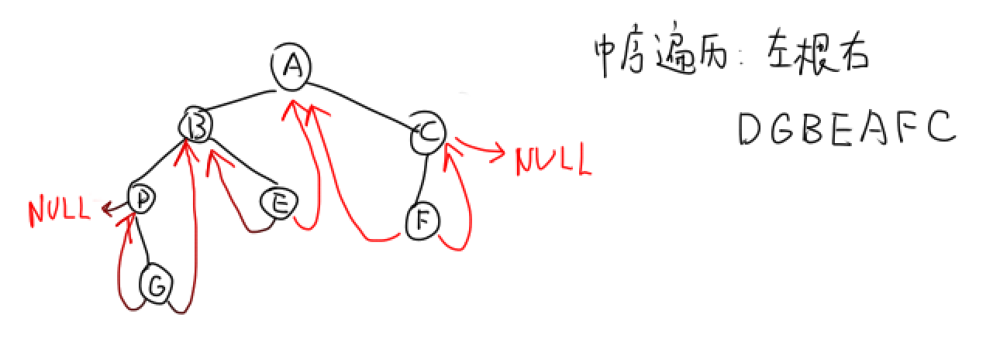
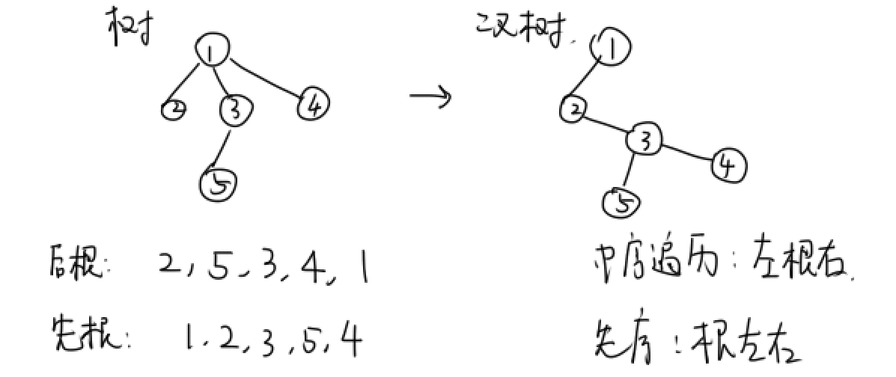
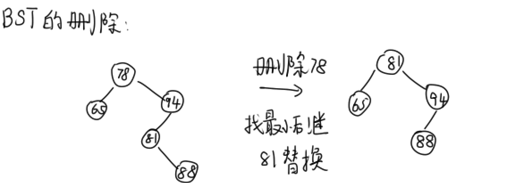
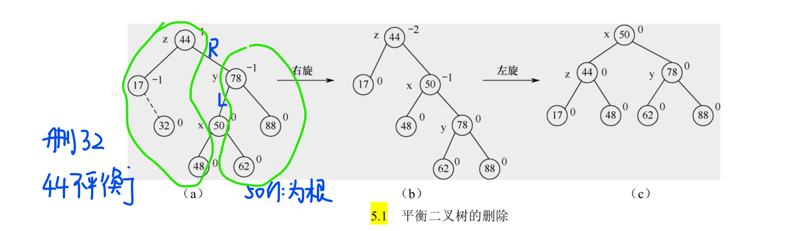
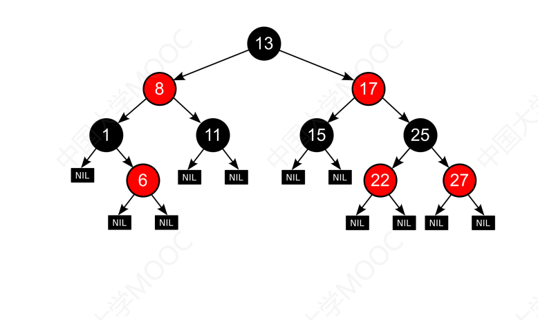
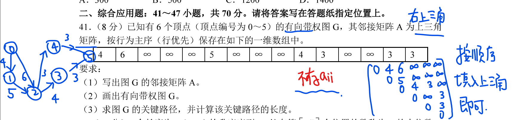
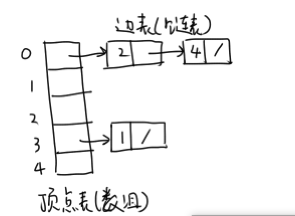
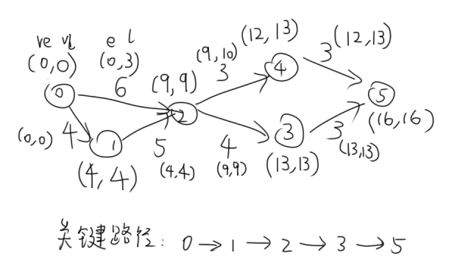
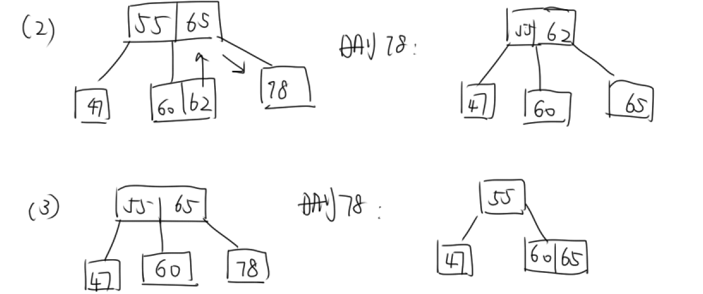
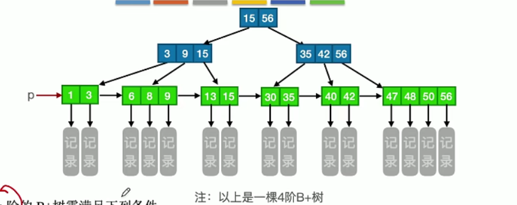

### 第一章——绪论

#### 1.1 数据结构基本概念

数据结构：相关的数据元素的集合

数据结构的三要素：逻辑结构，存储结构，数据的运算

##### 逻辑结构和存储结构

数据的逻辑结构：

- 线性：线性表
- 非线性：集合，树，图

存储结构（物理结构）：

- 顺序存储：逻辑上相邻的元素物理位置也相邻
- 链式存储
- 索引存储：有个索引表【关键字|地址】
- 散列存储

抽象数据类型：有逻辑，但不规定物理结构

#### 1.2 算法和算法评价

算法：对特定问题求解步骤的一种描述

##### 时间复杂度

问题规模：n

时间复杂度：T(n)的数量级O(f(n))，表示算法执行的最低上界

加法规则，乘法规则


求解时间复杂度：

```c
i=2;
while(i<n/3){
    i*=3;
}
```

设`i*=3`执行了k次，于是最终$n>2\cdot 3^k\ge n/3$，从而$k<\log_3{n/2}$

于是上面代码的时间复杂度是$O(\log_2n)$

##### 空间复杂度

算法原地工作：辅助空间为常量，O(1)

---

### 第二章——线性表

#### 2.1 线性表的定义和基本操作

线性表：具有相同数据类型的元素的有限序列

线性表是一种逻辑结构，可以采用顺序存储和链式存储的存储结构


#### 2.2 顺序表

线性表的顺序存储称为顺序表。优点：随机访问，存储密度大（无需指针域）；缺点：插入删除麻烦

可以静态分配，或通过指针动态分配一整块空间

操作：

- 插入：i位置及后面的后移，O(n)

- 删除：i后面的前移,O(n)

- 按值查找：O(n)


#### 2.3 链表

##### 1.单链表

线性表的链式存储称为单链表。非随机存取

每个节点一个数据域，一个next指针【链表头是最左边】

在单链表第一个节点前加一个**头结点**（可不填数据域），便于第一个位置上的操作

头指针指向第一个节点，若有头结点则指向头结点，保证非空


##### 2.单链表操作

头插法：在头结点后面添加。但是节点是倒序的

尾插法：增加一个尾指针，始终指向尾结点，尾结点后面添加

查找：逐个搜索

插入节点到第i个位置：找到第i-1个节点，再后插

> 2013.1
>
> 两个升序链表，长为m,n，合并成一个升序链表，采用尾插法。
>
> 合并成降序链表，采用头插法
>
> 最坏情况：先比较完长的，比较次数最多，时间复杂度O(max{m,n})
>
> 最好情况：先比较完短的，O(min{m,n})

###### 单链表的逆置

```cpp
Node* reverse(Node *head){
    Node *p=NULL,*q=head,*r;//pqr是连续的三个节点指针，不断平移
    while(q){//当q到达链表最末尾结束
        r=q->next;//r前移
        q->next=p;//关键步骤：q指向p
        p=q;//p前移
        q=r;//q前移
    }
    return p;//最终p是头结点
}
```

每进行一次循环，修改一次p和q的指针方向。O(n)时间，O(1)空间即可完成


##### 3.双向链表

next，prior两个指针指向后一个，前一个

插入，删除


##### 4.循环链表

（1）循环单链表：尾结点rear的next指向头结点head

判空条件：rear==head，开始只有一个头结点

判满条件：rear->next==head

如果经常在循环单链表表头和表尾添加元素，只需要尾指针，rear->next就是头指针，O(1)


用循环链表实现队列：在rear后面入队，将head出队

```c
//入队
if(rear->next==head){
    rear->next=newNode;
    rear=rear->next;
    rear->next=head;//rear前移
}
//出队
if(rear==head)return;
cout<<head->val<<endl;
head=head->next;//head前移
```


（2）循环双链表：头结点的prior指向尾结点。

判空条件：head->next==head->prior==head

如果要在表尾删除元素，循环双链表最好，方便找到倒数第二个节点


##### 5.静态链表

静态链表用数组表示，每个数组元素有data和next，next是链表下一个元素的数组下标

```c
SLinkList[0].next=2;//头结点
SLinkList[2].data='a';
SLinkList[2].next=1;
```

应用：操作系统的文件分配表FAT

---

### 第三章——栈、队列

栈和队列的逻辑结构都是线性表

<font color=ff6666>不管是顺序还是链式，记住插入位置：栈头队尾！因为总希望头部弹出</font>

#### 3.1 栈

##### 1.栈：只能在栈顶出入

卡特兰数：n个不同元素进栈，出栈的不同排列数
$$
\frac{C^n_{2n}}{n+1}
$$


##### 2.顺序栈：栈的顺序存储

初始化：stack.data[maxsize], stack.top=-1

入栈：data[top++]=x，在表头入栈

出栈：x=data[top--]，在表头出栈


共享栈：两个栈顶向共享空间的中间延伸，更有效利用空间

判满：top1-top0==1


##### 3.链栈：栈的链式存储

链栈没有头结点，只能在**表头**进行出入栈（如果在表尾的话，出栈时难以找到前一节点改next=NULL）

head指向第一个节点

```c
进栈：
p->next=head;
head=p;

出栈：
head=head->next;
```


#### 3.2 队列

##### 1.队列的基本概念

队列：只能在**队尾插入，队头删除**，先进先出

##### 2.队列的顺序存储，循环队列

（1）普通方法

头尾两个指针，front指向队头，**rear指向队尾元素的下一个位置**，初始front=rear=0

插入元素时，rear++；删除元素时，front++

但是rear==maxsize不能判满，因为front走过的地方没法再利用，从而引出循环队列


（2）循环队列

牺牲一个单元，专门用来区分队列空还是满。队尾永远指向空元素

队空条件：rear==front

队满条件：(rear+1)%maxsize==front

队列元素个数：(rear-front+size)%size

入队：data[rear]=x; rear=(rear+1)%size，尾++

出队：x=data[front]; front=(front+1)%size，头++

##### 3.队列的链式存储

链式队列在**表尾**入队

front指向队头结点，rear指向队尾节点（和顺序存储不同）

为了方便操作，通常设置头结点。头结点下一个节点出队

```c
入队：
rear->next=p;
rear=p;

出队：
front->next=front->next->next;
```


##### 4.双端队列

两端均可出入元素的队列

输入受限、输出受限的双端队列


#### 3.3 栈和队列的应用

##### 1.栈-括号匹配

遇到左括号入栈，遇到右括号看能不能和栈顶匹配

##### 2.栈-表达式求值

###### 中缀表达式转后缀

运算符优先级：加减，乘除，左括号

【符号栈，待处理序列，后缀表达式】

- 当待处理序列头部是数字时，加入后缀表达式

- 当待处理序列头部是符号时：

  - 若不是括号，当其优先级高于栈顶运算符时，入栈；**当前运算符优先级<=栈顶时，pop掉栈中<=当前运算符优先级的符号**，直到遇到左括号

  - 若是左括号，直接入栈
  - 若是右括号，栈不断pop，直到遇到左括号

计算符号栈最大元素数量：符号优先级从小到大的最长排列

```cpp
#include <iostream>
#include <stack>
#include <queue>
#include <map>
#include <cstring>
using namespace std;
//中缀表达式转后缀表达式
void printPostfixExpression(char *exp,int n){
	map<char,int>priority;//优先级越高的数值越大
	priority['+']=priority['-']=1;
	priority['*']=priority['/']=2;
	priority['(']=3;
	stack<char>signStack;//符号栈
	queue<char>postQueue;//输出
	for(int i=0;i<n;++i){
		if(exp[i]=='('){//左括号直接进栈
			signStack.push(exp[i]);
		}
		else if(exp[i]==')'){//遇到右括号，将左括号后面的全部弹出（左括号直接pop）
			char t;
			while(!signStack.empty()){
				t=signStack.top();
				signStack.pop();
				if(t=='('){
					break;
				}
				postQueue.push(t);
			}
		}
		else if(exp[i]=='+'||exp[i]=='-'||exp[i]=='*'||exp[i]=='/'){
			if(signStack.empty()){
				signStack.push(exp[i]);
			}
			else{
				char t=signStack.top();
				if(priority[exp[i]]>priority[t]){//当前优先级大于栈顶，直接进栈
					signStack.push(exp[i]);
				}
				else{//当前优先级<=栈顶
					while(!signStack.empty()){//弹栈，直到当前优先级>栈顶或遇到左括号
						t=signStack.top();
						if(priority[exp[i]]>priority[t]||t=='(')break;
						signStack.pop();
						postQueue.push(t);
					}
					signStack.push(exp[i]);
				}
			}
		}
		else{//数字
			postQueue.push(exp[i]);
		}
	}
	while(!signStack.empty()){
		char t=signStack.top();
		signStack.pop();
		postQueue.push(t);
	}
	while(!postQueue.empty()){
		char f=postQueue.front();
		cout<<f;
		postQueue.pop();
	}
	cout<<endl;
}
int main(){
	char exp[20];
	cin>>exp;//a/b+(c*d-e*f)/g
	printPostfixExpression(exp,strlen(exp));//ab/cd*ef*-g/+
}
```

###### 利用后缀表达式计算

顺序扫描每个元素，遇到操作数入栈，遇到运算符则弹出栈顶两个元素进行运算，结果入栈

##### 3.栈-递归

先调用的函数在栈底


函数的局部变量在系统栈中


##### 4.队列-层次遍历

```c
while(!q.empty()){
	t=q.pop();
	q.push(t.left);
	q.push(t.right);
}
```


##### 5.队列-计算机系统

io缓冲区

就绪队列

#### 3.4 特殊矩阵的压缩存储

数组的存储结构：

一维数组

二维数组：行优先存储

矩阵的压缩存储：值相同的元素只分配一个存储空间，0元素不分配空间

<font color=ff6666>解题方法：计算出A[i,j]前有多少个元素</font>

##### 1.对称矩阵

只存放下三角的元素，排成一行。i>=j

矩阵第k行有k个元素需要存储

若矩阵的下标从1开始，则元素aij在一维数组中下标为k=i(i-1)/2+j-1


##### 2.三角矩阵

下三角矩阵（对角线上方元素为一常量）：类似对称矩阵存法，最后再存一个常量。k=i(i-1)/2+j-1

上三角矩阵：k=(i-1)(2n-i+2)/2+j-i

##### 3.三对角矩阵

按行存储在一维数组中，a[i]\[j]对应一维数组下标k=2i+j-3

##### 4.稀疏矩阵存储

三元组（行，列，值），不能随机存取

十字链表法

### 第四章——串

#### 4.1 串的定义和实现

串：字符组成的有限序列

子串：主串中连续字符组成的子序列

\0不计入串长

串的存储：定长顺序存储，堆分配存储，块链存储

#### 4.2 串的模式匹配

##### 1.简单的模式匹配

模式匹配：子串的定位操作

暴力方法：从主串的第一个字符起，与模式的第一个字符比较，若相等则继续比较；否则从主串的下一个字符起，重新和模式比较。时间复杂度O(mn)


##### 2.KMP算法

思想：利用前后缀相同避免过度回溯，O(m+n)

前缀：除了最后一个字符外所有头部子串

设主串S，模式串T

（1）对模式串建立一个**部分匹配值**表(PM)，**PM值就是最长相等前后缀长度**。

设当前匹配到第j个字符时不匹配，子串向后移动位数=已匹配的字符数-最后一个匹配字符的部分匹配值
$$
move=j-1-PM[j-1]
$$
<font color=gree>可以理解为跳过肯定无法匹配的部分，直接让后缀覆盖原来前缀的位置，再开始新一轮的比较</font>

例：abcac的部分匹配值表是

|      | a    | b    | c    | a    | c    |
| ---- | ---- | ---- | ---- | ---- | ---- |
| PM   | 0    | 0    | 0    | 1    | 0    |


（2）为了简化代码，将PM表中每个字符的部分匹配值**右移一位**，得到next数组。

|      | a    | b    | c    | a    | c    |
| ---- | ---- | ---- | ---- | ---- | ---- |
| next | -1   | 0    | 0    | 0    | 1    |

设当前匹配到第j个字符时不匹配，子串向后移动位数move=已匹配的字符数(j-1)-next[j]。注：j从1开始
$$
move=j-1-next[j]
$$

（3）有时还可以进一步简化，将next数组每个元素+1，得到move=j-next[j]，即next[j]=j-move。

【408中next数组的标准构造方法】

|      | a    | b    | c    | a    | c    |
| ---- | ---- | ---- | ---- | ---- | ---- |
| next | 0    | 1    | 1    | 1    | 2    |

此时next数组有两种含义：

- **next[j]表示T[1:j-1]最长相等前后缀长度+1**
- next[j]表示在子串的第j个字符失配时，回到子串的next[j]处重新与主串当前位置S[i]进行比较


##### 3.KMP算法的优化

现在S[i]和T[j]失配，下面要将子串跳转到next[j]处。如果T[j]=T[next[j]]，那么必然T[next[j]]仍然失配，所以需要不断求next，直到和T[j]不同为止。所以考虑构造一个新的数组nextval进行优化

```python
nextval[1]=0
for j in range(2,len+1):
	if T[j]==T[next[j]]:
        nextval[j]=nextval[next[j]]
    else:
        nextval[j]=next[j]
```


### 第五章——树与二叉树

#### 5.1 树的基本概念

树是递归定义的：非空树只有一个根，其余节点分为多个互不相交的树。n个节点n-1条边

节点的度：该节点的孩子个数（图节点的度是相邻所有边数）

树的度：最大节点度数

重要性质

- **所有节点度数之和=边数=结点数-1**

- 设根为第一层，则度为m的树第i层至多有m^(i-1)个节点。

- 若已知h层m叉树，则至多有
  $$
  等比数列求和=\frac{a_1-a_nq}{1-q}=\frac{m^h-1}{m-1}
  $$
  个节点【二叉树最大结点数=$2^h-1$，三叉树$(3^h-1)/2$】

- n个节点m叉树，高度最少为$h=\lceil log_m[n(m-1)+1]\rceil$

$$
\frac{m^h-1}{m-1}\ge n
$$

#### 5.2 二叉树的概念

每个节点度数<=2，左右子树不可颠倒

二叉树和度为2的树有两个区别：1.二叉树可以为空，度为2的树至少3个节点；2.二叉树某节点即使只有一棵子树，左右也不可混淆，后者某节点只有一棵子树时可不区分左右

##### 特殊的二叉树

1.满二叉树：高h，有2^h-1个节点的二叉树，每层均满

2.完全二叉树：满二叉树的一部分，只缺右下角

- 完全二叉树最多只能有一个度为1的节点，即最后一个分支节点
- n个节点的完全二叉树，则最后一个分支节点的编号为$\lfloor n/2\rfloor$，叶节点个数为$n-\lfloor n/2\rfloor$

3.二叉排序树：每个节点关键字值左<根<右

4.平衡二叉树AVL：每个节点左右子树高度差<=1


##### 二叉树的性质

- 非空二叉树<font color=ff6666>**n_0=n_2+1**</font>
- 第i层最多2^(i-1)个节点
- 高为h，最多2^h-1个节点
- 对于完全二叉树，设根节点编号为1，则i节点的左右儿子为2i,2i+1，父节点为i/2向下取整
- n个节点的完全二叉树的高度为ceil(log2(n+1))（n<=2^h-1），或者写成floor(log2n)+1


##### 二叉树的存储结构

顺序存储：将完全二叉树存储在一维数组中，一般下标从1开始

链式存储：data,\*lchild,\*rchild

n个节点含有2n-(n-1)=n+1个空链域


#### 5.3 二叉树的遍历，线索二叉树

先序遍历：根左右 

中序遍历：左根右

后序遍历：左右根

模板

```cpp
#include<iostream>
using namespace std;
typedef struct node{
    char data;
    node *left,*right;
    node(char d){
        data=d;
        left=right=NULL;
    }
    node(char d,node *left,node *right){
        data=d;
        this->left=left;
        this->right=right;
    }

}btree;
void inorderTraversal(btree *root){
    if(root==NULL)return;
    inorderTraversal(root->left);
    cout<<root->data;
    inorderTraversal(root->right);
}
int main(){
    btree *node2=new btree('a');
    btree *node3=new btree('b');
    btree *node1=new btree('*',node2,node3);
    inorderTraversal(node1);
    
}
```


##### 遍历的非递归实现

先序、中序：一路向左，然后转向右子树

后序

层次遍历

##### 由遍历序列构造二叉树

必须知道**中序遍历**序列和其他一个序列

分治思想：在先序序列中找根，然后在中序序列中根据根进行划分，再对左右子树进行相同操作

例如先序序列是1234，中序序列是2341

于是树根是1，左子树是234；左子树的根是2，2的右子树是34；34的根是3，3的右子树是4


##### 线索二叉树

如果想获得二叉树任意节点在某种遍历序列中的前驱后继，就要建立线索二叉树

已知遍历序列，利用二叉树节点的左右空指针（称为线索，共2n-(n-1)=n+1个线索）来指向前驱后继，方便遍历二叉树

- 如果左儿子为空，让其指向前驱；右儿子为空，指向后继
- 对于遍历序列的首节点和尾结点，线索为NULL



用线索二叉树进行遍历

中序遍历：首先找到最左下节点（不一定是叶节点，可能是只有右子树的中间节点），然后不断访问后继，直到为空。如果一个节点有右儿子，那么后继是右子树的最左下节点

后序后继不能有效求解，后序遍历需要用栈，因为左右完了才能访问根

#### 5.4 树，森林

n个节点，m条边的森林有(n-1)-m+1=n-m棵树

##### 树的存储结构

父亲表示法：用一张表【节点|父亲】来表示树

孩子表示法：每个节点用一个链表连接所有孩子

孩子兄弟表示法：每个节点左指针指向第一个孩子，右指针指向下一个兄弟节点。方便将树转为二叉树


##### 树、森林、二叉树之间转换

树->二叉树：每个节点左指针指向第一个孩子，右指针指向下一个兄弟节点。**左孩子右兄弟**

森林->二叉树：先将每棵树转成二叉树，再将第二棵树的根作为第一棵树的根的右儿子

二叉树->森林：将根的右链断开，每棵二叉树再转成树（与树->二叉树互逆）

转换的目的：树、森林、二叉树知道一个就能确定另外两个，它们用二叉链表的表示是相同的，因此可以**用二叉链表来存储树和森林**。


树/森林转为二叉树，若一个节点没有右儿子，说明原来的树中没有右兄弟（即非终端节点的最后一个儿子）

特殊法：2011(6)

选择题一定要画图！！


##### 树和森林的遍历

树的先根遍历：每个节点先根后儿子。即树转为二叉树的先序遍历

树的后根遍历：树转为二叉树的**中序遍历**（注意不是后序遍历！），对树的每个节点先访问所有儿子才访问根



森林的先序遍历：对每棵树先根遍历

森林的后序遍历：对每棵树后根遍历


#### 5.4.4 并查集

将集合中各个元素分成多个互不相交的子集，并形成树

采用双亲表示法，即用数组S存储每个节点的父亲

##### 查，并

查：元素属于哪个集合；并：两个子集合并

find(x)：寻找所在集合

union(root1,root2)：将集合2合并入集合1

```c
//并查集初始化
void initial(int *S,int n){
    for(int i=0;i<n;++i){
        S[i]=-1;
    }
}
//查找祖先
int find(int *S,int x){
    while(S[x]>=0){
        x=S[x];
    }
    return x;
}
//合并子集
void unionSets(int *S,int root1,int root2){
    if(root1==root2)return;
    S[root2]=root1;
}
```

查的最坏情况的时间复杂度是O(n)

优化合并操作：

- 每次让更小的树合并到大树上，尽量使得高度不增加
- 对于每棵树的根i，用(-1)乘树的结点数作为S[i]的值，用来比较树的大小；对于非根节点，S[i]表示其父亲

```c
//优化后的合并操作
void unionSets2(int *S,int root1,int root2){
    if(root1==root2)return;
    if(S[root1]<S[root2]){//root2的节点数<root1，则把root2合并到root1上
        S[root2]=root1;
        S[root1]+=S[root2];//更新root1的结点数
    }
    else{
        S[root1]=root2;
        S[root2]+=S[root1];
    }
}
```

##### 并查集的应用

- 判断图的连通分量的数量：遍历所有边，相连的顶点放入一个集合
- 判断图是否有环：遍历所有边，发现已经在一个集合的顶点又有边，则有环
- Kruskal中判断每条边的两个顶点是否在一个集合中


#### 5.5 树与二叉树的应用

##### 1.二叉排序树 BST

所有节点左<根<右，中序遍历可得到升序序列

查找节点：从根向下dfs，小于当前节点则向左，反之向右

###### BST的插入

先查找该值，没有的话插入到该查找路径的**叶节点**的孩子。相同关键字插入顺序不同二叉排序树也不同

###### BST的删除

若该节点有两个儿子，则用其直接前驱或者直接后继（右子树的最左节点，不一定是叶节点！可能是只有右子树的分支节点）来替代



##### 2.平衡二叉树 AVL

左右子树高度差<=1即可，不要求是二叉排序树，左根右

但是一般情况下作为二叉排序树的加强版，要求是二叉排序树


###### AVL插入节点

首先按照二叉排序树的方法插入，找到插入路径上最先出现左右不平衡的节点A（查找节点：O(log2n)），根据插入节点的位置分成四种情况：

- LL：L变成根（右单旋转）

- RR：R变成根（左单旋转）

- LR：L的R变成根（先左后右双旋转）

- RL：R的L变成根（先右后左双旋转）


###### AVL删除节点

用二叉排序树的删除方法删除节点w

从节点w向上回溯，找到第一个不平衡的节点z44。

设y78是节点z高度最高的孩子节点，x5是y高度最高的孩子节点

- y是z的左儿子，x是y的左儿子：用LL方法来调整
- y是z的左儿子，x是y的右儿子：LR
- y是z的右儿子，x是y的右儿子：RR
- y是z的右儿子，x是y的左儿子：LL

若调整后子树高度-1，则还要检查z的父节点是否平衡



注：AVL树先删除一个节点再加入它，形成的新树可能会变化，也可能不变！


###### AVL树最少结点数问题

深度=高度-1（深度不包括根节点！）

设深度为h的AVL树的至少有n[h]个节点。n0=0, n1=1, n2=2，h树总可以由h-1树和h-2树和根节点拼成，则有递推式
$$
n[h]=n[h-1]+n[h-2]+1
$$

$$
若n[h]\le n\lt n[h+1]
$$
则说明n个节点的AVL树最大深度为h


##### 3.哈夫曼树

树的带权路径长度=sum(叶节点权值x路径长度)，带权路径长度最小的树称为哈夫曼树

构造：不断选取权值最小的子树作为新节点的左右子树（没规定谁左谁右），新节点的权值=两个权值之和。最后权值越小的节点路径越长

哈夫曼编码：左0右1，得到总长度最短的二进制前缀编码（没有编码是另一个编码的前缀）

哈夫曼树一定没有度为1的节点，n0+n2=n，又n0=n2+1，因此，叶节点数n0=(n+1)/2


#### 5.6 红黑树

AVL树的插入和删除需要频繁调整整体拓扑结构，代价较大。红黑树相当于把AVL树的平衡条件放宽

红黑树的性质：

- 红黑树是二叉排序树，左<根<右
- 在原始树的基础上，有n+1个NULL的黑色外部节点作为叶节点
- 根（失败节点）、叶节点都是黑色
- 红节点的父亲和儿子都是黑色
- 对于每个节点，从该节点出发（不包含该节点）到任意叶节点的路径上黑节点的数量相同，称为黑高bh



进阶性质

- 任意节点到叶节点的最大长度<=2*最短长度
- 红黑树任意节点左右子树高度差不超过一倍（把AVL树的平衡条件放宽）
- 红黑树从根到叶节点（不含叶节点）的任何一条简单路径上至少一半是黑节点。因此假设树高为h，则根的黑高最小为h/2。若想让节点最少，则所有路径都是黑节点，此时节点数=2^(h/2)-1。但由于树高为h，因此肯定要有红节点，所以树的真实节点数

$$
n\ge 2^{\frac{h}{2}}-1
$$
因此，n个节点的红黑树高度
$$
h\le 2\log_2(n+1)
$$

##### 红黑树的插入

每次只需判断不红红


##### 红黑树的删除

### 第六章——图

#### 6.1 图的基本概念

简单图：没有重边，没有自环

完全图：n(n-1)/2条边的简单图，节点两两直接相连

##### 连通问题

连通图：对于无向图

强连通图：对于有向图，任意两点可到达

连通分量：无向图的**极大连通子图**，需要包含所有边

生成树：包含原连通图所有顶点，边数n-1的连通子图，是**极小连通子图**


无向图顶点的度：相连边数。**节点度数之和=2边数**

有向图顶点的度：出度+入度。总出度=总入度

简单路径：顶点不重复的路径

简单回路：只有起点和终点相同的路径


目前题目中的无向图和有向图都是简单图，不包含自环和重边！

n个顶点的无向图，当给n-1顶点的完全图+1条边时，即有(n-1)(n-2)/2+1条边时，能确保是连通图

#### 6.2 图的存储和基本操作

##### 邻接矩阵

A\[i][j]=wij，无法到达用0或∞表示。邻接矩阵适合**稠密图**

无向图的邻接矩阵是对称矩阵，存储时只需存储右上三角矩阵的元素。

有向图也能用右上三角矩阵来存储，例如2011(41)



注：设邻接矩阵为A，则$A^m[i][j]$表示i到j长度为m的路径条数


##### 邻接表

适合稀疏图

邻接表分成两个部分：**顶点表**和**边表**。

- 顶点表：用一个数组存储各顶点的data和边表头指针
- 边表：为每个顶点建立一个链表，保存每条出边的顶点和next指针



邻接表判断两个节点之间有无边效率较低

若将n个顶点e条边的有向图采用邻接表存储，则拓扑排序的时间复杂度是O(n+e)：输出每个起点的同时删除它的出边，因此对顶点和边都要遍历


##### 十字链表：存有向图

弧节点【起点|终点|指向**终点相同**的下一个弧节点的指针|指向**起点相同**的下一个弧节点的指针】

##### 邻接多重表：存无向图

普通邻接表在删无向图的边时要删两次，效率低

弧节点【起点|指向**起点相同**的下一个弧节点的指针|终点|指向**终点相同**的下一个弧节点的指针】

注意这里的起点和终点不是有顺序的，即只要一条边两端就可以互为起点终点

邻接多重表相比邻接表的差别仅在于同一条边只有一个节点表示


图的基本操作


#### 6.3 图的遍历

##### BFS：广度优先搜索

需要一个数组记录已经访问过的节点

需要一个队列，每次将队首元素的未访问过的邻居加入队列。和二叉树的层序遍历完全一致

bfs可求解单源最短路


##### DFS：深度优先搜索

不断搜索未访问过的邻居，直到无法访问，退回前一节点

需要借助递归工作栈

若题目只给一张图，则遍历邻居节点的顺序没有要求，但若给邻接表就有唯一顺序了

```c
void dfs(Node *root){
    if(root!=null){
        visit(root);
        dfs(root->ls);
        dfs(root->rs);
    }
}
```

非递归实现：以先序遍历为例

```c
vector<int> preorderTraversal(TreeNode* root) {
    vector<int>v;
    if(root==NULL)return v;
    TreeNode *p=root;
    stack<TreeNode*>s;
    s.push(p);
    while(!s.empty()){
        p=s.top();
        v.push_back(p->val);
        s.pop();
        if(p->right){
            s.push(p->right);
        }
        if(p->left){
            s.push(p->left);
        }
    }
    return v;
}
```


##### 复杂度分析

空间复杂度：最坏情况**队列/栈节点满**，复杂度O(V)

时间复杂度：

- 若图采用邻接矩阵存储，复杂度O(V^2)，广度优先树和深度优先树唯一

- 采用邻接表存储，复杂度O(V+E)，广度优先树和深度优先树不唯一


#### 6.4 图的应用

##### 1.最小生成树 MST

权值最小的生成树

Prim：不断找距**离当前集合最近的节点**加入集合，时间复杂度O(V^2)，适合稠密图

Kruskal：不断寻找最短的边，保证边的两端在不同的连通分量中（并查集），直到n-1条边。采用最小堆O(ElogE)，适合稀疏图


##### 2.最短路径

Dijkstra求单源最短路径：不断寻找集合外**离源点最近的点**加入集合，并更新该点邻居到源点的距离，共n-1次。有负边时不适用.O(V^2)

Floyd求各顶点间最短路：三重循环O(V^3)，用每个顶点来更新i到j的距离
$$
A[i][j]=\min\{A[i][j],A[i][k]+A[k][j]\};
$$


##### 3.有向无环图：DAG

对于表达式树，使用DAG可以共享相同子式，节省存储空间

##### 4.拓扑排序：AOV网

AOV网：顶点表示活动的网络

有向边<vi,vj>表示i活动优先于j活动

拓扑排序是对有向无环图的一种遍历，使得满足活动优先关系

求拓扑排序序列：先找一个没有入边的顶点，每次删除顶点以及它的出边，迭代直到图为空，或者不存在无前驱节点（有环）。O(V+E)

使用dfs也可实现

##### 5.关键路径，AOE网

AOE网：用**边表示活动**，边权表示活动的开销，**顶点表示事件（一个状态）**

关键路径：从源点到汇点**最大长度的路径**，整个工程的最短时间取决于关键路径的长度

每个事件有early,late

- 最早发生时间ve=max{前面事件的ve+路径w}
- 最迟发生时间vl=min{后面事件的vl-路径w}

求关键路径的方法

- 先从源点出发，令ve(源点)=0，向后求出每个节点的ve
- 从汇点出发，令汇点vl=ve，向前求出每个节点的vl
- 计算每条弧<i,j>的最早开始时间e=ve(i)
- 计算每条弧<i,j>的最晚开始时间l=vl(j)-w
- 计算每条弧的**时间余量**d=l-e，若为0，则为**关键活动**，**所有d=0的弧构成关键路径**



注：

（1）时间余量=0表明该活动不可以拖延，为了缩短工期，可以适当减小关键活动的边权，但缩减太多会使其成为非关键活动；而延长关键路径的时间，则整个工程也随之延长这么多

（2）关键路径是最长的路径，可能不唯一，<font color=ff6666>只有将所有关键路径都缩短才能缩短工期</font>

（3）求关键路径以拓扑排序为基础，一开始需要拓扑排序

---

### 第七章——查找

#### 7.1 查找的基本概念

关键字：唯一表示数据元素的数据项的值

平均查找长度ASL：sum{比较次数}/n

#### 7.2 顺序查找，折半查找

##### 一般线性表的顺序查找

从后向前找第i个元素，比较次数为n-i+1，**ASL成功=(n+1)/2**

将a[0]作为哨兵，等于要查找的关键字，防止数组越界


##### 有序表的顺序查找

只要a[i]<key, a[i+1]>key，说明查找失败，避免了失败时和全体都比较一次

顺序查找判定树：n+1个失败节点

注：不管有序还是无序，查找成功的ASL都相同；查找失败的ASL，有序要小


##### 折半查找（二分）

先和中间比较，若key>mid，在后半部分查找；否则左半部分查找。O(logn)

```c
int twoSplitSearch(int *a,int left,int right,int x){
    while(left<=right){
        int mid=(left+right)/2;
        if(x==a[mid]){
            return mid;//index
        }
        else if(x<a[mid]){
            right=mid-1;
        }
        else{
            left=mid+1;
        }
    }
    cout<<left<<","<<right<<endl;
    return right;//如果没搜到，最终a[right]会比x小，a[left]比x大 
}
```


折半查找的判定树是**平衡二叉树**，也是**二叉排序树**（必须满足左<根<右）。

为了二分，线性表必须随机存取，因此**必须采用顺序存储**，关键字有序排列（从小到大，从大到小都可）

注意：求mid=(l+r)/2采用向下取整和向上取整都可以，但一棵树只能使用一种方法

对折半查找成功和失败的ASL的计算：（例P276(14)）

- **先画出判定树**，判定树高度为$\lfloor log_2n\rfloor+1$
- 然后对每一层加权计算查找长度，相加即可

例：元素1~12使用折半查找的判定树，空指针处代表查找失败：


##### 分块查找

将查找表分成若干块，块内无序，块间有序

先在索引表中二分，找到块，然后块内顺序查找

最理想块长：sqrt(n)，见P277(17)


#### 7.3 B树，B+树

##### 1.B树

###### B树的性质

- m叉B树，每个节点最多m个儿子（m-1个关键字）

- 根节点至少两个儿子（可以只有一个关键字），除根外每个中间节点的关键字个数至少为
$\lceil{m/2}\rceil-1$

- 因此，m叉B树除根外每个中间节点关键字个数范围是
  $$
  [\lceil{m/2}\rceil-1, m-1]
  $$
  
- **所有节点的平衡因子=0，绝对平衡**

- 每个节点中关键字从小到大排列，每个关键字都带有记录

- 注意：m叉b树不需要至少一个节点有m个儿子，只需满足每个节点关键字个数满足[[m/2]-1, m-1]即可


区分B树的终端节点和叶节点：对于原B树，给**终端节点**下面再增加一层**失败节点**（叶节点，实际为NULL，不带任何信息，不包含在b树中），<font color=ff6666>n个关键字的B树有n+1个失败节点，对应n+1个查找失败的区间。</font>下图没有画叶节点，最后一层是终端节点！


###### B树的最大/最小高度、关键字个数、结点数问题

（1）关键字个数n最多情况：已知高度h，则当每个节点都m叉时，关键字个数=失败节点个数-1=m^h-1。反过来可求最小高度

（2）关键字个数n最少情况：根2叉，除了根以外每个节点都$\lceil{m/2}\rceil$叉时，每层关键字个数分别为
$$
1,2,2\lceil{m/2}\rceil,2\lceil{m/2}\rceil^2...
$$
第h+1层（失败节点）为$2\lceil{m/2}\rceil^{h-1}$。因为**共n个关键字，肯定有n+1个失败节点**，因此
$$
n=2\lceil{m/2}\rceil^{h-1}-1
$$
反过来可求最大高度
$$
h=log_{\lceil{m/2}\rceil}\frac{n+1}{2}+1
$$
（3）已知高度h的m叉树，当为满$\lceil{m/2}\rceil$叉树时节点个数最少（根节点是二叉）；当满m叉树时节点个数最多，为(m^h-1)/(m-1)


###### B树的查找

分为在磁盘上查找节点读入内存，和在内存中查找关键字

先自顶向下多路分支找到节点，节点内部使用顺序查找/二分


###### B树的插入

- 先自顶向下找到最下方的节点，若插入关键字后仍满足$[\lceil{m/2}\rceil-1, m-1]$，直接插入
- 如果插入关键字后>m-1，需要**分裂**：
  - 先将关键字插入节点
  - <font color=ff6666>m/2位置的关键字mid上升到父节点</font>
  - <font color=ff6666>mid左右的关键字分裂成父节点的两个儿子</font>
  - 若该操作导致父节点关键字超标，则向上继续该过程


###### B树关键字的删除

需要使删除后节点的关键字数>=$\lceil{m/2}\rceil-1$

- 关键字位于非终端节点（不是最后一层）：用前驱/后继代替，转为删除终端节点

- 关键字位于终端节点：
  - 若删之前关键字数>$\lceil{m/2}\rceil-1$（够删）：直接删除
  - 若删之前关键字数=$\lceil{m/2}\rceil-1$（不够删）：
    - 该节点左右相邻兄弟关键字数>=$\lceil{m/2}\rceil$（兄弟够借），则从兄弟借一个关键字给父节点，再从父节点下来一个给源节点（2）
    - 该节点左右相邻兄弟关键字数=$\lceil{m/2}\rceil-1$（兄弟不够借），则父节点下来一个关键字，和源节点、兄弟节点合并（3）



##### 2.B+树

B+树一个节点有多少关键字就有多少子树

m阶B+树每个节点的关键字个数为$[\lceil m/2\rceil,m]$，根节点至少两个子树

每个父节点的关键字指向的子节点里的关键字都小于该父节点



###### B+树的结构性质

- 每个分支节点包含它各个子节点关键字的最大值
- 节点中关键字从大到小排列，每个叶节点前后相连
- 只有叶节点上有指向记录的指针，叶节点包含全部关键字。

###### B+树的查找

- B+树有两种查找方法：从最左的叶节点顺序查找（b树不支持顺序查找）；从根向下多路查找（分块查找）
- B树的查找可以停在中间层，B+树一定要查找到最下层

###### B+树的插入

首先自顶向下找到插入位置，如果关键字数超标，则以中间关键字为中枢分裂，中间关键字上升到父节点。父节点可能超标，再向上重复相同过程即可

###### 磁盘相关

B+树主要用来构建数据库的索引，每访问一个节点就得读一次磁盘，所以一个节点里有多个关键字就能提高效率

- B+树阶越大，树越矮，读磁盘次数越少
- B+树中间节点不包含记录的磁盘地址，使得一个磁盘块可以包含更多关键字。


#### 7.4 散列表

散列函数：Hash(key)=addr

散列表：建立关键字和存储地址之间的映射关系，关键字通过散列函数hash得到地址

同义词：发生冲突的不同关键字

##### 常用的散列函数

- 直接定址法：关键字的线性函数值
- 除留余数法：取质数p，hash(key)=key%p
- 数字分析法：关键字是r进制数，选其中若干位作为散列地址
- 平方取中法：关键字^2的中间几位


##### 冲突处理方法

（1）开放定址法

di是增量序列，m为散列表表长
$$
地址=(Hash(key)+d_i)\%m
$$

- **线性探测法**：di=0,1,2...m-1，若冲突不断找下一个位置，会造成大量元素在相邻位置堆积
- 平方探测法：di=0,1,-1,4,-4...，表长m是4k+3的素数
- 伪随机序列法：di为伪随机数

开放定址法不能随便删除已有元素，否则查找元素时无法判定是否存在，需要标记

（2）链地址法：把所有同义词串在一个链表

（3）再散列法：使用两个散列函数，一个冲突换另一个


##### 散列查找性能分析

关键字，比较次数，平均查找长度ASL

**装填因子**α=表的记录数n/表长m，表示散列表的装满程度，越满越容易冲突；平均查找长度只与α有关，与mn无直接关系

查找成功的平均查找长度：对每个记录求比较次数，取平均

**查找失败的平均查找长度**：

- 采用线性探测法，查找时按顺序一个个比较，一旦发现**空位置**，说明查找失败。
- 因此要计算ASL(失败)，则对所有**有效地址**（不是对关键字，而是查找失败时第一次访问的位置）求出查找失败时的比较次数（NULL也需要一次比较）的平均值

例：2010(41)

T失败只对0到6的位置计算，但是不截掉6后面的位置。例如查找6位置失败时，比较4次（30,18,9,空）


---

### 第八章——排序

#### 8.1 排序的基本概念

稳定性：关键字相同的元素排序后相对位置不变

内部排序：只在内存中

外部排序：元素无法同时进入内存


#### 8.2 插入排序

##### 1.直接插入排序：在前面有序表插入

每趟排序时，元素a[i]之前的a[0,i-1]已经排好序，从位置i-1向前找到正确位置插入。固定n-1趟排序

```c
void insertSort(int *a,int n){
	int i=0,j=0;
    for(i=1;i<n;++i){
        int t=a[i];
        for(j=i-1;j>=0;--j){//从a[i-1]不断向前找插入位置，一旦当前元素大于等于前面的元素就停止
            if(a[j]>t){
				a[j+1]=a[j];//大的元素后移
			}
			else break;//直到找到不大于t的，退出循环 
        }
        a[j+1]=t;
    }
}
int main(){
	int a[]={49,38,65,97,76,13,27,49};
    int n=8;
    insertSort(a,n);
    for(int i=0;i<n;++i)cout<<a[i]<<' ';
	
}
```

空间O(1)，时间O(n^2)，稳定

最好情况：顺序，O(n)

最坏情况：倒序，比较次数为sum(i-1)，O(n^2)

适用于顺序存储和链式存储的线性表


##### 2.折半插入排序

先用二分找到插入位置，然后将后面的元素集体后移

比较次数减少，但后移次数没改变，时间复杂度仍为O(n^2)


##### 3.希尔排序

- 设步长为d1=n/2，将元素分为d1组，组内直接插入排序

- 然后取第二个步长d2=d1/2

- 重复直到dt=1，整体进行一趟插入排序

希尔排序**不稳定**，因为相同关键字可能分到不同组

仅适用于顺序存储

可以使用并行技术

空间O(1)，时间小于O(n^2)

#### 8.3 交换排序

##### 1.冒泡排序：相邻比较

从后向前，两两比较**相邻**元素，前大于后则交换，一趟之后最小元素交换到最前面

如果从后向前一趟没有发生交换，说明已排好序

```c
void BubbleSort(int *a,int n){
    for(int i=0;i<n;++i){//i是最前元素
        bool swaped=false;
        for(int j=n-1;j>i;--j){//每趟把最小元素放到i处
            if(a[j]<a[j-1]){
                swap(a[j],a[j-1]);
                swaped=true;
            }
        }
        if(swaped==false){
            break;
        }
    }
}
```

最好情况：顺序，直接跳出循环，O(n)

平均/最坏：逆序，O(n^2)

稳定，因为a[j]=a[j-1]时选择不交换


##### 2.快速排序：选枢轴

快排是目前最好的内部排序方法

- 每趟排序中，任取一个元素t作为枢轴

- 指针j从后向前找比t**小**的元素交换到i的位置，指针i从前向后找**大**于t的元素交换到j的位置，不断重复
- 直到i=j，将枢轴元素放在i处，使左侧均小于t，右侧均大于t
- 再对此时i左右进行分治

```c
void quickSort(int *a,int low,int high){
    int i=low,j=high;
    if(i>=j)return;
    int t=a[i];//枢轴
    while(i<j){
        while(i<j&&a[j]>=t)j--;
        a[i]=a[j];//比枢轴小的放到前面
        while(i<j&&a[i]<=t)i++;
        a[j]=a[i];//比枢轴大的放到后面
    }
    a[i]=t;//枢轴放到正确
    QuickSort(a,low,i-1);
    QuickSort(a,i+1,high);
}
```

空间：需要**递归栈**，最好情况栈的深度$O(\log_2n)$，最坏情况O(n)

时间：最坏情况是每次划分极不平衡，两边为0和N-1个元素，O(n^2)。平均为O(nlogn)

不稳定，如果右侧有两个相同元素大于t，则先交换后面的，造成不稳定

**快排第i趟后，至少有i个元素在最终位置上**

注：408中的“一趟”指的是对所有元素进行一遍处理，即第一趟将枢轴归位，第二趟将枢轴左右区间各归位一个元素。从而两趟确定了三个元素的最终位置（2019（10））


#### 8.4 选择排序

##### 1.简单选择排序：从后面找最小元素

在i后面的序列中找到最小的且小于a[i]的元素，放在第i个位置

```c
void selectSort(int *a,int n){
    for(int i=0;i<n-1;++i){
        int min_index=i;
        for(int j=i+1;j<n;++j){
            if(a[j]<a[min_index]){//比较
                min_index=j;
            }
        }
        if(i!=min_index){
            swap(a[i],a[min_index]);//移动
        }
    }
}
```

空间：O(1)

时间：元素比较O(n^2)，移动O(n)，总O(n^2)

不稳定，例如{2,2,1}，第一个2先和1交换


##### 2.堆排序：弹出最值

堆是一棵完全二叉树，用一维数组存储（注意为了方便不使用a[0]）

满足任意儿子<父亲的堆称为大根堆

- 构造初始堆：开始先按照数组顺序构建一棵完全二叉树。
- 调整：

  - 从序号为$\lfloor n/2\rfloor$的中间节点（**最后一个分支节点**）开始，按序号从大到小的顺序选定每个分支节点进行检查<font color=ff6666>【每一趟保证该以分支节点为根的子树是最大堆】</font>

  - 如果该分支节点的值<儿子，则更大的儿子和根交换
  - 上述操作可能导致子树不是堆，此时需要将儿子不断下坠（可能有多步）
- pop最大值

  - 构造完大根堆后，将最大的堆顶元素和堆底元素交换（该元素从此不属于堆）
  - **重新从上到下进行调整**（下坠）
  - 重复弹出n-1次最大值，最终得到一个升序的数组
- 堆的插入操作：先将新节点放到堆底，再向上调整


例：7个元素，7/2=3，于是先交换a[3]=5和右儿子7


```c
void HeapAdjust(int *a,int k,int n){//调整根为k的树，使元素a[k]到达正确位置
    int t=a[k];
    for(int i=2*k;i<=n;i*=2){
        if(i<n&&a[i]<a[i+1]){
            i++;
        }
        if(t>=a[i])break;
        else{
            a[k]=a[i];//将更大的儿子上升
            k=i;//下坠，因为替换可能使子树不满足大根堆性质，需要继续调整
        }
    }
    a[k]=t;//将t放到最终位置
}
void BuildMaxHeap(int *a,int n){//根据原始一维数组构建最大堆
    for(int i=n/2;i>0;--i){//i从最大分支节点n/2开始调整
        HeapAdjust(a,i,n);
    }
}

void HeapSort(int *a,int n){//注意数组a[0]为空，便于2*i找左儿子
    BuildMaxHeap(a,n);
    for(int i=n;i>1;--i){
        swap(a[1],a[i]);//将堆顶元素（最大元素）和堆底元素交换
        HeapAdjust(a,1,i-1);//将剩下i-1个元素调整成最大堆
    }
}
int main(){
	int a[]={0,5,2,16,12,28,60,32,72};
    int i=0,j=0;
    int n=8;
    HeapSort(a,n);
    
    for(i=0;i<=n;++i){
        cout<<a[i]<<endl;
    }
}
```

空间：O(1)

时间：建堆时间O(n)，n-1次向下调整，**每次调整的复杂度为O(h)=O(logn)**，最好最坏平均复杂度均为O(nlogn)

**不稳定**，例如{1,2‘,2}，首先构造最大堆{2’,2,1}，弹出并调整为{2,1,2‘}，弹出并调整为{1,2,2’}，与原始不同

堆排序不能使用并行技术

#### 8.5 归并排序，基数排序

##### 归并排序：两有序数组合并

每次将两个排好序的数组合成一个，不断比较最小元素

```c
//将a[low,mid]和a[mid+1,high]归并
void Merge(int *a,int low,int mid,int high){
    int i,j,k;
    int b[200];
    for(i=low;i<=high;++i){//利用b作为辅助空间
        b[i]=a[i];
    }
    for(i=low,j=mid+1,k=i;i<=mid&&j<=high;++k){
        if(b[i]<b[j]){//不断将较小元素复制过来
            a[k]=b[i++];
        }
        else{
            a[k]=b[j++];
        }
    }
    while(i<=mid){//将剩余的复制过来
        a[k++]=b[i++];
    }
    while(j<=mid){
        a[k++]=b[j++];
    }
}
void MergeSort(int *a,int low,int high){
    if(low<high){
        int mid=(low+high)>>1;
        MergeSort(a,low,mid);//先将左右分别排好序
        MergeSort(a,mid+1,high);
        Merge(a,low,mid,high);//二路归并
    }
}
```

空间：辅助数组O(n)

时间：每趟归并O(n)，归并趟数O(logn)，总时间O(nlogn)

稳定，归并不改变相对次序

归并排序的趟数问题：若第一趟是两两归并，则第一趟后数组每组两个元素是有序的；第二趟则是每组四个元素有序（每组包含上一趟的两个组）例：P343(10)

可并行

##### 基数排序：个位十位百位

基于关键字各位大小排序。思想：最不重要的（个位）先排序

最低位优先法：

- 基数r=10，构造10个链队列，将所有个位数相同的进入一个队列。一趟后收集，即将所有链表输出，排成一队，**队中个位数最小的在最前**
- 再根据十位数，进行相同操作，收集，**队中十位数最小的在最前**
- 根据百位数，进行相同操作，收集，**队中百位数最小的在最前**

空间：O(r)

时间：设d趟排序，构造队列O(r)，收集O(n)，总复杂度O(d(r+n))

稳定，因为收集时不改变相对顺序

适合关键字位数少，可以分解的

#### 8.6 内部排序算法比较

内部排序：内存中进行排序

- 比较次数与序列初始状态无关：简单选择排序
- 排序趟数与序列初始状态无关：直接插入排序（n-1趟），简单选择排序（n-1），基数排序
- 移动次数与序列初始状态无关：基数排序
- 每趟排序能确定一个元素的最终位置：快排，选择排序，堆排序
- 适合并行的排序：快排，归并，希尔

最好的内部排序：快速排序

最好的外部排序：归并排序

时间复杂度为O(nlogn)：快排，归并，堆排序

最好情况时间为O(n)：插入排序，冒泡排序


空间复杂度不是O(1)的：快速排序需要递归栈，平均O(logn)，最坏O(n)；归并O(n)

稳定的排序：直接插入排序，冒泡排序，归并排序，基数排序

不稳定：简单选择，希尔，快排，堆

#### 8.7 外部排序

##### 多路归并，外部排序

外部排序：待排序的文件较大，无法全部放入内存，需把数据部分调入内存排序，需要进行多次内外存之间交换。最常用的算法是多路归并排序

将文件分成若干子文件，每个子文件进入内存使用内部排序，重新写回外存；对这些**内部有序的子文件（称为归并段）**进行两两归并，再对结果两两归并。。。得到最终的有序文件

例如：一个文件包含16个磁盘块

- 分成8个子文件，每个子文件**内部排序**使得内部的块有序，得到8个归并段R1~R8（每个归并段2块），读入内存
- 两两归并：文件R1的每块进入输入缓冲区1，R2的每块进入输入缓冲区2，<font color=ff6666>归并后放入**输出缓冲区**（内存中），输出缓冲区满则按顺序输出到输出归并段R1'（磁盘上），再清空输出缓冲区</font>
- R1'和R2'归并得到R1''，R3'和R4'归并得到R2''
- R1''和R2''归并得到有序文件
- 开始的内部排序需要16次读16次写，外部排序每趟（归并树每层）需要16次读16次写，共需3趟，故一共128次读写。

二路归并的**归并树**：


设r为归并段数，k路归并，则归并趟数=树高=$\lceil\log_kr\rceil$

要想减少io次数，提高外部排序速度有两种方法：

- 减少归并段个数。
- 增大归并路数可以使得归并树高度下降，归并趟数减小


##### 败者树

增加归并路数能减小io次数，但会增加内部排序时间。败者树能够**更快找到k个归并段中记录的最小值**

设归并路数为k，也就是说一趟归并的每一步都需要在k个元素中找到最小值，传统方法需要比较k-1次才能找到最小值，设k路一共有n个元素，则一趟归并需要比较(n-1)(k-1)次。而败者树可以减小找到k个中的最小值的比较次数

> 例如归并段1={6,15,25}，归并段2={12,37,48}，归并段3={10,15,16}，归并段4={9,18,20}，一趟归并指的是归并段1和2完全合并，而一趟中的一步指的是6,12,10,9中找到最小值的一次操作

败者树是一棵**完全二叉树**，r个叶节点对应r个归并段当前需要比较的记录（块），两个节点相比较，大的为败者，小的为胜者，父节点填入败者的归并段号，胜者不断向上比较，即可得到最小值

k路归并的败者树深度为$\lceil\log_2k\rceil$，因此最多只需比较$\lceil\log_2k\rceil$次就能找到k个中的最小值，于是每趟归并共需要$(n-1)\lceil\log_2k\rceil$次比较

因为r个归并段一共$\lceil\log_kr\rceil$趟归并，所以总的比较次数为$(n-1)\lceil\log_2k\rceil\lceil\log_kr\rceil=(n-1)\lceil log_2r\rceil$，发现与k无关了


##### 置换-选择排序

**增大每个归并段内的块数**，减少初始归并段个数，减小io次数

- 首先设立一个内存工作区，假设可容纳3块
- 不断将输入文件的块送到工作区中，一旦工作区满就把工作区中关键字最小的块送到输出文件中（选择过程采用败者树实现），使得输出文件是一个递增序列
- 如果工作区中关键字最小的块<输出文件的末尾，则固定这块不动，继续检查第二小的块
- 如果工作区所有块都<输出文件的末尾，则目前的输出文件就是一个归并段
- 开启新的归并段

这种方法能够增大每个归并段的块数


##### 最佳归并树：k叉哈夫曼树

为了减少io次数，希望块数越大的归并段io次数越少，因此可以采用**哈夫曼树**的思想，构造一棵最佳归并树。

归并树的**带权路径长度WSL**=sum{每个叶节点的权重*叶节点到根的边数}。因为每条边代表一对io，所以**总io次数=2WSL**

k路归并的最佳归并树必须是**严格k叉树**，即只能有度为0或k的节点，其中一个叶节点就是一个归并段

现在设共有n0个归并段，则有两个限制条件：

$$
点:n_0+n_k=n\\

边:kn_k=n-1
$$
联立后得
$$
n_k=\frac{n_0-1}{k-1}
$$
这表明要想满足严格k叉树，**n0-1必须是k-1的整数倍**。如果目前归并段不满足此要求，则需要增加长度为0的**虚段**，凑足n0

一个实例：


### 总结

链表实现栈和队列，插入元素位置：栈头队尾，栈无头结点


各种树的插入方法

二叉排序树：从上向下插入叶节点

AVL树：从上向下插入叶节点，再四种情况调整

红黑树

B树：先自顶向下找到插入位置，若关键字超标则分裂，中间元素加入父节点

B+树：

最大堆：先插入堆底，再从序号为$\lfloor n/2\rfloor$的中间节点（**最后一个分支节点**）开始按序号从大到小的顺序进行调整
