### 第一章——计算机系统概述

#### 1.1 计算机发展历程

计算机采用的技术

- 电子管
- 晶体管：受电信号控制的开关
- 中小规模集成电路
- 超大规模集成电路：数百万晶体管组成的电路

机器字长：ALU每次能处理的数据位数，也称为CPU位数

存储字长：内存每个存储单位的长度

指令字长：指令的长度，不固定，但一般是存储字长的整数倍

- ALU位数，通用寄存器位数一定等于机器字长
- 指令寄存器宽度不一定是机器字长，因为指令长度不一定定长，有单字、双字等，IR的宽度是最长指令的长度
- 浮点寄存器位数=80位=long double，大于机器字长

单字长：2B，双字长：4B

操作系统的位数=其所依赖的**指令集的位数**≤CPU位数


#### 1.2 计算机系统层次结构

##### 1.计算机硬件组成

早期冯诺依曼机以运算器为中心，提出存储程序概念（指令放在主存中）

现在以存储器为中心，使io操作绕过cpu，直接和内存交互

计算机组成部件：输入设备，输出设备，运算器，存储器，控制器

- 存储器分为主存和辅存，主存包括存储体、MAR、MDR，但现在MAR、MDR、cache在CPU中

- 运算器：包括ALU，累加器ACC，乘商寄存器MQ，操作数寄存器X，变址寄存器IX，基址寄存器BR等

- 控制器：PC、指令寄存器IR、控制单元CU


运算器和控制器组成CPU

存取速度：寄存器>cache>内存

计算机采用二进制的原因：二进制运算规则简单；制造双稳态的物理器件容易；便于用逻辑门电路实现算术运算

程序员可以看到的寄存器（CPU运算器内）：状态寄存器，通用寄存器；

看不到的（控制器内）：CPU内部的寄存器，包括IR,MAR,MDR


##### 2.从源程序.c到可执行文件的四个阶段

- 预处理：插入头文件，处理宏定义，生成.i
- 编译：生成汇编程序.s
- 汇编：生成机器语言，打包成可重定位目标文件.o
- 链接：将多个可重定位目标文件和标准库函数连接起来，得到可执行文件，放在磁盘上

翻译程序：把源程序转换成机器语言程序的软件，**翻译程序包括编译程序和解释程序**

编译程序：把源程序一次全部翻译成汇编语言，运行速度快

解释程序：一行行翻译，边翻译边执行，速度慢


##### 3.指令的执行过程

以取数指令为例

取指：首先PC取出下一条指令地址，送到MAR，再送到主存根据地址取出指令，指令放入MDR，指令放入IR，PC++

指令译码：CU根据指令的op码判断取数指令，并从指令中得到操作数地址

执行：操作数地址送到MAR，送到主存取数，放入MDR，再送入运算器ACC运算


CPU和主存之间有一组总线：地址线、控制线、信号线

CPU区分指令和数据的方法是**指令周期的不同阶段**，取指周期还是间址周期（取地址）、执行周期（取数）


##### 4.计算机系统的层次结构

裸机：纯硬件

- 传统机器语言层
- 微程序机器层（硬件直接执行微指令）

虚拟机：

- 应用层
- 高级语言层
- 汇编语言层
- 操作系统层

上层是下层的功能扩展，下层是上层的基础，可以只有下层没有上层


#### 1.3 计算机性能指标

机器字长：计算机进行一次整数运算能处理的二进制数据的位数，一般等于cpu内部寄存器大小。机器字长决定计算精度

数据通路带宽（数据字长）：**cpu外部**数据总线宽度，一次能并行传输数据的位数

主存容量：字数x字长，MAR的位数限制了可寻址范围的最大值

吞吐量：单位时间处理请求数


时钟周期：CPU最小的时间单位

<font color=ff6666>**CPU主频：1s有多少时钟周期**</font>。一条指令的执行时间=周期数/主频

CPI：clockcycle per instruction，**每条指令多少时钟周期**，时钟周期数=指令条数·CPI

CPU执行时间=周期数/主频，简称CPU时间，为只在CPU上花费的时间，包括用户CPU时间和系统CPU时间

主频高不一定更快，因为指令集也会变化，主频、cpi、指令数相互制约


MIPS：每秒执行几百万指令

MFLOPS：每秒几百万次浮点运算

1K=1e3, 1M=1e6, 1G=1e9, 1T=1e12

---

### 第二章——数据的表示和运算

#### 2.1 数制与编码

##### 计数制和转换

计算机系统使用二进制的好处：对应高低电平，运算简单，与逻辑真假对应

小端编址：低位在低地址

二进制转8,16进制

十进制转二进制：整数部分除留余数法，余数倒着拼起来；小数部分x2取整，从上到下即高位到低位

##### 真值与机器数

真值：+1，-2包含正负号的数

机器数：包含符号位的数

##### 字符和字符串

ASCII码：共128个字符，最高位恒为0，补足8位

汉字：GB2312


#### 2.2 定点数的表示与运算

无符号数：全为非负数，0~2^n-1

有符号数：0正1负

定点数：小数点位置不变，与浮点数相反。分为定点小数（纯小数，整数部分为0，小数点在数据最高位前）和定点整数（小数点在最低位之后）。形式均为【符号位|数值部分】

浮点小数的范围是
$$
[-(1-2^{-n}),1-2^{-n}]
$$

##### 1.原码、反码、补码

**设字长为n+1**（含一个符号位）

- 原码：【符号位|绝对值】

  - [+19]原=0 0010011，[-19]原=1 0010011

  - 0的原码有两种表示，1 0000和0 0000
  - 范围关于0对称[-(2^n-1),(2^n-1)]

- 反码：

  - 正数=原码；
  - 负数：除了符号位全取反。[19]反=0 0010011，[-19]反=1 1101100
  - 0的反码有两种表示，1 0000和0 0000
  - 范围关于0对称[-(2^n-1),(2^n-1)]

- 补码：

  - 正数=原码；

  - 负数：除了符号位全取反+1。[+19]补=0 0010011，[-19]补=1 1101101

    [-0.0110]补=1.1010 000，**后面补0**

  （当原码为0 0000000时，补码为1 0000000，仍表示0，所以不用担心符号位的进位）0的补码是唯一的

  - 模4补码（变形补码）：双符号位，00代表正，11代表负
  - 0的补码表示唯一，0 0000
  - 补码的范围[-2^n,2^n-1]，不对称

- 移码=真值+2^n（机器字长为n+1）

  - 任何数的移码和补码仅符号位不同，相当于负数全+2^n变成了正数，而正数的符号位溢出变成1，保证了数据原有的大小顺序
  - 当n=7，可以用[0,255]表示[-128,127]

  - 0的移码唯一，1 0000

注：

- 已知负数补码，求负数原码：符号位不变，其他按位取反+1（和原码转补码是一样的规则）
- 已知x的补码，则-x的补码为：所有位按位取反+1

做题技巧：

- 对于负数的补码，绝对值大的，则机器数也大。比如FFFF FFFFH>FFFF FFF0H. 因为无符号部分的机器数小的，加上负号就反过来了

求补码小工具：

```c
//求二进制
vector<int> get_binary(int a){
    stack<int>s;
    vector<int>bin;
    while(a){
        s.push(a%2);
        a/=2;
    }
    while(!s.empty()){
        bin.push_back(s.top());
        s.pop();
    }
    return bin;
}
//获得1+n位补码
void get_complement(int a,int n=16){
    if(a>=0){
        cout<<"0_";
        vector<int>bin=get_binary(a);
        for(int i=0;i<n-bin.size();++i){
            cout<<0;
        }
        for(int i=0;i<bin.size();++i){
            cout<<bin[i];
        }
    }
    else{
        cout<<"1_";
        vector<int>bin=get_binary(-a);
        for(int i=0;i<n-bin.size();++i){
            cout<<1;
        }
        int CF=1;
        for(int i=bin.size()-1;i>=0;--i){
            bin[i]^=1;//取反
            if(CF==1){//需要进位
                bin[i]^=1;
                if(bin[i]==1){//加完进位还是1，下一位不用进位
                    CF=0;
                }
            }
        }
        for(int i=0;i<bin.size();++i){
            cout<<bin[i];
        }
    }
    cout<<endl;
}
```


##### 2.定点数的运算

###### 2.1 移位运算（算术：有符号，逻辑：无符号）


（1）逻辑移位：针对无符号数，直接左右移

左移时低位补0，高位舍弃；右移时高位补0，低位舍弃

（2）算术移位：针对有符号数，符号位不变

对于正数：左移时低位补0，高位（不包括符号位）舍弃；右移时高位补0，低位舍弃

对于负数：

- 原码的算术移位同正数

- 反码：左移时低位补1，右移时高位补1

- 补码：左移时低位补0（因为最末的1及其右侧与原码一致），**右移时高位补1**（因为最末的1左侧与反码一致）

（3）循环移位

有一个进位标志位CF，左移的话高位移到最低位


###### 2.2 原码定点数的加减法

也就是无符号数的加减法

（1）加法

正+负：绝对值大的减小的，符号与大的一致

正+正/负+负：绝对值做加法，可能溢出，丢掉最高位


（2）减法：被减数-减数

把减数的符号取反，和被减数做加法

可能溢出，丢掉最高位

###### 2.3 补码定点数的加减法

加法器输入：两个操作数，来自低位的进位Cin；输出：结果，高位产生的进位Cout

加法：补码直接相加，符号位也参与运算，符号位产生的进位丢弃

减法：x-y相当于x加上-y的补码，即将减数的补码按位取反+1（1来自Cin=1）


补码加减运算器：

需要一个多路选择器来选择输入y还是-y

###### 2.4 标志位的生成

OF：overflow，溢出标志=最高位进位 异或 次高位进位。仅在**有符号数**加减运算中用来判断溢出

SF：sign，符号标志

ZF：zero，零标志，结果为0则置1

CF：carry，进位/借位标志。只在**无符号数**加减法时用来判断溢出

###### 2.5 溢出的判断

（1）使用一位符号位，根据结果判断

上溢：大于机器能表示的最大正数。两正数相加，符号位为1，表示成负数

下溢：小于机器能表示的最小负数。两负数相减，符号位为0


（2）**一位符号位，并根据进位判断溢出**

符号位进位Cs（最高位进位）=0，最高数值位进位C1（次高位进位）=1，上溢

符号位进位=1，最高数值位进位=0，上溢

**只要符号位进位和最高数值位进位相同，则没有溢出**


（3）双符号位（模4补码）

正数的符号位00，负数11

上溢：01

下溢：10


###### 2.6 定点数的乘法

(1)无符号数乘法电路

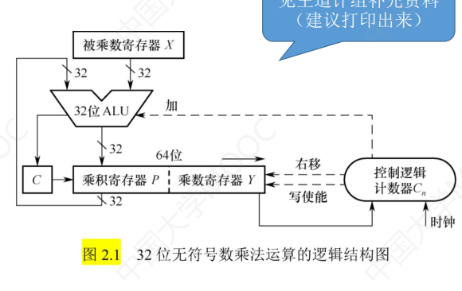

计数器Cn控制加法次数=被乘数的位数。

```
while Cn>0:
	看乘数Y的最低位:
		若为1，则部分积P+=被乘数X
		若为0，则P不变
	然后P||Y整体右移一位，最低位被丢弃
	Cn--
```

C是加法可能产生的高位进位

P初始为全0

控制逻辑的写使能信号使得P可以被ALU结果覆盖

溢出判断：两个n位数相乘，结果用2n位暂存，若只保留低n位。那么只要最后P内（高n位）不全0，就说明有溢出


(2)有符号数乘法电路（补码一位乘法）

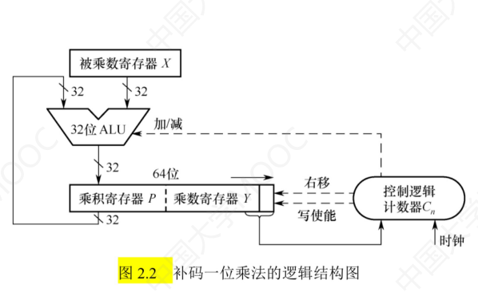

对于n位乘法（含1位符号位），需要n次循环

P前面不用进位位C，因为X的符号位不当做数值

Y的最低处新增一位Yn+1，为辅助位，初值为0

```
  while Cn>0:
  	if 辅助位-Y末位=1，则P+=[x]补
  	else if 辅助位-Y末位=0，则P+=0
  	else if 辅助位-Y末位=-1，则P+=[-x]补
  	P||Y算术右移（有符号，需要根据之前的正负在最高位补0或1）
  	Cn--
```

溢出判断：最终只保留后n位（Y），如果前n+1位（P的n位以及Y的最高位）全1或全0则没有溢出

###### 2.7 定点数的除法

被除数（余数）在ACC中，商在MQ中，除数在通用寄存器中

1.原码除法的恢复余数法

符号位为两个操作数异或


除法本质就是不断用余数（被除数也算余数）减去除数，又有：

被除数-除数=被除数+[-除数]补

计算机每次默认商为1（够减），如果发现结果为负数，说明不够减，于是就把余数还原回来（加上除数），商0.

一趟结束后，ACC||MQ左移

重复左移n次，MQ中的商为n位，结束


2.原码除法的不恢复余数法（加减交替法）

是恢复余数法的优化

- 每次被除数-除数
  - 若余数为正，则商1，ACC||MQ直接左移一位，ACC再减去除数；
  - 若余数为负，商0，ACC||MQ直接左移一位，ACC再加上除数

对于n+1位除法（1位符号位），需要n+1步的减法；如果第n+1步余数是负数，那么需要再加上除数得到正确的余数

3.补码除法的加减交替法


##### 3.定点数类型转换

###### （1）有符号数和无符号数的转换

不改变位值，只改变这些位的解释方式

例如short x=-4321，转为无符号数unsigned short就是61215

###### （2）不同字长整数之间转换

字长变小：直接截断高位部分。例如int->short：0xffff7751->0x7751

字长变大：负数前面补1，正数前面补0


##### 4.数据的存储和排列

###### 大端小端存储

大端存储：低位高址【从左到右地址增加，数也从高位到低位排列】

**小端存储：低位低址**

例如存储int i=01234567H：

| 地址（B，递增） | 0800H | 0801H | 0802H | 0803H |
| --------------- | ----- | ----- | ----- | ----- |
| 大端            | 01H   | 23H   | 45H   | 67H   |
| 小端            | 67H   | 45H   | 23H   | 01H   |


###### 边界对齐存储

使得半字地址一定是2的整数倍，字地址一定是4的整数倍。

例如按字节编址时：

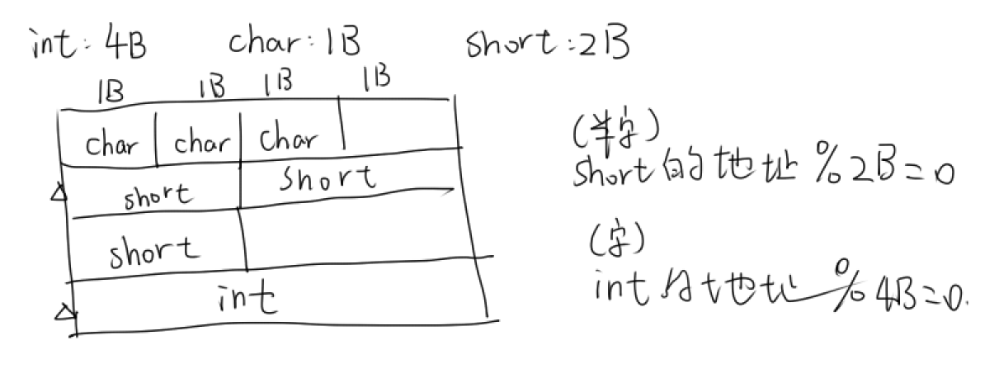

因为每次访存都是1个字（4B），故无论是1B,2B还是4B，数据以边界对齐方式存储（若有剩余则填充0），都可以一次访存取出


#### 2.3 浮点数的表示与运算

浮点数表示为：
$$
2^{阶码}×尾数
$$
计算机内浮点数格式：【阶码符号|阶码|尾数符号|尾数】

##### 1.规格化浮点数

为了充分利用尾数的有效位，类似科学计数法，让尾数的最高位有效（对于**原码就是最高位为1**），例如2^10x1.01

规格化规定尾数的绝对值∈[1/基数,1]

左规：对于非规格化数（小数点前为0），尾数左移，阶码-1，重复进行直到规格化

右规：双符号位为01或10时，尾数溢出，尾数右移，阶码+1。可能导致尾数精度损失


（1）原码规格化后：

- 对于正数，最大值为0.11...1，最小值为0.100..0（小数点前为符号位）

- 对于负数，最大值为1.00...0，最小值为1.11..1


（2）补码规格化后：

- 对于正数，最大值为0.11...1，最小值为0.100..0
- 对于负数，最大值为1.01...1，最小值为1.00..0（来自原码按位取反+1，负数补码的规格化开头规定是1.0）

> 例如：阶码和尾数都是补码，将浮点数0 110;1 1110100规格化
>
> 尾数开头是1 1，不行，所以需要左移三位，阶码（110）对应减3=011，得到规格化浮点数0 011;1 0100000


##### 2.IEEE754标准

浮点数格式：【数符|阶码E（移码表示）|尾数M（**原码表示**）】

有float和double两种浮点数格式

（1）float单精度

32bit，**数符1位，阶码8位，尾数23位**。偏置值=2^(8-1)-1=127

真实的阶数是阶码-127
$$
(-1)^s×1.M×2^{E-127}
$$


可表示的最小值：E=1,M=0，最小正整数为$1.0\times 2^{-126}$，最大负数$-1.0\times 2^{-126}$

最大值：E=254,M=111...，最大正整数为$2^{128}-2^{104}$

<font color=red>注意：除了0以外，阶码最小为1，最大为254</font>

特殊情况：

| 阶码 | 尾数 | 表示                           |
| ---- | ---- | ------------------------------ |
| 0    | 0    | 0                              |
| 0    | 非0  | 非标准化形式，0.M              |
| 全1  | 0    | 无穷大，根据符号位分为正负无穷 |
| 全1  | 非0  | NaN，不是有效数                |


例如：

- float x=-8.25，转为二进制为-1000.01，规格化=-1.00001x2^3。数符为1
- 阶码（8bit）=3+127=130，二进制为1000 0010
- 尾数（23bit）为0000 1000 0000 0000 0000 000。最后拼起来是1 1000 0010 0000 1000 0000 0000 0000 000，16进制为C1040000

（2）double双精度

64bit，数符1b，阶码11b，尾数52b。偏置=2^(11-1)-1=1023
$$
(-1)^s×1.M×2^{E-1023}
$$

最小值：E=1,M=0

最大值：E=2046,M=111...


##### 3.浮点数的加减运算

- 对阶：**小阶向大阶看齐**，右移尾数，使阶数相等
- 尾数求和
- 规格化：如果尾数非规格化，需要左规；如果尾数的符号位为01或10，需要右规
- 舍入：对阶和右规时，可能造成尾数低位丢失，0舍1入
- 判断溢出：阶码符号位为01表示上溢，进入中断处理；10表示下溢，按0处理

浮点数的溢出：上溢表示阶码大于最大阶码；下溢表示阶码小于最小阶码

一个浮点数加法的例子（2009.13）：设浮点数阶码和尾数均为补码，位数为5和7（均含2位符号位），X=2^7x29/32. Y=2^5x5/8，计算X+Y的结果


##### 4.浮点数的上下溢

注意：浮点小数的上下溢和定点小数的上下溢不一样。

定点小数：小于-1则下溢，大于-1则上溢

浮点数的下溢指的是机器无法满足小数的精度，上溢则是绝对值太大


规格化数：机器可以表示的数（不存在溢出），要求1/基数<尾数<=1

机器零：超出表示范围且无限趋于0的数

发生下溢时，浮点数太小，所以被当做机器0，CPU不会进行溢出处理，而是当成0继续运行

只有上溢时，CPU才会溢出处理


##### 5.浮点数类型转换

- int转float：因为int32位，float的尾数只有23位（加上省略的1位是24位），所以当int位数大于24位时会有数据舍入，没有溢出
- int/float转double：能保留精确值
- double转float：两种情况导致不能保留精确值
  - double太大，float阶码范围更小，可能溢出
  - double太精确，float有效位少，可能舍入
- float/double转int：两种情况导致不能保留精确值
  - 浮点数的小数部分不为0：直接截断，仅保留整数部分
  - 浮点数太大，而int表示的范围较小，可能溢出
- 浮点数加法中，f=1.5678e3, d=1.5e100，计算f+d，对阶时f直接被化为0e100，因此f+d=f

---

### 第三章——存储系统

#### 3.1 存储器概述

##### 存储器分类

按层次分：主存（内存），辅存（外存），cache

按介质分：磁表面、半导体（MOS）、光盘

按存取方式：

- RAM随机：分为静态SRAM（cache，触发器原理），动态DRAM（内存，电容充电原理）。随机存取，需刷新，易失性存储器
- ROM只读：写入即固定，断电不会消失，非易失性存储器。也是随机存取
- 串行访问存储器：不随机存取，按物理位置寻址
  - 直接存取存储器DAM：磁盘
  - 顺序存取存储器SAM：磁带，光盘（CD-ROM不是随机存取！）

按信息可保存性：

- 易失性存储器：RAM
- 非易失性：ROM，磁表面存储器，光存储器


##### 存储器性能指标

存储容量：字数x字长，如1Mx8b

存取时间：启动存储器操作到完成操作的时间；恢复时间：存取完到下次启动时间

**存取周期**：存取时间+恢复时间，一次完整读写操作的全部时间，即两次独立访存的最小时间间隔

主存带宽：数据传输率，每秒从主存进出信息的最大量


##### 题目中常见的表述

机器字长：规定一个字的长度

按字寻址：存储器每个单元的大小是一个字，总容量/字长就是单元数


#### 3.2 存储器的层次结构

从上到下：寄存器，cache，主存，磁盘，磁带/光盘

CPU可直接和主存及以上的交换信息。最主要的是cache，主存，辅存

上一层存储器是下一层的高速缓存（副本）

cache和主存之间的数据交换对程序员不可见，主存和磁盘之间可见


#### 3.3 半导体随机存储器：RAM和ROM

RAM都是易失性存储器，断电后数据丢失，但SRAM不用刷新


##### SRAM：静态随机存储器

应用：cache

- 利用MOS（双稳态触发器，两个稳态对应0和1）记忆
- 集成度低，功耗大，价格高。
- 读后不用刷新
- SRAM的引脚总数=数据线（每个单元数据位数）+地址线（主存地址位数）+读写控制线WE（1根或者2根）+片选线CS（CPU选择哪个存储芯片）


##### DRAM：动态随机存储器

应用：内存

利用电荷存储信息，电容上有电荷为1，无电荷为0，必须每隔一段时间刷新一次。

集成度高，功耗小，价格低。


###### DRAM行列地址

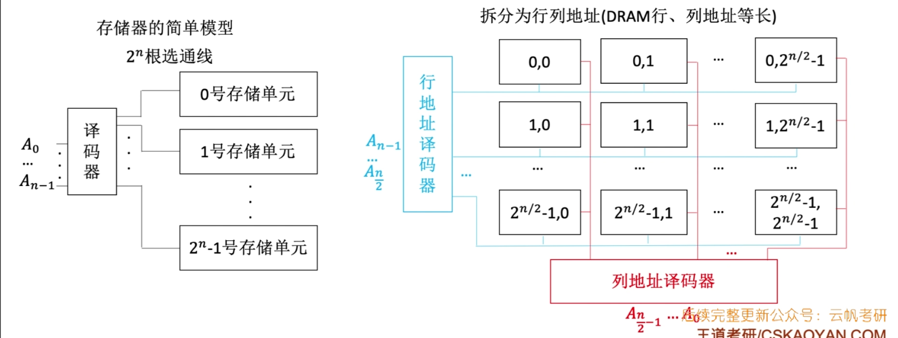

对于传统的存储器，2^n个存储单元，需要n位地址，需要2^n根选通线（译码器与存储单元的连接线）

如果把2^n个存储单元排列成2^(n/2)x2^(n/2)的矩阵，那么需要n/2位行地址和n/2位列地址，拼成一个完整的地址；需要2^(n/2)根选通线连接行地址译码器和所有行，需要2^(n/2)根选通线连接列地址译码器和所有列，这样只需要2*2^(n/2)根选通线了

因此使用行列地址的好处就是减少了选通线的数量


###### DRAM刷新方法

- 集中刷新：一段专门时间（刷新周期）内对所有区域刷新，有死时间，期间不能读写
- 分散刷新：每次读写完都刷新一行，没有死时间
- 异步刷新（每隔时间t刷新一行）。刷新只占用一个存取周期
- 因为DRAM按行刷新，所以尽量减小行数可以减少刷新时间


###### DRAM地址复用技术

地址：【行地址n/2位|列地址n/2位】

为了减少地址线条数，分两次传行地址和列地址

**地址线是原来的1/2**。通过行通选、列通选两次传送地址信号（行号、列号），行通选线1根，列通选线1根，片选线可用行通选线代替

DRAM的引脚数=数据位数+地址位数/2+行通选线1根+列通选线1根+读写控制线WE。

因为DRAM传两次地址，每次传一半位数；如果行数≠列数，则地址引脚数=最大值（行列差不应太大）

> 例：2014(15)
>
> 某容量为256MB的存储器由若干4Mx8位的DRAM芯片构成，该DRAM芯片的地址引脚和数据引脚总数为？
>
> 4MB=2^22B，由于DRAM地址复用，所以地址线11根
>
> 数据线8根
>
> 所以一共19个引脚


##### ROM

PROM：一次可编程只读存储器，只能写入一次

EPROM：可擦除可编程只读存储器，可写入多次。不是随机存储器

EPROM分为紫外线擦除UVEPROM，电擦除EEPROM，通过电压修改

Flash：闪存，如U盘。需要擦除后重写，因此写的速度比读慢

SSD：固态硬盘，由闪存组成

ROM读速度>写速度，因为写有擦除时间

注意：CD-ROM不是ROM，只是为了突出只读

##### 主存的基本组成

存储体：有若干存储单元

- CPU要访问主存单元时，先把地址送到MAR，经过地址线送入主存中的地址寄存器，经地址译码器译码，选中单元。CPU将读写信号通过控制线送到主存的读写控制电路。
- 如果是写操作，则将数据经数据线从MDR写入主存单元（数据线宽度=MDR宽度，地址线宽度=MAR宽度）
- 如果是读操作，则将数据经数据线从主存单元读入MDR

若数据线为64bit，每个单元8bit，则每次可以存取64/8=8个单元的内容

芯片容量=2^地址线数x数据线数（数据线位数一般等于存储单元，但也可能不等，如上例）


#### 3.4 主存与CPU的连接，主存扩展

##### 主存容量扩展

用多个存储芯片增加存储字长，使数据位数=CPU数据总线数

（1）位扩展法：增加存储字长

8个8Kx1位【共有8K个存储单元，每个单元1bit】的RAM芯片组成8Kx8位的存储器

片选信号连接到所有芯片（相当于并联，这些芯片是叠起来的，8个芯片在一行），如果要存8b的数据，则每个芯片存一位


（2）字扩展法：增加存储字数

4个16Kx8位的RAM芯片组成64Kx8位的存储器

4个芯片的地址高两位作为片选信号，分别为00,01,10,11。用片选信号来选中那个芯片

每个芯片内部单元数为16K=2^14，因此芯片内部的地址需要14位（总地址的低14位）

总地址需要16位


（3）字位同时扩展法：

设2Kx4位的芯片组成8Kx8位存储器，则每行2个芯片，每列4个芯片（相当于有4个大芯片，每个大芯片是两个小芯片叠起来）

因为**每个芯片有2K个单元**，即大芯片内部地址长度11位（内部地址位数取决于单元数量而不是字节数！）

因为一共4组芯片，所以片选信号需要2位。总地址需要13位

综上，地址结构为：

- 第一行（2个芯片并联）：0000-07FF

- 第二行（2个芯片并联）：0800-0FFF

- 第三行（2个芯片并联）：1000-17FF

- 第四行（2个芯片并联）：1800-1FFF


#### 3.5 双端口RAM和多模块存储器

存取周期：可以连续读/写的最短时间间隔。

<font color=red>存取周期T=存取时间r+恢复时间</font>

需解决两个问题：

- 多核CPU时，第一个CPU存取时间后，第二个CPU还等待第一个CPU的恢复时间？——双端口RAM
- CPU在主存的恢复时间可以不等待嘛？——多模块存储器


##### 1.双端口RAM：空间并行

同一个存储器有两个独立的端口，允许两个CPU同时访问存储单元，只要地址不同，就不会冲突

同步互斥和读者-写者问题一样

可以优化多核CPU访问一根内存条的速度


##### 2.多模块存储器：时间并行

a.单体多字存储器：每个单元m个字，总线宽度也为m个字，一次并行读m个字，指令也同理

b.多体并行存储器：存储器有多个模块，每个模块有独立的读写控制电路、地址寄存器、数据寄存器。分为高位交叉编址和低位交叉编址

(1)高位交叉编址

- 地址【体号|体内偏移】
- 每个模块内地址连续，不能并行访问（因为0地址的内容整个存取完才能开始1地址的内容）
- 本质仍是顺序存储器
- 连续存取m个字的总时间t=mT


(2):star:低位交叉编址（**n体交叉存储器**）：

- 地址【体内偏移|体号】，4个模块，则体号2位
- 模块号=地址%n
- 可以并行存取，采用流水线
- 每个地址对应主存单元里面是一个字

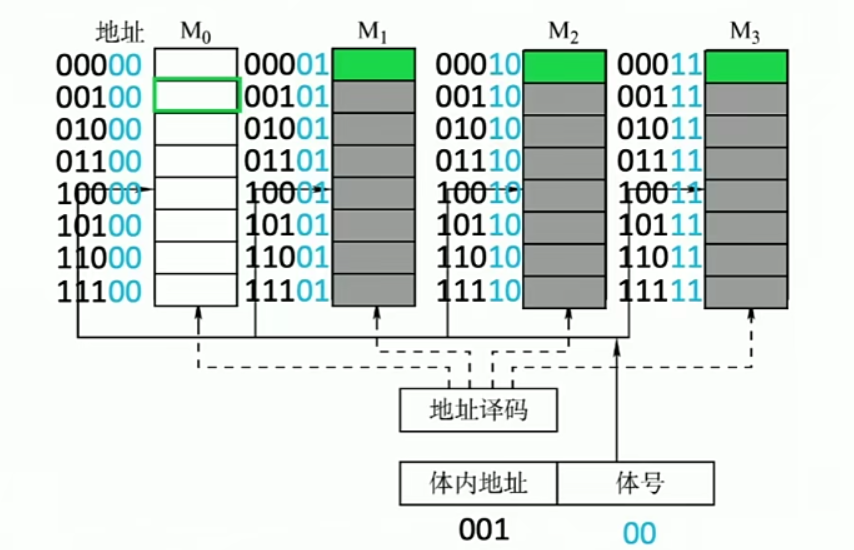

**存取周期T=存取时间（启动时间）r+恢复时间**

交叉存储器模块数m必须大于等于存取周期T/存取时间r

- 若m<T/r，当再次轮到M0模块存取时，M0上一趟还没恢复完
- 若m>T/r，则M0已经恢复完成，但仍要等一段时间才会被用来存取，造成时间过剩
- 因此一般来说，题目中m=T/r，这样效率最高

因此，并行连续存取n个字的总时间为
$$
存取周期T+(n-1)\cdot启动时间r
\\=T+(n-1)T/m
$$


例题：2013.43

每次突发传输所需时间=5+75+5=85ns

- 传地址：5ns
- 准备数据：即存储数据的时间=40+(8-1)*5=75ns
- 传数据：因为前一个字的传输和后一个字的存取并行，所以只需要计算最后一个字的传输时间=5ns


#### 3.6 cache高速缓冲存储器

程序访问的局部性原理：空间，时间

##### cache的基本工作原理

cache内部的块大小=内存块，cache按照某种策略将内存块放入cache中

cpu与cache之间交换数据的单位是字，cache和主存之间单位是块

若cache已满，则需要用策略替换cache块

若cache被cpu修改，导致和内存块内容不同，需要按照写策略处理：全写法/写回法

cache命中率=命中次数/总次数


##### cache与主存的映射方式

（1）直接映射：相当于cache分为n组，一组就是一块

cache块号=主存块号（不是主存地址！要除以块大小）%cache块数，其实就是主存块号的低c位

cache地址=主存地址%cache容量


<font color=#ff6666>主存地址划分：【标记|cache块号|块内偏移】</font>

往往先计算出后两个的长度，再得到标记长度，从而得到标记；或者已知主存大小时，标记长度=log2(主存大小/cache大小)，这样使得主存地址不同的两个块当计算出的cache行号相同时标记一定不同

<font color=#ff6666>cache每行：【标记|有效位|主存每块数据】</font>

- 如果使用写回策略还需一位脏位判断是否修改过
- LRU替换策略还需要LRU位
- 有效位的作用：只要数据从内存进入cache，有效位就为1；如果需要重置cache，就将其有效位置0，省掉清除数据位的时间了


工作原理：

cpu根据地址先找到cache对应行，然后比较地址中的标记和cache内标记，若相同且有效位=1，则命中；否则cpu从主存中读出一块，送到cache行中，修改有效位=1，**再读取cache**，数据送入cpu

直接映射冲突率最高，但是标记短，所需时间短


（2）全相联映射：相当于0组

主存每块可以放入cache任意位置

<font color=#ff6666>物理地址：【标记|块内偏移】</font>

冲突率最低，但是比较标记的时间长


（3）r路组相联映射：

将cache分成k=n/r组，**每组r行**，主存每块可以放入cache一组任意位置

组号=主存块号%cache组数，占log2k位

<font color=#ff6666>物理地址：【标记|cache组号|块内偏移】</font>，每组内部顺序比较标记


##### cache中主存块的替换算法

FIFO：先进先出

LRU：最近最少使用，选择最久没访问过的替换出去

- LRU辅助位：在cache的每一行加入LRU位。
- 8路组相联（每组8个块）则LRU位为3位，相当于计数器。
- 数据块进入cache后，每经过一轮计数器+1，LRU位最大的被换出

抖动现象：访存块数>cache组数时，可能命中率为0


##### cache写策略

当cache内容被修改，需要保持主存和cache内容一致的策略

当cache写命中时，有两种策略

- **全写**（写直通）：同时写入cache和内存，缺点是访存次数太多。

  写缓冲：为了减少访存的时间消耗，在cache和主存之间加一个缓冲。

- **写回**：先写cache，当这块被替换时，如果脏位=1，则写主存。

当cache写不命中时，有两种策略

- 非写分配：只写主存，不再把内存块调入cache
- 写分配：把内存块调入cache，再写cache

非写分配法通常和全写法搭配，写分配法和写回法搭配


注意：cache缺失与虚存缺失处理方法不同，cache完全由硬件实现，不由操作系统（软件）控制


#### 3.7 虚拟存储器

为了解决主存容量不足，不必同时把一个程序整体放入内存，发明了虚拟存储器，它将主存和辅存统一编址，形成程序员眼中更大的存储空间，而不必关心这一页到底在主存中还是磁盘上

CPU使用虚拟地址/逻辑地址，由辅助硬件将其映射到物理地址，然后访存；若该页（或段）在主存中则直接访存，否则将页从磁盘调入主存后再访问；若主存已满，还需要使用替换算法来替换物理页

虚拟存储器容量小于等于主存+辅存之和，不是正好相等

##### 页式虚拟存储器

虚存以页为单位，虚拟页和物理页大小相同

虚拟地址：【虚页号|页内偏移】，虚页号就是页表项的index

页表项：【虚页号|有效位|脏位（写回机制）|引用位（什么替换策略）|物理页号】

每个进程有一个页表基址寄存器。cpu访存时，根据虚拟地址的虚页号+当前进程的页表基址找到页表项，若页表项有效位=1，则把页表项中**物理页号拼上offset得到实际物理地址**；否则缺页处理


##### 快表TLB

TLB：由cache组成，是页表项的拷贝

**虚拟地址划分**：【标记|TLB组号|页内偏移】

- 对于k路组相联，有n/k组，TLB组号为log2(n/k)位
- 如果TLB是**全相联映射，相当于只有1组，则没有组号**，虚页号整体就是标记
- 如果TLB是直接映射，相当于n组，则组号有log2(n)位

**快表项**：【有效位|标记|物理页号】


查找时，先找快表组号，然后每组内部比较标记

CPU访存的三种缺失：

- TLB缺失：TLB中没有对应的页表项，要去页表中找
- cache缺失：页表项有需要的物理地址，先查cache，看里面没有对应的主存块
- 缺页：页表项没有对应的物理地址，要去访问磁盘

注意：如果TLB不缺失，那么必然不缺页，因为TLB是页表的副本


##### 段式虚拟存储器

段按程序的逻辑结构划分

虚拟地址：【段号|段内偏移】，段号也就是段表项的编号

段表项：【段号|段起始地址|装入位|段长度】

先查找段表基址寄存器，获得段表基址，与段号相加找到对应的段表项，然后根据装入位判断该段是否装入内存，若在内存，则将段起始地址与段内偏移相加获得物理地址

缺点是有碎片


##### 段页式虚拟存储器

将程序先按逻辑结构分段，每段内划分成固定大小的页

虚拟地址：【段号|段内页号|页内偏移】

段表项：段号-【该段的页表基地址】

段号->段表项->页表基址+段内页号->页表项->物理页号||offset->物理地址


P149大题1：包含cache，虚存，TLB的综合应用题：


#### 3.8 外存储器

##### 1.磁盘存储器

柱面是相对位置相同的一组磁道，指定柱面号即指定了磁道

扇区是每个磁道的一小段，不管位置内外每个扇区的容量都相同，内侧的扇区位密度大

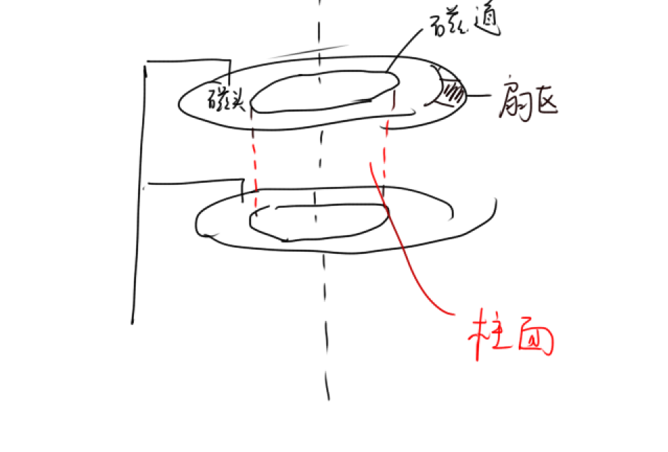

磁盘读写时间=寻道时间+旋转时间（找到某扇区的时间）+传输时间

- 平均寻道时间=mn+s，m是常数，n是跨越磁道数，s是启动磁臂时间。一般题中直接给

- **平均旋转时间=一转的时间/2**

- 传输时间=传输字节数/传输速率。

  假设已知每个磁道的扇区数，则传输时间=一转的时间/扇区数

> 例.2013(21)某磁盘转速为10000转/分，平均寻道时间6ms，磁盘传输速率20MB/s，磁盘控制器延迟为0.2ms，读取一个4KB的扇区所需平均时间为？
>
> 旋转一圈的时间=60000ms/10000=6ms
>
> 平均查询扇区的时间（旋转时间）为6/2=3ms
>
> 传输时间=4KB/20MB/s=0.2ms
>
> 总时间=寻道时间+旋转时间+传输时间+延迟=6+3+0.2+0.2=9.4ms

格式化容量<非格式化容量

磁盘地址：【驱动器号（哪个磁盘）|柱面号|盘面号|扇区号】

磁盘的读写是串行的，只能一位一位读写


##### 2.固态硬盘SSD

SSD由若干闪存芯片组成，每个闪存芯片有多个块，每块有多个页

以页为单位存取，以块为单位擦除

SSD通过电路将逻辑地址映射到物理地址，是**随机存取**，而机械硬盘通过旋转磁臂顺序存取

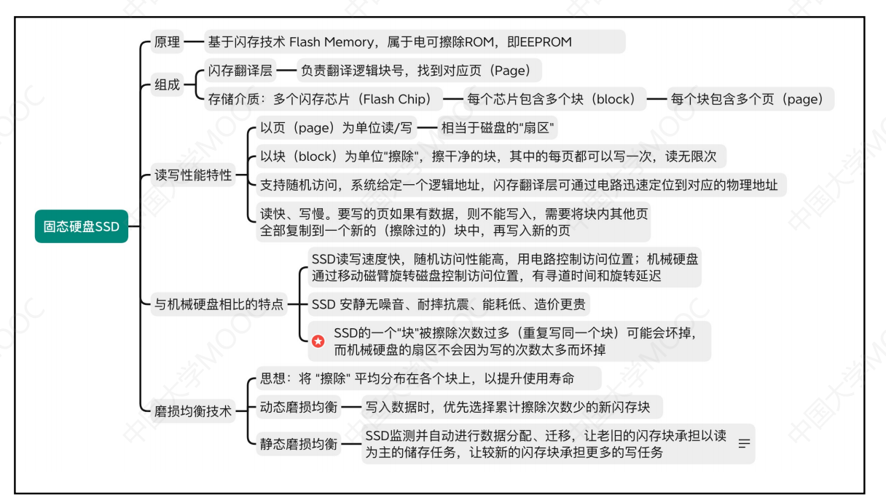

---

### 第四章——指令系统

指令系统：一台计算机所有指令的集合，也叫指令集

#### 4.1 指令格式

指令：【操作码|地址码】，地址码是操作数的地址

根据操作数的个数不同，可将指令分为0/1/2/3/4地址指令

定长操作码指令格式：操作码部分定长，最多2^n条指令


可变长操作码指令格式

扩展操作码：使操作码的长度随地址码的减少而增加，可以在指令长度不变的条件下，增加指令数量

> 设指令字长20位，每个操作数地址码8位，指令分为0,1,2地址三种
>
> 采用定长操作码时，因为二地址指令操作码4位，因此任何情况下操作码都是4位16种情况。两种留给零地址和一地址，于是二地址有14种指令
>
> 采用扩展操作码时，只需留一种情况给零地址和一地址共用，比如0000,0001作为一地址的操作码，0000,0000作为零地址的操作码。此时二地址指令有15种，只要不是0000开头就行

堆栈计算机两个操作数来自栈顶和栈次顶

程序控制指令：jmp，循环等；中断隐指令是硬件指令

若计算机按字节编址，则指令长度必须是8bit的倍数

#### 4.2 指令的寻址方式

##### 1.指令寻址

顺序寻址：PC++，形成下一条指令的地址

跳跃寻址：jmp指令修改PC值，故下一条指令的地址总在PC中

##### 2.数据寻址

为区别各种寻址方式，在指令中增加一个寻址特征字段来表明哪种方式

指令：【操作码|寻址特征|形式地址A】

常见的数据寻址方式：

（1）隐含寻址：不给出第二个操作数的地址，默认第二个操作数是硬件（如累加器ACC里面存了操作数）。可用于缩短指令字长

（2）立即数寻址：操作数是一个立即数，即A本身

（3）直接寻址：地址字段A是操作数的真实地址EA，EA=A

（4）**间接寻址**：A指向的存储单元里面是操作数的地址，EA=(A)，也就是说需要找两次存储单元才能找到操作数。优点是扩大了寻址范围，因为EA位数比A长，缺点是访存次数增加

（5）寄存器直接寻址：A是操作数所在的寄存器编号，EA=Ri。因为编号短，所以地址段也很短，且速度快

（6）寄存器间接寻址：寄存器存的是操作数的地址，EA=(Ri)

括号代表取里面的内容作为地址，没有括号代表里面就是操作数

（7）**相对寻址**：PC内容+形式地址，EA=(PC)+A。A可正可负，补码表示。

（8）基址寻址：基址寄存器BR+形式地址，EA=(BR)+A。基址寄存器面向操作系统，里面的内容由操作系统确定，适合多道程序设计（多个程序穿插并行，程序段浮动）

（9）变址寻址：变址寄存器IX+形式地址，EA=(IX)+A。变址寄存器面向用户，最适合访问数组，**A作为数组基址（一般不改变），IX作为偏移量**（字节数）

（10）堆栈寻址：栈顶指针sp指向读写单元的地址。一般访存后会自动改变sp的值


#### 4.3 CISC和RISC

CISC：Complicated Instruction-Set Computer，复杂指令集计算机

- 指令系统中指令数目庞大
- 指令长度不固定，执行时间相差很大
- 采用**微程序控制器**，指令复杂难以采用硬布线控制
- 典型的架构：x86

RISC：Reduced Instruction-Set Computer，精简指令集计算机

- 使用寄存器-寄存器操作指令
- 指令定长对齐，格式种类、条数少
- 必须采用流水线技术，大部分指令在一个时钟周期内完成
- 仅load/store指令访存，使得访存时间固定
- 采用**硬布线控制器**
- CPU内部通用寄存器数量很多，寻址方式少
- 简化了指令系统，不好与老机器兼容
- 典型架构：ARM, MIPS

#### 4.4 高级语言与汇编的对应

汇编指令集包括MIPS, Intel x86, ARM

---

### 第五章——中央处理器

#### 5.1 CPU的功能和基本结构

##### 运算器

运算器包括：

- ALU
- 暂存寄存器，累加寄存器ACC
- 通用寄存器组：可以存放数据和地址
- **程序状态字寄存器**PSW（也叫eflags）
  - 溢出标志OF：有符号数运算
  - 符号SF：运算结果的正负。无符号整数的运算不用管SF
  - 零标志ZF：运算结果为0
  - 进位标志CF：无符号数运算
- 移位器，计数器

##### 控制器

从主存中取指，分析指令，产生有关的操作控制信号

包括：

- PC
- IR（保存正在执行的指令）
- 指令译码器（仅对操作码译码）
- MAR，MDR
- 时序系统，微操作信号发生器


汇编语言程序员可见的是PC,状态寄存器、通用寄存器（意思是程序员可以手动修改）

而IR,MAR,MDR是CPU内部的工作寄存器，不可见

#### 5.2 指令执行过程

指令周期：从主存取指并执行的时间，**由若干机器周期（CPU周期）组成**，**一个机器周期包含若干时钟周期**（计算机工作的最小时间周期）

一个完整的指令周期包括：

- 取指周期：将指令保存到IR，PC+1
- 间址周期：间接寻址的周期，取操作数的有效地址
- 执行周期：取操作数，执行
- 中断周期：检查中断信号，若有中断则把PC压栈

四个标志触发器来区别不同机器周期

<font color=ff6666>※注意：取指周期之后，PC+=指令长度。假设指令长为3B，现在要从200跳转到240，实际上跳转指令的偏移量为240-(200+3)=37.</font>


##### 四个机器周期

- 取指周期：PC中的指令地址-》MAR，去主存取出指令，经过MDR放入IR。PC自增。（取指操作是控制器自动进行的，不同长度指令取指操作不同）
- 间址周期：IR将指令的地址码送到MAR（这个地址码是地址1），CU发出读主存命令，从主存读**操作数有效地址**（地址2，操作数真正的地址），送入MDR
- 执行周期：根据IR中指令的操作码和操作数，通过ALU运算。不同指令执行周期任务不同
- 中断周期：当前指令执行完成后，需要检查是否发生中断，如果有中断，则需要去执行中断处理程序的指令。为了中断处理完成后能回来继续执行，现在需要把下一条指令的地址（PC）压栈。具体方法是先把栈顶指针SP-1，然后存入PC的值。


##### 指令执行方案

- 单指令周期：每个指令执行时间相同，串行，指令周期取决于最长的时间

- 多指令周期：不同指令执行时间不同，串行

- 流水线：每个时钟周期启动一条指令，并行


#### 5.3 数据通路

数据通路：数据在**CPU内部**功能部件之间传送的路径

数据通路结构

- CPU内部单总线：同一时刻只能两个部件之间数据交换

- CPU内部三总线：同时支持3对部件之间数据交换

- 专用数据通路：部件之间直接加通路，硬件量大


注意：所谓的数据、地址、控制总线是CPU外部的总线，不要与内部混淆了！！！


CPU内部单总线的数据通路：


有效控制信号：输入部件的控制信号Xin，输出信号Xout，只有和总线直接连接才有信号！！！


题目：按照题目的图示，写出数据通路（微操作）和有效控制信号P215

写数据通路即写明每一步的数据流向，用箭头表示，从寄存器取数需要写括号

例如从主存取数：

Ad(IR)->MAR

M(MAR)->MDR

加法运算：(Y)+(R0)->Z

运算的结果若要赋给某寄存器，都需先发给MDR


#### 5.4 控制器的功能和工作原理

##### 1.硬布线控制器

硬布线控制器的工作原理：微操作控制信号由各种输入即时产生。

硬布线指的是组合逻辑门电路和触发器，也叫组合逻辑控制器（相比时序逻辑，组合逻辑没有触发器，不能记忆，输入什么输出什么）


###### 控制单元CU的输入

- 时序系统产生节拍（对应时钟周期），使得微操作命令按时间先后输出
- 指令的**操作码**通过**指令译码器**，产生的**指令信息**
- 执行单元的状态标志位（如溢出）
- 来自控制总线的控制信号，来判断当前是哪个机器周期（寻址、间址、执行、中断）

不同输入信号进行与或非，即可得到输出信号，即微命令C1...Ck，输出到CPU内部或者外部控制总线上


###### 如何设计CU内部的电路

- 分析每个机器周期的微操作序列
- 选择CPU的控制方式：同步（机器周期定长），异步
- 安排微操作的时序：确定多条微操作能否在一个时钟周期内并行
- 电路设计：包括列出操作时间表，列出最简逻辑表达式，画逻辑电路图

机器周期是所有指令执行的基准时间，通常以**存取周期**作为机器周期

硬布线控制器适合RISC，因为指令少，简单


##### 2.微程序控制器

微程序控制器运用了存储程序的思想，把微指令存储起来，再排列组合成微程序（机器指令），而不是像硬布线控制器一样“随机应变”，由当前的控制信号来决定做什么。

###### 基本术语

每条机器指令编写成一个**微程序**，每个微程序包含若干**微指令**，同一时序Ti内的微操作合成一个微指令。

微命令是微操作的控制信号，微操作是微命令的执行过程。

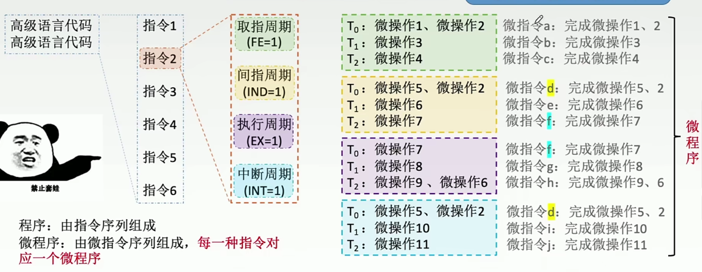


微程序控制器CU就像一个缩小版的CPU，同样有微指令的地址寄存器、微指令寄存器

微程序存储在控制存储器CM中，在CPU内部，ROM构成

CM中，不同的微程序占用不同的段，由于所有指令的取指周期的微程序都相同，所以取指微程序只有一段。而不同指令执行周期不同，所以n种指令有n个执行微程序段。

- CM：控制存储器，存储微程序
- CMAR：微地址寄存器，μPC
- CMDR：微指令寄存器，μIR


###### 工作过程

在微程序控制器的控制下，计算机执行机器指令的过程：

- 首先执行【取指微程序】，准备机器指令。机器【自动】将取指微程序的入口地址送入CMAR，从CM中取出取指微指令送入CMDR，执行，这时从主存取出的机器指令进入到指令寄存器IR中
- 准备微程序。机器指令的op码通过微地址形成部件，产生该机器指令对应的微程序的入口地址，送入CMAR
- 从CM中取出微指令到CMDR，生成控制信号（微命令），发给执行部件执行
- **微指令的下地址可以表示后继微指令的地址**，通过这种方法来找下一条微指令的地址


###### 微指令的格式

- 水平型微指令：微指令长；微程序短，执行速度快。一条微指令可以执行多种基本操作
- 垂直型微指令：微指令短，便于编写程序；微程序长，速度慢。一条微指令只能执行一种基本操作


###### ※ 水平型微指令的编码方式

对控制字段编码，以形成控制信号（微命令）

微指令的格式：【操作控制字段|下地址】

- 直接编码：类似独热编码，每位对应一个微命令。最快，但是微指令太长

- **字段直接编码**：将操作控制字段分成若干段。【控制字段1|控制字段2|控制字段3|下地址】
  
  - 互斥性微指令分在同一段内，相容性微指令分在不同段内。
  - **每个互斥类还需要留出一个全0的情况**，表示不操作
  - 总长度=每个互斥类所需位数相加
  
  > 例：王道8.2(19)
  >
  > 某机采用微程序控制方式，微指令字长24位，共有30个微命令，构成4个互斥类，分别包含5,8,14,3个微命令，外部条件共3个，则控制存储器的容量为？
  >
  > 首先，微指令的格式为[操作控制字段|判断测试字段|下地址字段]
  >
  > 操作控制字段
  > $$
  > \sum{\lceil\log_2(n_i+1)\rceil}=3+4+4+2=13位
  > $$
  > 因为3个外部条件不一定互斥，故需要3位
  >
  > 于是下地址字段有24-13-3=8位
  >
  > 所以CM有2^8=256行，每行24bit的微指令，总容量为256x24bit
  
  
  
- 字段间接编码：两层译码

一个字段的某些微命令还需由另一个字段的某些微命令来解释

###### ※ 微指令的地址形成方式

后继微指令的地址形成方法：

- **断定法**：由微指令的下地址字段指出，下地址字段长度=log2(微指令总数)

- 机器指令的op码，经过微地址形成部件形成
- 增量计数器法：CMAR+=1

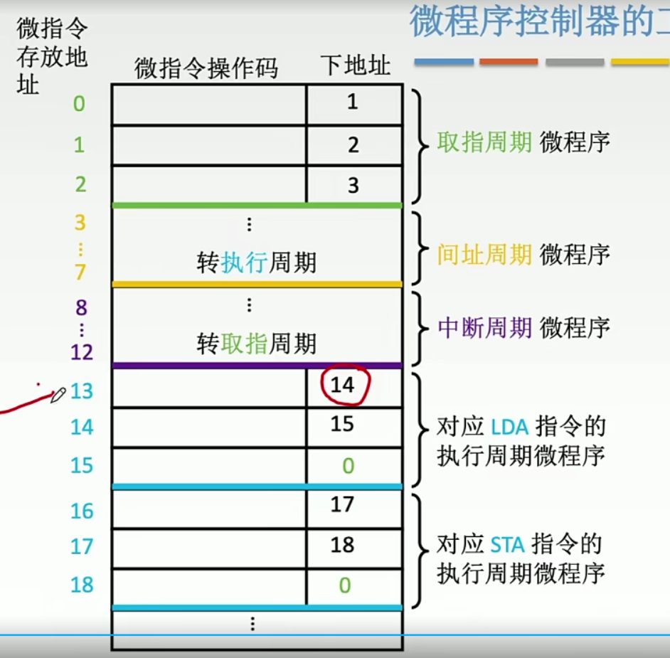

###### 两种CU对比

|            | 硬布线控制器                 | 微程序控制器                   |
| ---------- | ---------------------------- | ------------------------------ |
| 工作原理   | 微操作命令由各种输入即时产生 | 微操作命令以微程序形式存在CM中 |
| 速度       | 快                           | 慢（因为要访存）               |
| 场合       | RISC                         | CISC                           |
| 修改和扩展 | 难（因为硬件设计固定）       | 易                             |


#### 5.5 指令流水线

五段流水线（MIPS架构）：取指IF，译码ID，执行EX，访存M，写回WB

指令流水线的原理是**时间并行性**（空间并行指的是多套硬件，如多核CPU）

每个功能段部件后面有一个缓冲寄存器，保存本流水段的执行结果

##### 流水线冒险/相关

1.结构冒险：多条指令在同一时刻争用同一资源

解决方法：

- 后一指令暂停1周期
- 设置两个存储器（数据、指令）


2.数据冒险：下一条指令要用到当前指令的结果

解决方法：

- 硬件阻塞bubble，或软件插入nop指令，使后面的指令等待若干个时钟周期

- 旁路技术：直接把当前指令的ALU计算结果作为下一条的输入

- 编译优化，调整指令顺序


3.控制冒险：当前指令会改变PC值，与下一条指令不同

解决方法：

分支预测：提前预测跳转地址

- 静态分支预测：总预测条件不满足

- 动态分支预测：根据历史执行情况，动态预测


##### 流水线性能指标

- 吞吐率：指令数/时间

  对于k级流水线（每个任务分成k段），完成n个任务需要**k+n-1**个时钟周期

- 加速比：不用流水线的时间/用流水线的时间。当n->∞，加速比=k

- 效率：时空图中n个任务面积/矩形面积


##### 流水线多发技术

- 超标量流水线：每个时钟周期并发多条指令，需要多套硬件（空分复用）

- 超流水线：一个时钟周期再分段，一个时钟周期内一个功能部件使用多次（时分复用）

- 超长指令字：编译器把多条能够并行的指令，组合成一条有多个操作码字段的超长指令字，也需要多套硬件


#### 5.6 异常和中断

#### 5.7 多处理器

SISD：单指令流单数据流结构，传统的单处理器

SIMD：单指令流多数据流结构，多个处理单元执行同一条指令，但处理的数据不同，数据级并行

MIMD：多指令流多数据流结构，多处理器，有独立的地址空间，通过消息传递进行数据传送，线程级并行

---

### 第六章——总线

#### 6.1 总线概述

##### 总线的基本概念

总线：多个部件分时（同一时刻只能一个设备向总线发送信息）、共享（同一时刻不同设备可以同时从总线接收信息）的信息传送线路。

特性：机械、电气、功能、时间

总线上地址、控制、状态信息单向传输，数据双向传输


##### 总线的分类

按数据传输格式

- 串行总线：**一次只能传1位，如USB**
- 并行总线：一次传多位。并行总线不一定比串行快，因为频率上去了线之间会干扰


按功能

- 片内总线：CPU内部总线

- 系统总线：计算机各部件之间的总线

  数据总线（传输数据信息）、地址总线（数据所在主存地址/io端口地址）、控制总线（控制信息）；

- 通信总线（外部总线）：计算机系统之间传输信息的总线


按时序控制方式

- 同步总线：采用统一的时钟信号，不由各设备提供
- 异步总线


##### 系统总线的结构

- 单总线结构：只有一组总线（包括数据、地址、控制三条总线）

- 双总线结构：主存总线+IO总线

  支持**猝发（突发）传输**：CPU先送出一个地址，然后收到一批地址连续的数据

- 三总线结构：主存总线+io总线+dma总线（主存-设备）


##### 总线的性能指标

- 总线周期：也称传输周期，即传输一次数据的时间。工作频率=1/总线周期

- 总线时钟周期：即机器的时钟周期。总线时钟频率=1/总线时钟周期，1s有多少时钟周期


总线宽度：数据总线的位数

**总线带宽：总线宽度/总线周期**，即单位时间总线上可传输的数据位数，b/s

总线复用：一种信号线不同时间传不同信息，如数据/地址复用

信号线数：地址、数据、控制3种总线数的总和

#### 6.2 总线仲裁

总线仲裁：选择一个设备优先获得总线控制权

计数器定时查询：若有0,1,...,n的设备，计数器从k开始，则优先级从高到低为k,k+1,...,n,0,...,k-1

#### 6.3 总线操作和定时

总线周期的4个阶段：

- 申请分配阶段：主设备提出申请，总线仲裁机构把总线使用权授予某个申请者
- 寻址阶段：总线发出从设备地址和命令，主设备启动从设备
- 传输阶段：主从设备之间数据交换
- 结束阶段：主设备有关信息从系统总线上撤除

主设备：有总线使用权的设备（USB接口）。从设备：U盘，USB鼠标


总线定时：让占用总线的两个设备配合传输数据

- 同步定时：采用统一的时钟信号，一个总线周期发送方和接收方进行一次数据传送

- 异步定时：没有统一的时钟，通过<u>握手信号</u>来控制，主设备发送请求信号，从设备发送回答信号（如IO接口和打印机交换信息，二者速度相差过大）
  - 不互锁方式：两个设备发完信号后，不等回复，过一段时间自动撤销信号
  - 半互锁方式：主设备等从设备回答才撤销，从设备过一段时间自动撤销信号
  - 互锁方式：主设备等从设备回答才撤销，从设备等主设备撤销后才撤销


#### 6.4 总线标准

ISA：系统总线

局部总线：PCI，AGP

PCI总线：

- 与CPU时钟频率无关
- 即插即用
- 猝发传输
- 扩展性好，可采用多级PCI总线

USB：设备和设备控制器之间的总线，串行（只能1位），即插即用，热插拔

---

### 第七章——输入输出系统

#### 7.1 I/O系统

CPU先编写通道程序放在内存中，通道取出通道指令并执行，通道与设备交互，实现CPU和设备之间并行

#### 7.2 外部设备

显存：把一帧图像的信息存储在刷新存储器中

显存VRAM带宽=分辨率x灰度级位数x帧频

磁盘平均存取时间=平均寻道时间+平均旋转时间（半圈）+传输时间

非格式化容量：所有磁化单元总数；

格式化容量：按照特定格式能存储的信息量，小于非格式化总量

RAID磁盘阵列：

- 将多个独立的物理磁盘组成一个逻辑盘。
- 将数据放在不同物理磁盘的扇区，可以并行读写。
- 可靠性：两个磁盘互为备份；奇偶校验


#### 7.3 I/O接口

I/O接口（io控制器，设备控制器）负责主机和外设之间数据传输

##### I/O接口：设备控制器

功能：实现数据缓冲，并串转换，传送控制和状态信息，地址译码、设备选择

io接口通过io总线与内存、cpu相连

io总线包括数据线、地址线、控制线

- 控制线和地址线都是CPU->I/O接口，单向的
- I/O接口中的命令字、状态字和中断类型号通过数据总线传给CPU

地址线传送的是要访问的io接口的**寄存器的地址**

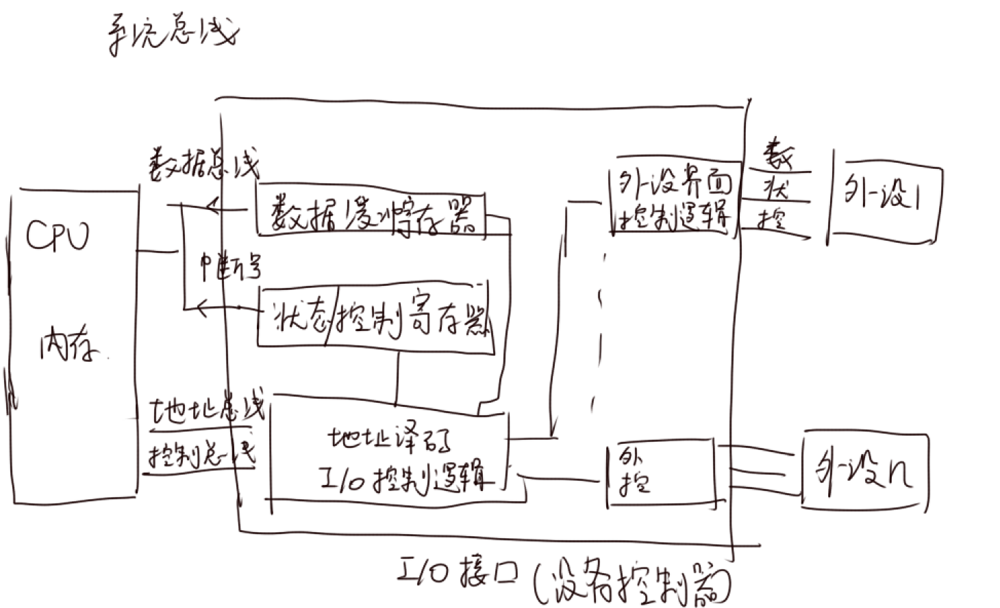

CPU访问io设备时，需要三步

- 发命令
- 读状态
- 读写数据


##### I/O端口及其编址

io端口：接口电路中能被CPU直接访问的**寄存器**。数据缓冲寄存器就称为数据端口，状态端口和控制端口可合用一个寄存器

IO指令实现的是io端口和通用寄存器之间的数据传送

io端口为了被cpu访问，就要给各个端口进行编址，有统一编址和独立编址两种方式。

- 统一编址（内存映射）：把io端口当成存储器的单元，用访存指令即可访问。但是减小了内存容量

- 独立编址（io映射）：io端口的地址空间和主存地址空间独立，需要专门的io指令来访问io端口


#### 7.4 I/O控制方式

##### 1.程序查询方式

cpu不断空转，轮询各个io设备状态，直到外设准备完成

只能与一个外设交换信息

独占查询：CPU100%的时间都在查询io状态

定时查询：每隔一段时间查询一次io状态，其余时间正常执行


##### 2.程序中断方式

一旦外设准备完成，向cpu发出中断，cpu执行中断服务程序来服务外设，完成后再回去继续执行

###### 中断的分类

硬件中断：中断信号来自外部设备

- 外中断（中断）：来自外部设备，包括io设备中断、外部信号中断、定时器引起的时钟中断
- 内中断（异常）：中断信号来自cpu执行的指令
  - 故障fault：可恢复的错误，如缺页（也是通过访存指令产生的异常）
  - 终止abort：不可恢复的错误，如非法指令，除数为0

软中断：通过当前进程中断指令int产生的中断，其实是程序的正常执行

- 陷入trap：有意的异常，如系统调用（用户态到内核态的切换）


中断判优：硬件排队器来决定先响应哪个中断，硬件中断优于软件中断，高速设备优于低速设备，输入设备优于输出设备


###### 中断响应

CPU在每条指令执行结束后，向接口发出中断查询信号检查中断。检查到则进入中断处理


###### 中断处理

注意：中断处理程序执行时是开中断的！

- **中断隐指令**（硬件直接实现）做的事：
  - 关中断：因为保护中断现场时不能被中断打扰
  - **保存断点**：将当前PC值压栈
  - 中断服务程序寻址：硬件先产生向量地址（中断类型号），通过**数据总线**发给CPU。CPU在中断向量表中由中断类型号找到中断向量（中断服务程序的入口地址）放入PC
  
- **中断服务程序**（操作系统负责）做的事：
  - **保存现场**和屏蔽字：通用寄存器的值
  - 开中断：为了中断嵌套，接受新的中断
  - 执行中断服务程序
  - 关中断：保证恢复现场时不能被打扰
  - 恢复现场和屏蔽字
  - 开中断
  - 中断返回
  
  注：中断返回指令iret不是跳转指令jmp

###### 多重中断（中断嵌套）

暂停当前的中断服务程序，转而执行新的优先级更高的中断服务程序


###### 中断屏蔽

中断屏蔽字：描述中断屏蔽的【处理优先级】，不是响应优先级！

每个中断源都有一个屏蔽触发器，1表示它能够屏蔽的中断源（能屏蔽自己），0表示不能。所有屏蔽触发器组合成一个屏蔽字寄存器，屏蔽字寄存器的内容称为屏蔽字（P300）

若中断源A优先级比B高，说明A能屏蔽B，则第A行第B列为1

设优先级从高到低为DACB

| 中断源 | A    | B    | C    | D    |
| ------ | ---- | ---- | ---- | ---- |
| A      | 1    | 1    | 1    |      |
| B      |      | 1    |      |      |
| C      |      | 1    | 1    |      |
| D      | 1    | 1    | 1    | 1    |


##### 3.DMA方式

###### DMA控制器的组成

- 主存地址计数器
- 传送长度计数器
- 数据缓冲寄存器：暂存每次传送的数据


###### DMA传送过程

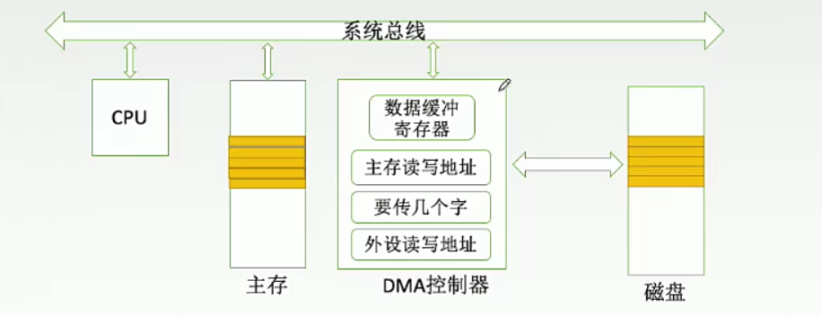

- 预处理：CPU进行准备工作，测试io设备状态
- IO设备需要数据传输（每当数据缓冲寄存器充满）时，向DMA控制器发送DMA请求
- DMA控制器向CPU发送总线请求
- CPU响应后让DMA控制器接管系统总线
- 设备驱动程序设置传送参数（如主存地址和长度）
- 进行数据传送
- 后处理：传完以后DMA控制器向CPU发送中断请求，CPU执行中断服务程序进行数据的校验等


###### DMA传送方式

- 停止CPU访问主存法：传送整个数据块过程中CPU都不能访存
- DMA与CPU交替访存法
- 周期挪用法：DMA控制器每准备好一个字，即可访存，然后DMA控制器释放总线使用权每个字传完后CPU可以访存


###### DMA方式和程序中断方式的区别

- 中断响应只能在一条指令结束后，DMA方式可以在每个**时钟周期**结束后
- 中断方式每传一个字都需要一次中断，DMA传完才会发送中断请求

数据缓冲寄存器为32bit，说明一次中断可以传输32bit的数据


#### ※ 计算I/O时间与CPU总时间之比

CPU间隔查询的最长间隔时间=设备准备数据时间=数据缓冲寄存器大小/数据传输率

- **每秒内I/O次数**=数据传输率/数据缓冲寄存器大小
- **每次I/O的时钟周期数**：按照不同的控制方式分为3种情况：
  - 查询方式：每次IO的指令数*CPI
  - 中断方式：中断响应和处理时间
  - DMA方式：预处理和后处理时间
  - 注意：不包括传输时间
- 每秒用于I/O的时钟周期数=每秒I/O次数*每次I/O的时钟周期数，除以每秒的时钟周期数就是I/O时间与CPU总时间之比

例（2019.21）

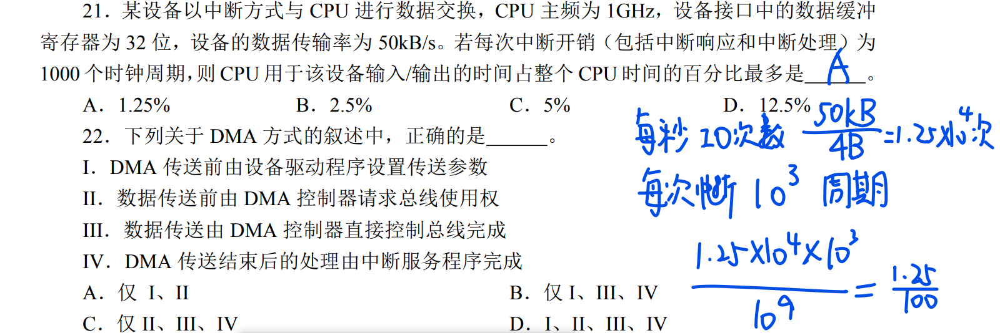

2018,43

### 总结

65536=256x256=2^16

