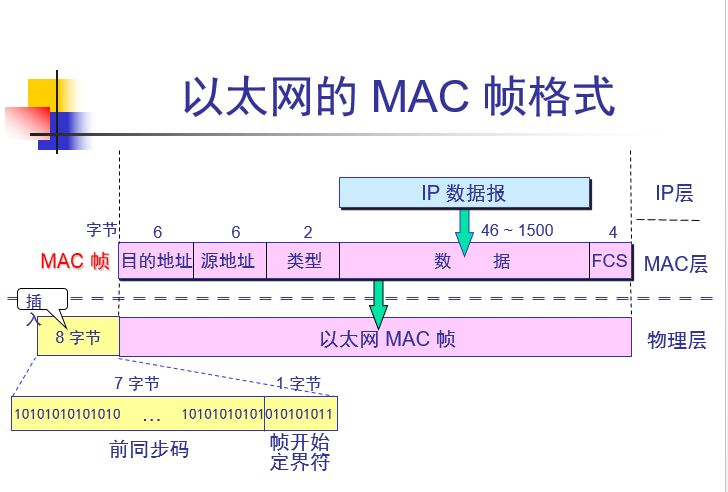
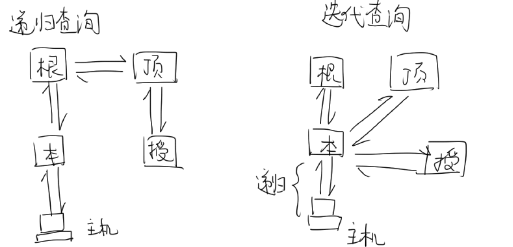
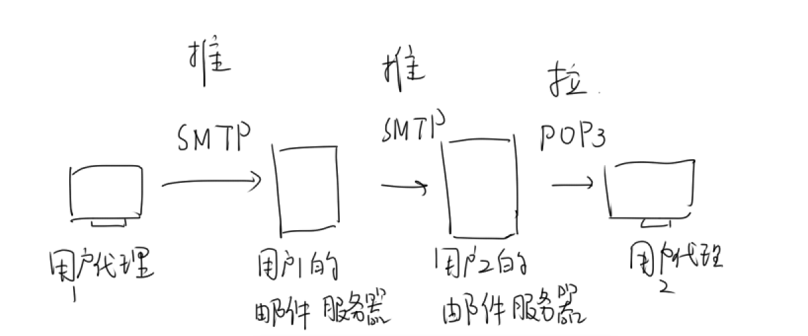
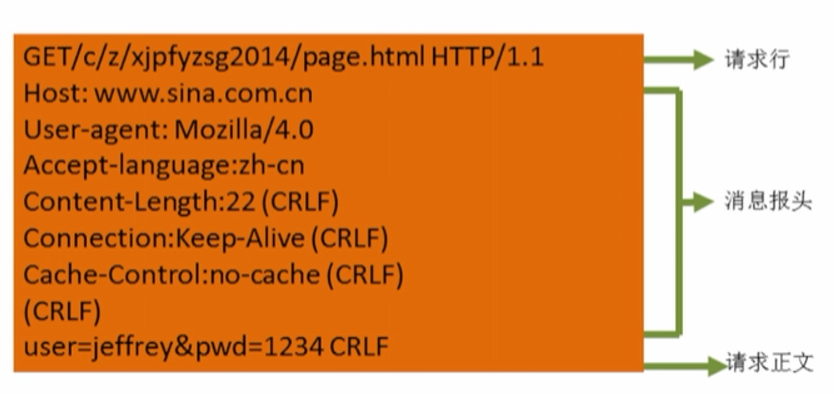
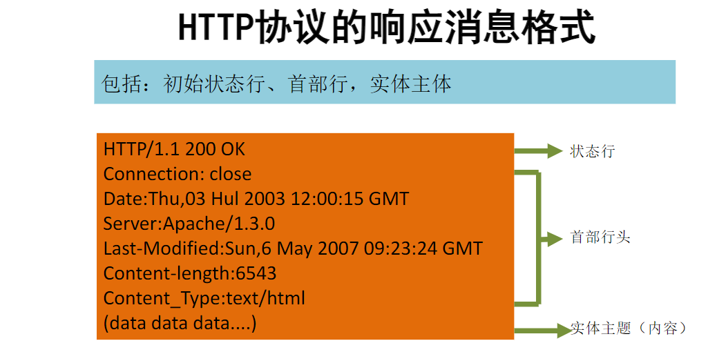
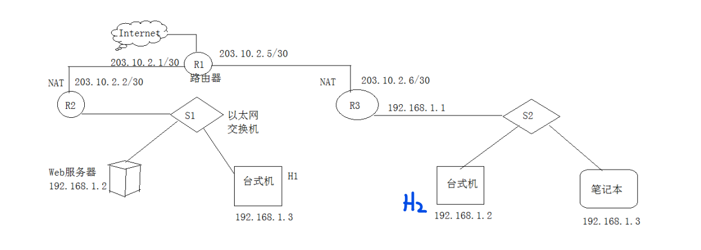

## 第一章——计算机网络体系结构

### 1.1 计算机网络概述

#### 一、计算机网络的概念

将独立的计算机系统通过通信设备和线路连接起来，由软件实现资源共享和信息传递 

#### 二、计算机网络的组成

从组成成分看

- 硬件：主机（端系统），通信链路，交换设备，通信处理机（网卡）
- 软件：应用层程序

从工作方式看

- 网络边缘：主机
- 网络核心：网络和路由器

从功能组成看

- 通信子网：物理层，数据链路层，网络层
- 资源子网：会话层，表示层，应用层。资源包括硬件、软件、数据

#### 三、功能

数据通信，资源共享，分布式处理，提高可靠性，负载均衡

#### 四、分类

按分布范围分类：

- 广域网WAN：几十km到几千km，采用交换技术
- 城域网MAN
- 局域网LAN：几十-几千米，采用广播技术
- 个人局域网PAN

按传输技术分类：

- 广播式网络：所有联网计算机共享一个公共信道
- 点对点网络：每条物理线路连接一对计算机。广域网

按拓扑结构分类

- 总线形网络：单根传输线
- 星形：每个计算机与中央设备（交换机、路由器）相连
- 环形：环中信号单向传输，令牌
- 网状：可靠性高，复杂，多用于广域网

按交换技术分类

- 电路交换网络：如传统电话网络，源节点和目的节点之间独占专用通路
- 报文交换网络（**存储-转发**网络）：数据+源地址、目的地址等信息封装成报文，每次传送到相邻节点，**全部存储后**再转发
- 分组交换网络：将数据分成固定长度的数据块，每个块+源地址、目的地址等组成分组，再存储-转发。缺点是附加信息开销大

#### 五、标准化工作和组织

RFC

#### 六、性能指标

带宽：信道传输速率，b/s

时延=发送+传输+处理+排队（后两个一般可忽略）

- 发送时延：把分组所有比特推入链路的时间
- 传播时延：信道长度/传播速率
- 处理时延：分析报文头部，差错检验等的时间
- 排队时延：分组进入路由器的输入队列中等待处理的时间

时延带宽积：传播时延x带宽

往返时延（RTT）：从发送端发送数据到发送端收到ACK的时间

吞吐量：单位时间内通过信道的数据量

信道利用率：
$$
信道利用率=\frac{有数据通过时间}{有数据通过时间+无数据通过时间}
$$

### 1.2 计算机网络体系结构与参考模型

网络体系结构：下层向上层提供服务，每层是一种实体

报文：数据部分+控制信息部分。上层的报文是下层的数据部分

协议：对等实体间通信规则。协议由语法，语义，同步组成

- 语法规定数据传输格式
- 语义规定要完成的功能
- 同步规定了各种操作的时序关系

接口：同一节点内相邻两层间交换信息的连接点，服务访问点SAP

服务原语：请求，指示，响应，证实

服务分为：

- 面向连接（先建立连接，分配资源）/无连接（尽最大努力交付）

- 可靠/不可靠：可靠需要序号和校验和两个字段

- 有应答/无应答

#### ISO/OSI参考模型

应用层
表示层：数据格式转换，使得不同表示方法的信息可以互相交换
会话层：会话管理和同步（SYN），可以使用校验点，使会话在通信失效时，从校验点继续恢复通信
传输层：端到端通信，流量控制，拥塞控制
网络层：路由选择，分组转发
数据链路层：点对点通信，组帧，差错控制，介质访问控制
物理层：传输比特流

通信子网：物理层，数据链路层，网络层
资源子网：会话层，表示层，应用层
传输层承上启下

OSI模型精确定义了：服务，协议，接口

#### TCP/IP模型

应用层，传输层，网际层，网络接口层（链路层+物理层）

OSI模型的网络层既支持无连接又支持面向连接，传输层仅支持面向连接；TCP/IP的网际层（IP）仅支持无连接不可靠服务，传输层既支持无连接又支持面向连接

TCP/IP模型没有精确定义服务，协议，接口

|        | OSI           | TCP/IP        |
| ------ | ------------- | ------------- |
| 层数   | 7             | 4             |
| 传输层 | 有连接        | 无连接/有连接 |
| 网络层 | 无连接/有连接 | 无连接        |

#### 课程采用的五层模型

- 应用层：FTP，SMTP，HTTP
- 传输层：（1）将数据分割成**报文**；（2）负责**进程间（端到端）通信**的流量控制、差错控制等服务。
  - 复用：多个应用层进程向下使用传输层服务（源端口号不同）
  - 分用：传输层把信息交付给上面应用层不同进程（目的端口号不同）
  - TCP，UDP
- 网络层：数据报为单位，**将数据封装成分组**。**路由选择**，分组转发，网际互联。典型协议：IP，ICMP，ARP，OSPF
- 数据链路层：将IP数据报**组帧**，负责**主机之间（点到点）通信**的**差错控制**，流量控制。典型协议：PPP
- 物理层：传输比特流，规定电路接口的参数，通信链路传输信号的意义和电气特征

---

## 第二章——物理层

物理层考虑如何在各计算机之间传输比特流

### 2.1 通信基础

#### 1.基本概念，码元

信号：数据的电磁或电气表现，数字信号，模拟信号

信源：发送信号的源头
信宿：接收信号的终点
信道：信号的传输媒介，分为**数字信道（基带传输）和模拟信道（宽带传输）**

信源（计算机）发出数字信号，经过调制解调器转换为模拟信号，再送到模拟信道上

通信双方的交互方式：

- 单工：一条信道，仅一个方向

- 半双工：两条信道，不可同时发送接收

- 双工：两条信道，可以同时发送接收

串行传输：距离长，速度慢

并行传输：距离短，速度快

**码元**：一种固定时长的信号波形，可以表示不同离散数值。

要表示**4进制码元**，就需要**四个高度的电平**作为4种码元00,01,10,11，此时一个码元携带**2比特的信息量**

码元传输速率（**波特率**）：每秒传输的码元个数（脉冲个数，信号变化的次数），单位：1**波特**（Baud）=1码元/秒

信息传输速率：每秒传输的比特数，单位b/s。

假设一个码元携带n比特的信息量（1个码元有2^n个有效离散值），则M波特率的码元传输速率对应的信息传输速率为nM比特/s

传输速率是将比特推入信道的速率，传播速率是在信道上总的传播时间，一般速度接近光速

**计算机网络中的带宽**：最高传输率（b/s）

#### 2.奈奎斯特定理与香农定理

（1）奈奎斯特定理：在理想**低通**信道（<u>无噪声</u>）中的极限传输率（是传输速率的一个上限）

对于一个V进制码元，则需要log2V个二进制位。

W：理想低通信道带宽，单位Hz，极限码元传输率=2W波特

【注：**通信原理中的带宽W**：信道能够传输的最大频率与最小频率之差(Hz)。频率太小会衰减，频率太大会发生码间串扰，波形之间没有清晰界限。】
$$
极限传输率=2W\log_2V
$$

（2）香农定理：有高斯<u>噪声</u>时的极限传输率。

**S：信号平均功率，N：高斯噪声功率**
$$
极限传输率=W\log_2(1+\frac{S}{N})
$$
$$
信噪比=10\log_{10}(\frac{S}{N})，单位:dB（分贝）
$$

信噪比有两种形式：

- 如果信噪比以dB（分贝）为单位给出（上式结果），则需要计算出S/N
- 如果以S/N形式给出，则没有单位，直接用来计算极限传输率

香农定理给出了信息传输速率的极限，由带宽和信噪比共同约束，这个极限不能突破

若同时规定了码元代表的进制数时，就要使用奈奎斯特定理来约束了，即两个定理需要同时满足，两种方法求出极限传输率的最小值是最终的极限传输率

> 例：王道8.1(34)
>
> 一个信道的信号功率0.62W，噪声功率为0.02W，频率范围3.5~3.9MHz，求最高数据传输速率
>
> S/N=0.62/0.02=31
>
> 带宽W=3.9-3.5=0.4MHz
>
> 最高数据传输速率=Wlog2(1+S/N)=0.4*5=2Mbps
>
> 
>
> 王道8.4(34)
>
> 信道的状态数为4，信噪比30dB下的极限传输率为8kbps，求其带宽W。
>
> 根据奈奎：2Wlog2V=4W
>
> 根据香农：Wlog2(1+S/N)=10W
>
> 相比较2W更小，因此4W=8k, W=2k

#### 3.编码与调制

为了传输数据，要转换成信号，数据分为数字数据（0101）和模拟数据，这两种都可以转为数字信号或模拟信号，所以有4种转换方法

**调制：数据->模拟信号**

**编码：数据->数字信号**，用怎样的信号表示0和1

数字数据-数字发送器-数字信号

数字数据-调制器-模拟信号

模拟数据-PCM编码器-数字信号

模拟数据-放大器调制器-模拟信号

##### （1）数字数据编码为数字信号

发送方和接收方的同步：非归零编码连续的0或1会导致连续的高/低电平，接收方不知道时钟周期的情况下无法判断到底有几个数，难以同步，因此有多种编码方法解决该问题

- 非归零编码NRZ（No Return Zero）：0低1高，无法同步

- 归零编码RZ：每个时钟周期中间回到低电平（归零）

- 反向非归零编码NRZI（No Return Zero-Inverse）：若码元为0，则下一个电平与之前相反；1则相同

- 曼彻斯特编码：在每个码元的中间实现电平跳变。先高后低表示1，先低后高表示0。可以同步。

  数据传输率=1/2码元传输率。【以太网使用曼彻斯特编码，10BaseT是10Mb/s的以太网】

- 差分曼彻斯特编码：若码元为1，下一个码元的前半与前一个码元后半的电平相同；若码元为0，下一个码元的前半与前一个码元后半的电平相反（图像1连0断）

- 4B/5B编码：数据流每4位为一组，转换成5位码，效率80%

##### （2）数字数据调制为模拟信号

- 幅移键控ASK：用不同振幅表示01
- 频移键控FSK：不同频率
- 相移键控PSK：不同相位
- 正交振幅调制QAM：结合振幅和相位，形成叠加信号。

计算题：设m个相位，每个相位n种振幅，则有mn种码元，设波特率为B，则数据传输率=$B\log_2(mn)$ b/s

##### （3）模拟数据编码为数字信号

对音频信号进行脉码调制PCM三个步骤：采样，量化，编码

- **采样**：连续信号取一些离散点，注意**采样定理：采样频率>=2最大频率**，才能确定正弦波波形。**【假设每1/8s采样一次，频率就是8Hz】**
- 量化：把离散的电平幅值转为数字值并取整

- 编码：转为二进制编码

##### （4）模拟数据调制为模拟信号

为了传输的有效性，需要使用放大器和调制器增大信号频率再传输

#### 4.电路交换、报文交换与分组交换

电路交换：
- 传输之前先建立一条物理通信路径，可能经过多个中间节点，传输期间一直独占，结束后释放，带宽利用率低
- 建立连接时延大，传输时延小
- 不能差错控制，但是按序到达
- （电路交换不分组！）

报文交换：
- 传输单位是报文，报文大小无上限
- 含源地址、目标地址
- **存储-转发传输**：优点是可以检错，缺点是有排队时延
- 无连接
- 动态分配线路

分组交换：限制了每次传送的数据块大小上限，把大块划分成小块，在头部加入控制信息（如源地址、目的地址、编号）
- 分组=控制信息+数据，大小有上限
- 存储-转发
- 分组间并行传输，分组交换传输时延比报文交换小
- 以太网采用分组交换

> 计算题：设文件大小为n b，每个分组大小为m b，链路的数据传输率为v b/s，将文件通过【甲主机-路由器-乙主机】的路径来发送
>
> - 对于报文交换，整个报文需要经过甲和路由器两次存储转发，故传输时延=2n/v。
>
>   若中间有k个路由器，则传输时延=
>   $$
>   (k+1)n/v
>   $$
>   
>
> - 对于分组交换，由于并行传输，路由器接到第一个分组后直接开始转发，即除了第一个分组外的所有分组都不用计算路由器存储转发的时延。
>
>   传输时延=n/v（整体进入链路的时间）+m/v（第一个分组经路由器存储转发的时间）
>
>   若k个路由器，则传输时延=
>   $$
>   n/v+km/v
>   $$
>
> 注意题目中的MB和Mb
>
> 例（2010.34）
>

#### 5.数据报和虚电路

分组交换的两种方式

（1）数据报：

主机将分组发往相邻节点，缓存，查找转发表转发

- 数据报服务不保证可靠性，可能失序、丢失、重复分组
- 存储转发时有排队时延
- 链路出现故障时可以更新转发表
- 分组包含目的地址

（2）虚电路：

发送分组之前建立一条逻辑上相连的虚电路（虚指的是电路不是专用的，但也算建立连接）

端系统分配一个虚电路号给虚电路，不需要给虚电路预分配带宽

每个分组上有虚电路号，每个节点维护一张虚电路表

- 虚电路提供可靠的通信，不会失序
- 某个节点故障，整个虚电路都会故障
- 需要建立连接、断开连接的时间
- 分组不包含目的地址，数据报开销小。

### 2.2 传输介质

#### 1.双绞线、同轴电缆、光纤与无线传输介质

双绞线：绞合可以减少对相邻导线的电磁干扰。屏蔽层：进一步抗电磁干扰

同轴电缆：比双绞线屏蔽性高，传输速率更快

光纤：不受电磁、噪声影响。多模光纤：多条光线，适合近距离传输；单模光纤适合远距离传输

#### 2.物理层接口的特性

- 机械特性：引线、引脚的规格、数量、排列情况

- 电气特性：规定线路上信号的电压高低（多大的电压算高电平）、传输速率

- 功能特性：电平高低的意义（高电平表示什么），信号线的用途

- 过程特性：各条物理线路的时序关系

### 2.3 物理层设备：中继器，集线器

#### 中继器（转发器）

- 中继器将衰减失真的数字信号**再生（整形、放大）**再转发出去，可以使信号传得更远。放大器放大的是模拟信号，中继器放大的是数字信号

- 中继器没有存储转发功能，是直通式设备；

- 中继器两端是两个**网段**（属于一个局域网），必须数据传输速率相同

注：对于一个设备，如果想在物理层互联，即在两个网段之间传输物理层信号，只需两端的物理层协议相同，无需链路层协议相同；如果两个网段之间传输链路层信号，就需要物理层和链路层协议都相同

5-4-3原则：最多用4个中继器串联以太网，5段通信介质中只有3段可以挂计算机

#### 集线器（Hub）

- 集线器是多端口中继器
- 不能隔离冲突域和广播域，所有集线器的端口都属于一个冲突域
- 一个端口会把信号广播给其他所有端口（不包含发送端口！！），不需要的端口会丢弃
- 多端口发送会产生冲突，平分带宽

### 2.4 宽带接入技术

早期用户使用电话线连接ISP，从而接入互联网

ADSL非对称数字用户线技术：把低频频谱留给传统电话，高频用来上网。上行带宽（用户到ISP）远小于下行带宽

ADSL猫和光猫都是调制解调器（modem），光猫将要传输的信息转为光信号，而ADSL猫将其转为电话线的模拟信号

---

## 第三章——数据链路层

物理层提供的物理连接可能有差错，数据链路层为网络层提供逻辑上无差错的数据链路。链路分为两种：广域网采用**点对点链路**（PPP/HDLC协议），局域网采用**广播链路**

### 3.1 链路层功能

1.为网络层提供服务：有连接必有确认。包括无确认无连接、有确认无连接、有确认面向连接

2.链路管理：管理链路层连接的建立、维持和释放。包括在广播链路上通过介质访问控制为站点分配信道

3.组帧：链路层使用帧定界符将网络层的分组封装成帧，并保证**透明传输**，不管传输数据是什么比特组合都能传输

4.流量控制：当发送方发送能力大于接收方接收能力，需要让发送方知道接收方的状态，从而限制发送速率。链路层的流量控制控制的是相邻两节点（主机或路由器）之间的流量；传输层的流量控制针对源端和目的端之间的流量。

5.差错控制：使发送方知道接收方是否正确受到数据。在误码率高的情况下，还提供链路层的可靠传输。

位错：使用CRC循环冗余校验发现错误，再自动重传

帧错：引入定时器防止帧的丢失，给帧编号防止重复、失序

### 3.2 组帧

为了在出错时只发送出错的部分，所以把比特组合成帧，帧是网络中信息的最小单位。

组帧：把网络层的分组封装成帧，加头部和尾部来表明一个完整的帧，称为**帧定界**，即看到比特串就知道数据帧的开始和结束

#### 1.字符计数法

每个帧的头部用计数字段表示帧内字节数量（包括字段本身），如果计数字段出错就完蛋

#### 2.字符填充法-首尾定界符

使用特殊字符表示帧的开始和结束，为了区分正常数据中相同的特殊字符，需要在数据中这些字符的前面加上转义字符。如果数据中有转义字符，则需要写两遍转义字符

#### 3.比特填充法-首尾标志法

用01111110来标志一帧的开始和结束。为了区分数据中的连续6个1，每5个1后面加一个0

#### 4.违规编码法

对物理层比特编码时，如果使用曼彻斯特编码：1-高低，0-低高

此时低低和高高就是违规的编码序列，可以表示帧的开始结束

目前常使用3和4方法帧定界

### 3.3 差错控制

数据链路层的差错控制只能保证以太帧在路由器之间传输正确，传输层的差错控制能保证路由器内部NAT等操作时报文正确

差错控制的两种思路：检错重传；纠错

#### 1.检错码：奇偶，CRC

（1）奇偶校验码

1个校验位，事先说好是奇校验还是偶校验，如果是奇校验，让1的个数为奇数

（2）**循环冗余码CRC**

- 发送方和接收方事先定好一个r+1位二进制数G，最高最低位为1

- 发送方将d位数据后面拼上r个0，对G**模2除法**（**没有进位和借位，异或运算**），余数填入刚才r个0的位置，得到d+r位CRC编码
- 接收方得到CRC后，模G为0，则正确

#### 2.纠错码：海明码

数据位n位，校验位k位，因为要**用k位二进制数来表示总的n+k个位置**，必须满足
$$
n+k\le 2^k-1
$$
校验位=负责的数据位的异或

校验：校验位与数据位异或，全为0则正确；否则该数就是错误位的位号

海明距离（码距）：两个码字中不相同的二进制位的个数

- 检错d位：码距=d+1

- 纠错d位，需要码距=2d+1的编码方案

### 3.4 流量控制与可靠传输

在数据链路层，流量控制和可靠传输是不可分割的

#### 1.可靠传输

数据链路层的可靠传输的两种机制：确认，超时重传

**捎带确认**：将确认帧捎带在回复帧中，确认帧发送时延=数据帧发送时延

当确认时出现差错就需要自动重传请求ARQ：

- 接收方请求发送方重传出错的数据帧
- ARQ分为停等ARQ、GBN-ARQ、SR-ARQ三种协议

#### 2.流量控制

流量控制有两种：停等协议，滑动窗口协议（又分为GBN和SR）

停等协议：发送方只有收到ack才能再发，否则一直等待，是发送窗口=接收窗口=1的滑动窗口协议

滑动窗口协议：

- 发送窗口以内的才能发送，接收窗口以内的才能接收，否则丢弃
- 发送端每收到ack，发送窗口右移一个帧
- 接收端每收到数据帧，接收窗口右移，发送ack

##### 2.1 停等协议

发送窗口=1，接收窗口=1

三种差错：

- 数据帧丢失：超时重传
- 数据帧损坏：接收方丢弃损坏帧，不回ack，发送方超时重传

- 数据帧正确但ack帧损坏：发送方收不到确认帧，重传数据帧，接收方收到重复的数据帧后丢弃，仍然回复一个ack

帧缓冲区：为了重传数据帧，发送方需要缓存数据帧的副本，只有收到该帧的ack后，才可以清除副本

缺点：信道利用率低

##### 2.2 GBN-后退N步

发送窗口>1，接收窗口=1。设n是序号位数，由于发送窗口+接收窗口<=2^n，因此
$$
发送窗口\le2^n-1
$$
发送方无需等ack，可以连续发送帧，每发送一帧，启动一个计时器

如果有失序ack或者未收到ack，则重发被正确接收的数据帧以后的所有帧

**累积确认**：接收方可以不用给每个帧回ack，发送一个序号的ack表明之前的都正确收到了。如果一个帧n错误，后面的即使正确也都要抛弃（接收方只允许按顺序接收帧）

##### 2.3 SR-选择重传

发送窗口>1，接收窗口>1，接收窗口大于发送窗口没有意义，一般情况**二者相等**
$$
发送窗口=接收窗口=2^{n-1}
$$
接收方可以收下序号不连续但仍在接收窗口中的帧。收到错误帧时，发送NAK要求重传

注意选择重传不是累积确认，因为可以**无序接收进入缓冲区**。接收窗口要等到接收范围内所有帧收到才能更新，发送窗口等接收窗口更新后才能更新

哪几个帧超时，就等待重传哪几个帧

##### 窗口大小问题

窗口总大小=发送窗口+接收窗口

设k为帧的序号长度（二进制），为保证新窗口和旧窗口不重叠，需要
$$
发送窗口+接收窗口\le2^k
$$
对于GBN，接收窗口=1，那么发送窗口<=2^n-1。

##### 信道利用率问题

信道利用率也称链路利用率
$$
信道利用率=\frac{有效发送数据的时间}{总时间}
$$
（1）对于停等协议：

有效发送数据为一个帧，有效发送数据的时间就是一个帧的传输时延，等于一个数据帧字节数L/数据传输率C。

- 若不计ack的发送时延，一个发送周期T=一个帧的传输时延+2*单向传播时延

$$
信道利用率=\frac{L/C}{L/C+RTT}
$$
- 当采用**捎带确认**，即ack的发送时延=数据帧的发送时延，总时间还要包含ack的发送时延，也是L/C
  $$
  信道利用率=\frac{L/C}{2L/C+RTT}
  $$
  

（2）对于滑动窗口协议（GBN和SR）：

发送窗口>1。首先，分母是固定的，仍是一个发送周期T。设发送窗口大小为n，为了**提高信道利用率，就需要提高n**（从发送一帧到接收一帧确认的时间内最多发送多少帧）。【2012.36，2015.35】
$$
信道利用率=\frac{nL/C}{L/C+RTT}
$$
当GBN时，接收窗口=1，设帧序号的比特数为k
$$
2^k\ge n+1
$$
同样地，采用捎带确认时【2017,47】
$$
信道利用率=\frac{nL/C}{2L/C+RTT}
$$
信道吞吐率：信道效率*发送速率

### 3.5 介质访问控制MAC

在广播链路中，为了防止多个信号共用一条**广播**信道导致的通信互相干扰，引入介质访问控制MAC

- 静态介质访问控制：预先为每个用户分配信道，包括信道划分MAC
- 动态介质访问控制：不固定分配，一个用户可能占用整个信道，包括随机访问MAC，轮询访问MAC

#### 1.信道划分MAC

（1）频分多路复用FDM：不同频率载波，但不能传输数字信号

（2）时分多路复用TDM：分成若干时间片，轮流分配给多个信号

统计时分多路复用STDM：按需动态分配时间片

（3）码分多路复用CDM：使用不同编码

（4）波分多路复用WDM：光纤中不同波长，本质上是FDM

##### CDMA码分多址

CDMA是码分复用的一种方式

（1）码片序列

把时间分为更短的码片，每个站点分配一个码片序列。想要发送比特1时发码片序列，发送0时发码片序列的反码。当多个站点同时发送时，各路数据线性相加。

例如A站的**码片序列**是00011011（不是要发的信息），那么要发比特1时就发00011011，要发0时就发11100100.将码片序列中的0写成-1,1写成+1，码片序列为-1 -1 -1 +1 +1 -1 +1 +1。

（2）规格化内积

规格化内积(a,b)=a,b内积/a的维数

为了分离各路信号，不同站点的码片序列正交，即**规格化内积**(S,T)为0。另外(S,S)=1,(S,-S)=-1

（3）数据分离

已知S为A的码片序列，T为B的码片序列，经过f和g变换（原码或者反码）后线性相加，得到f(S)+g(T)送到链路上。现在要判断A和B分别发送了什么比特。

因为S与T正交，所以S与g(T)必然正交。(S,f(S)+g(T))=(S,f(S))+(S,g(T))=(S,f(S))+0=(S,f(S))。

让**码片序列和链路序列做规格化内积**(S,f(S))

- 如果结果为1，说明f(S)=S，发送的是码片序列的原码，即A发送了比特1；
- 如果为-1，说明f(S)=-S，发的是码片序列的反码，即比特0

> 例：2014.37
>
> A的码片序列是(1,1,1,1)，链路上收到序列(2,0,2,0),(0,-2,0,-2),(0,2,0,2)，则A发送的数据为？
>
> 让A的码片序列和后面3个序列做规格化内积，得到4/4=1, -4/4=-1, 4/4=1，于是A发送的数据就是101

#### 2.随机访问MAC

所有用户随意发送，但会产生冲突，所以每个用户按照规则反复重传帧，直到无碰撞通过。

##### （1）ALOHA协议

时隙ALOHA：将时间划分为一段段等长的时隙，每个时隙可以传输一个帧，每个节点时钟同步。只有在时隙开始才能发送帧，避免了随意性。如果同一时隙有两个站点发送，则认为冲突，站点在下一时隙以概率p发送数据帧

纯ALOHA：想发就发，如果一段时间收不到ack则认为发生冲突。如果两个站发送的两个帧发生碰撞，则各等待随机时间，再次发送

碰撞率很高

##### （2）CSMA协议

CSMA载波监听多路访问：站点在发送前先侦听信道，发现信道空闲后再发，发现信道忙就推迟发送，能够大大降低碰撞率

- 1-坚持CSMA：
  - 信道空闲，直接发；
  - 侦听到信道忙，继续坚持侦听，直到空闲才发送
- p-坚持CSMA：
  - 信道空闲，**以概率p发送**，以概率1-p下一个时隙再发（这样避免多个用户同时检测到空闲而同时发数据）；
  - 侦听到忙，等下一时隙侦听
- 非坚持CSMA：
  - 信道空闲，直接发；
  - 侦听到忙，等随机时间后（不用坚持）再侦听

##### （3）CSMA/CD

CD是碰撞检测（Collision Detection），用于**有线局域网**。每个主机都在不停地检测信道，信道空闲才能发送。**传输过程中也在侦听，一旦发生碰撞，就立刻停止传输**，并使用二进制指数退避算法等待一段时间再重传

但是，由于存在传播时延，可能A发出信号，但B没检测到信道忙就发送了信号，会发生碰撞。如果碰撞，则反弹回来，并立即停止发送。信号从发出到回来需要时间最多为2*信号的传播时延（2τ，也就是RTT），称为**争用期**。即从发出开始只要经过2τ时间还没检测到碰撞，即可断定没有碰撞。

a) **最小帧长**问题

为了保证发完帧之前就能得知发生碰撞，帧的传输时延应该>=2*信号的传播时延（2τ），τ=信道长度/传播速率，即
$$
RTT=2\tau \le L/C
$$
从上式可以确定一个最小的帧长L

如果一个站点收到的帧长小于最小帧长，说明这是停止发送导致的，就丢弃。

以太网规定最小帧长为64B

b) **二进制指数退避算法**：确定重传时机，防止重传仍然碰撞

- 设基本退避时间=2τ

$$
k=\min\{10,当前重传次数\}
$$

- 然后从$[0,2^k-1]$中随机选一个数r
- 等待$2τ\cdot r$​时间后重传

这样使得重传推迟的平均时间随重传次数增大而增大，降低碰撞概率

##### （4）CSMA/CA

CA是碰撞避免(Collision avoid)，用于**无线网**。无线网发送信号强度远大于接收，CSMA/CD碰撞检测成本太高。CSMA/CA不能完全避免碰撞，但会尽量发生碰撞的概率

CSMA/CA采用预约信道、确认帧和RTS/CTS帧三种机制来避免碰撞

- 预约信道：发送数据的同时广播其他站点，通知某段时间内不要发送数据，以免碰撞。

- ACK帧：所有站点在正确接收到数据帧（除广播帧）后，都要向发送方返回确认帧

- RTS请求发送帧/CTS清除发送帧：解决隐蔽站问题，即信道空闲时，A和C同时向B发送数据，A不知道C也要给B发送，C相对A是隐蔽站

流程：

- A先检测信道是否空闲，信道空闲则发送RTS帧请求发送同时其他站点不要发送

- 接收端B收到A的RTS后，响应CTS，拒收C的数据

- A收到CTS后，开始发送数据帧，同时预约信道，广播其他站点自己要传多久数据

- B收到数据帧后，CRC检验正确则回复ACK帧

#### 3.轮询MAC：令牌传递协议

不会发生碰撞

轮询协议：监控站对每个用户询问，一个用户发完才问下一个用户

令牌传递协议：一个令牌（特殊的帧）在节点间按次序交换，站点必须有令牌才能发送帧。通过RTS帧请求发送，CTS帧同意

令牌环网：物理上是星型，逻辑上是环形。某站点需要发送数据，当令牌轮到它时，将令牌加上要传输的数据形成数据帧，在环网中传输，到达目的节点后，目的节点保存一个数据帧的副本，原数据帧继续循环。再次到达发送方后，发送方重新产生一个令牌。。。

轮询介质访问控制适合负载高的广播信道

### 3.6 局域网LAN，以太网

#### 1.局域网的基本概念与体系结构

局域网：在较小地理范围内，所有站点共享总带宽。有星型、环形、总线型、星形总线型复合4种结构。局域网只包含数据链路层和物理层

IEEE802标准将数据链路层拆成两个子层

- LLC（逻辑链路控制）子层：给帧加序号，建立释放连接
- MAC（媒体接入控制）子层：负责组帧，比特差错检测

#### 2.以太网，IEEE 802.3

以太网是符合IEEE 802.3标准的基带总线型局域网

MAC地址（物理地址）：6个16进制数用-分割，如02-60-8c-e4-b1-21，6字节

##### 以太网MAC帧

- 目的MAC地址（6B）
- 源MAC地址（6B）
- 类型2B
- 数据（最短46B，最长1500B）
- CRC校验4B

注意：以太网帧在传输过程中，MAC源目的地址都是当前两个路由器的MAC地址，和整个过程的起点终点无关！！！

##### 以太网的性质

- 逻辑上是总线型拓扑结构
- 采用**广播**方式发送信息
- **无连接，不可靠**
- **以太网帧最短64B**。这里可以结合最小帧长问题，L=2τv，求出RTT=L/v
- 以太网帧的最大传输单元MTU=1500B（MTU指的是以太网帧的数据部分，即网络层IP数据报整体长度）。而IP数据报头部20B，因此用以太网传输时，IP数据报的数据部分最多1480B

##### 100BASE-T以太网

- 传输速率=100Mb/s
- 采用**双绞线**
- 物理上是星形拓扑结构，中间是集线器
- 使用曼彻斯特编码
- CSMA/CD介质访问控制
- 收发器和集线器距离不超过10

计算机通过**网卡**与局域网连接，每块网卡有一个独一无二的MAC地址（介质访问控制地址），网卡在物理层

##### 高速以太网

速率>=100Mb/s的以太网

- 100BASE-T以太网：全双工、半双工
- 吉比特以太网：半双工
- 10吉比特以太网：全双工

#### 3.IEEE802.11

IEEE802.11是无线局域网的协议标准，采用CSMA/CA介质访问控制 。Wi-Fi基于IEEE802.11

无线局域网的最小单位是基本服务集BSS，包括一个基站AP（接入点）和许多主机。自组织网络没有AP

**IEEE802.11的帧头格式**：假设用户A要向B发送信息，A先要发给它的基站AP1，AP1发给B的基站AP2，AP2发给B

| 地址1    | 地址2    | 地址3    | 地址4  |
| -------- | -------- | -------- | ------ |
| 接收端AP | 发送端AP | 目的地址 | 源地址 |
| AP2      | AP1      | MAC2     | MAC1   |

IEEE802.11的帧间间隔时间IFS

- DIFS：最长
- PIFS
- SIFS：最短，用于立即返回的操作，如ack

### 3.7 广域网WAN

广域网是覆盖范围很广的长距离网络，采用点对点链路，因为不是广播链路所以不需要介质访问控制

广域网内部有很多结点交换机（存储转发），交换机连着各局域网的路由器，广域网使用的主要是网络层协议，负责路由选择和分组转发。互联网是广域网与其连接的局域网的总和

广域网数据链路层控制协议：PPP和HDLC

#### 1.PPP点对点协议

PPP数据帧结构：【01111110|上层协议|上层数据|CRC校验码|01111110】，由于点对点，不需要MAC地址

- 要建立PPP链路，有连接，只支持全双工
- 不可靠，采用CRC校验，只能检错不能纠错，检出错就抛弃。没有序号和确认机制
- **面向字节**。PPP使用定界符01111110作为PPP帧的开始和结束，为了透明数据传输（数据域也允许包含01111110），如果数据域中有01111110，在前面加上01111101；如果数据域中有01111101，前面再加一个01111101

- 两端可支持不同网络层协议

三个组成部分

（1）LCP：物理链路

（2）NCP：逻辑链路

（3）将IP数据报封装到串行链路的方法

#### 2.HDLC高级数据链路控制协议

HDLC**面向比特**

所有帧采用CRC校验，有序号和确认机制，是可靠传输

帧定界使用首尾标志法（比特填充法），每个帧开头为标志字段01111110，确定帧的开始位置，组帧时数据中如果连着5个1，则添加一个0

有三种HDLC帧：信息帧，监督帧，无编号帧

### 3.8 虚拟局域网VLAN

一个以太网是一个广播域，可以把大的局域网分割成小的虚拟局域网，每个VLAN是一个小广播域。可避免广播的泛洪现象，并且不用硬件和路由器

VLAN可隔离冲突域和广播域

交换机有VLAN表，表项【VLAN ID|端口】

一个交换机连接的属于一个VLAN的主机相互通信：VLAN1中的主机广播时，交换机只转发给相同VLANid的端口，不同VLAN的主机无法互相发送信息（因为没有路由器）

不同交换机上相连的主机也可以属于一个VLAN：

- 主机发送以太帧给交换机1，交换机1在以太网帧插入标签字段（包括12位VLANid），称为802.1Q帧。
- 发到交换机2后，交换机2根据标签得知转发给对应VLANid的主机，去掉标签，转发

### 3.9 数据链路层设备：网桥，交换机

#### 网桥，只能隔离冲突域

网桥工作在链路层，两个以太网（网段）通过网桥连接起来，形成一个大的以太网。网桥使各网段成为隔离开的碰撞域（冲突域），但整体是一个广播域，可能产生广播风暴

广播风暴：以太网中出现了环，整个网络流量被广播包占据。交换机收到广播包后，复制一份转发给其他端口

网桥的自学习：发送方发送信息，经过网桥后，网桥的转发表记下来发送方的地址和网桥端口

网桥可以连接不同类型的局域网

#### 以太网交换机

**交换机是多端口网桥**，是链路层设备（路由器是网络层设备）

交换机的自学习：接收到数据帧时，只有源主机的方向确定，所以根据源MAC地址进行自主学习

交换机收到数据帧后，看目的MAC地址，如果不在转发表中，就广播出去，询问IP地址对应的MAC，加入转发表

|              | 隔离冲突域 | 隔离广播域 |
| ------------ | ---------- | ---------- |
| 集线器       | 否         | 否         |
| 网桥，交换机 | 是         | 否         |
| 路由器       | 是         | 是         |

#### 端口带宽问题

交换机能同时连接多对端口，每一对相互通信的主机都能无碰撞传输。因此连接交换机的每个站点都独享交换机的总带宽

集线器所连主机拥有的带宽则是1/n集线器总带宽

#### 交换机的两种交换模式

（1）直通式交换机：只检查帧的目的地址（6B），立即发出。缺点：无法错误检查

（2）存储转发式交换机：交换机向链路输出比特之前，必须先接收到整个分组并缓存，检查数据是否正确，再转发。缺点是速度慢，新分组到来后有排队时延

检查方式就是通过CRC校验

---

## 第四章——网络层

网络层将多个计算机网络通过中间设备（路由器）连接起来，形成更大的网络系统，不同网络之间是隔离冲突域、广播域的。而集线器、交换机只是把一个网络扩大

- 控制平面：路由选择，确定路径
- 数据平面：分组转发，路由器如何根据转发表将数据报转发

网络层不可靠

- 网络层的复用：发送方不同协议的数据可以封装成ip数据报

- 网络层的分用：ip数据报剥去首部后能分发给相应的协议

分组的排序由传输层负责（要向下递交）；分组的重组由网络层负责（要向上递交）

### 4.1 网络层功能

1.异构网络互联

多个异构网络（数据链路层、物理层不同）通过中间设备连接起来，但这些网络使用相同的网际协议。实际上，**网络层协议可以不同**（如ipv4和ipv6），而网络层以上层的协议相同。

2.路由选择，分组转发

3.拥塞控制

拥塞指的是过量分组导致网络性能下降。路由器的缓冲区大小有限，如果分组到达路由器过多，那么会有大量分组被丢弃，平均时延急剧增加，网络的吞吐量骤降。判断拥塞的方法：**随着网络负载增加，吞吐量反而下降**

流量控制是点对点的问题，拥塞控制是整个网络的问题。拥塞控制分为开环控制：静态预防；闭环控制：将拥塞信息转移到合适的地方

### 4.2 路由算法

路由选择分为直接交付（起点终点在同一网段内，子网地址相同），和间接交付

#### 1.静态路由与动态路由

静态路由：当网络结构或者链路状态变化时，网络管理员手工配置路由信息

动态路由：依靠路由器之间交换信息，用特定算法优化。分为距离向量路由算法和链路状态路由算法

#### 2.距离-向量路由算法DV

Distance Vector

路由表项：【目的网络|距离|下一跳路由器|端口】。距离：跳步数，每经过一个路由器跳数+1。注意：跳数包括当前路由器本身！

- 每个节点每隔30s将它的整个路由表发给相邻节点，即每个节点要维护它所有邻居的距离向量。16跳代表不可达，如果180s未收到邻居的信息，则认为该邻居不在网络中
- 当邻居发来路由表后，节点比较自己的路由表和传来的，更新自己的路由表最短路径

采用**Bellman-Ford**算法来迭代计算最短路径

$$
D[s][t]=\min\{D[s][t],D[s][x]+D[x][t]\}
$$

慢收敛：好消息传得快，坏消息传得慢

> 例如：e[x,y]=4, e[y,z]=1, e[x,z]=50，此时有最短路径d[x,y]=4, d[y,z]=1, d[x,z]=4+1=5
>
> 当e[x,y]变为inf后，d[x,z]本应变为50，但还没来得及更新，此时d[x,y]=d[x,z]+d[y,z]=5+1=6，之后d[x,z]按照规则变为6+1=7...迭代多次后才能变为50

典型：RIP协议，适用于小网络

#### 3.链路状态路由算法LS

Link State

每个节点都有**整张网络的拓扑信息**。每个节点将自己的**链路状态**发给所有节点

只有当链路状态发生变化时，路由器使用**泛洪**法向自治系统内所有路由器发送信息，即路由器发给所有邻居，每个邻居再发给它们的所有邻居

OSPF中的度量不一定是跳数，还可能是费用、时延等

**Dijkstra**算法计算最短路径

典型：OSPF协议，适用于大网络

#### 4.层次路由

将整个网络分成若干小的自治系统AS，每个自治系统内部使用自己的路由协议（内部网关协议IGP），自治系统间采用外部网关协议（EGP）

内部网关协议：RIP，OSPF

外部网关协议：BGP

OSPF再将一个自治系统划分成若干区域。使得每个区域内部交换路由信息量大大减少

### 4.3 IPv4

#### 1.IPv4分组格式

IPv4分组：IP数据报

##### IP数据报格式

- 版本：4
- 首部长度：单位4B，一般固定为**20B**，最长为60B
- 服务类型：上层的协议类型，如TCP为6，UDP为17，ICMP为1
- 总长度：首部长度+数据长度，单位是1B。IP数据报传输过程中总长度可能变化，因为可能需要分片来适应链路层要求
- 标识：在ip数据报分片时，不同片同样的标识表示来自一个原始数据报
- 标志（0，DF，MF）：DF=0表示可以分片；MF=1表示后面还有分片，MF=0表示最后一片
- 片偏移：单位是8B。偏移量=该片的数据相对原分组的字节位置/8
- 首部校验和：只校验首部，不校验数据部分
- TTL：寿命，数据报能经过的最大路由器个数。每经过一次路由器，寿命-1，到0被丢弃。避免形成环路无限转发
- 协议：6代表TCP，17代表UDP
- 源ip：4B
- 目的ip：4B
- 数据部分：对路由器不可见

##### IP数据报分片

链路层数据报的最大**数据**量称为**最大传送单元（MTU）**，ip数据报被封装在链路层数据报中，所以长度受限，需要被分成若干小的ip数据报（片）。

IP数据报每一片的数据部分+头部20B=MTU。

每片数据长度必须是8B的整数倍，片偏移的单位是8B，每片中的片偏移x8=该片中的数据相对0的字节位置。

每条链路的MTU可能不同，可能会多次分片，所以在目的主机才对分片后的数据重组

> 例如2018.47：
>
> MTU=800，IP头=20B，现有1500B的分组，则需要分的片数为？
> 
> 因为每片数据长度必须是8的整数倍，所以每片数据长度为$\lfloor{(800-20)/8}\rfloor*8$=776B，至少分两片

##### 网络层转发分组的流程

路由器根据数据报中的目的主机的ip地址D得到目的网络N地址，查找路由表，如果路由器与目的网络N直接相连就直接发给目的主机，称为路由器的直接交付；

否则间接交付：通过ARP协议将IP地址转为MAC地址后放入MAC帧首部（在不同网络中传送时MAC帧的源地址和目的地址要修改），发给下一跳路由器

注意：IP数据报经过路由器转发后，源IP地址和目的IP地址不会变化，除非需要NAT转换

#### 2.IPv4地址，NAT

ip地址：**【网络号|主机号】**，共32bit，每个数8bit。192.168.0.109

A类地址：第一个数是网络号，第一个数1~126

B类：前两个是网络号，128~191

C类：前三个是网络号，192~223

D类：224~239

E类：240~255

比如看到192开头，肯定是C类地址

特殊IP地址：

- 主机号全0代表本网络本身，主机号全1代表本网络的广播地址
- 255.255.255.255代表受限广播地址，整个tcp/ip网络的广播地址
- 0.0.0.0代表本机，只能用于源IP地址，用于发送方不知自己IP地址时
- 127.0.0.0环路自检地址，表示任意主机本身
- 127.x.y.z的IP地址是环回测试地址，向其发送会返回本机

一台主机若同时连接到两个网络需要两个ip地址，且网络号不同；同一个广播域的网络号都相同；路由器每个端口网络号都不同

- 单播地址：一对一的地址
- 多播（组播）地址：一对多，224.0.0.0~239.255.255.255
- 广播地址：发给所有，主机号全1

##### NAT：网络地址转换

私有地址->公用地址，**整个专用网对外是一个ip地址（只是端口号不同）**。c类的私有地址是192.168.0.0-192.168.255.255。路由器不会转发私有地址。

NAT路由器有NAT转换表，将私有地址->公用地址或者相反

NAT转换表项：【本地ip地址:端口，全球ip地址:端口】的映射，可以互相转换

| WAN端（广域网）  | LAN端（局域网）  |
| ---------------- | ---------------- |
| 138.76.29.7:5001 | 192.168.0.2:2233 |
| 138.76.29.7:5060 | 192.168.0.3:1234 |

NAT工作在传输层，因为它能看到端口！

如果现在内网发来一个分组，需要NAT转换，但NAT转换表LAN端没有这项，就丢弃分组，不转发。因为只有管理员才能添加NAT表项

#### 3.子网划分，子网掩码，CIDR

只是按类划分网络号和主机号的话，可能造成浪费，所以在ip地址中**将主机号的一部分作为子网号**，形成三级IP地址。

##### 子网划分

将ip地址划分为3级：**【网络号|子网号|主机号】**

先根据网络号找到对应路由器，路由器根据子网号找到目的子网，将数据交付主机

##### 子网掩码

子网掩码：32bit，网络号和子网号部分全1，**主机号部分全0**

子网掩码与ip地址相与，即可得到子网的网络地址。

例如ip地址为10.136.19.75，子网掩码为255.255.128.0，可以看到子网掩码的末15位全0，说明主机号占了15位，一共可以有2^15-2=32766台主机。

路由表中除了目的网络地址和下一跳地址，还必须要有子网掩码。

路由表：【目的网络地址|子网掩码|下一跳地址】

路由器转发过程：

- 拿到ip地址后，首先对与路由器**直接相连的网络**的子网掩码和ip地址相与，看得到的结果是否和网络的网络地址一样，如果一样就是直接交付；
- 否则，若路由表有该主机的特定路由方法，交给下一跳；
- 否则，查路由表的每一行，看该行的子网掩码和ip地址相与结果是否和该行的目的网络地址一样，若一致则交给下一跳；
- 否则，默认路由；
- 出错。

##### CIDR：无类路由选择

CIDR的目的是把小的网络聚合成大的超网

消除传统abc类网络划分，比如说可以连续分配16个c类网络，而不用一整个b类，可以大幅减小路由表大小，提高ip地址空间利用率。

CIDR斜线记法：IP地址/网络前缀位数，如128.14.32.5/20，对应掩码是20个1,12个0，即2^4=16个C类网络

##### 路由聚合

网络前缀相同的连续ip地址组成CIDR地址块。

如206.1.0.0/17和206.1.128.0/17这两个网络可以聚合成更大的块206.1.0.0/16，这样路由表中可以减少一项，两条路由合并成一条。

但是这一块中可能会有特例，所以需要最长网络前缀原则：优先选择**最长网络前缀**的路由，因为这样路由更具体。

对于题目中让写出一个路由器的路由表，并希望表项最少，则尽量把**同一端口**对应的子网聚合，写成一项

##### 注意事项

（1）CIDR斜线记法得到的是网络前缀位数，代表该网络划分前的大小；

而子网掩码得到的是子网的大小；

这两个数相除可以得到子网的最大数量。而每个子网里面有多少可分配地址要看子网掩码0的部分，记得减2！（全0，全1）。见P159(21)

（2）给定子网数，希望得到尽量小子网的不平均划分方法：第一大子网1位子网号，第二大子网2位子网号，以此类推，类似前缀编码。例如第一大子网0，第二大子网10，第三大110，第四大1110、1111。见P163(54)

#### 4.ARP,DHCP,ICMP协议

路由器只根据ip数据报的目的地址的网络号进行路由选择，数据报被转发时，数据链路层封装的帧头部的mac地址是不断改变的

##### ARP：地址解析协议

为了进入链路层，需要进行**IP地址到MAC地址的映射**。

每台主机有一个**ARP高速缓存**，里面存放本局域网中各主机和路由器的IP地址和MAC地址的映射表，即ARP表：【IP地址|MAC地址】

工作方式：

- 主机a想向主机b发送ip数据报，首先查ARP表里有没有b的映射，如果有直接封装成帧
- 如果没有：
  - 主机a广播[ARP请求分组]
  - 主机b回复给a[响应ARP分组]，该分组包含主机b的IP-MAC地址的映射关系
  - 主机a将其写入ARP缓存，然后根据映射发送mac帧

如果目的主机不在该局域网上，a会根据ARP表找到某个路由器的mac地址，由它来继续发送ARP请求

ARP协议是网络层协议

##### DHCP：动态主机配置协议

DHCP服务器给主机动态分配ip地址的过程：

- 客户机广播【DHCP发现报文】，寻找DHCP服务器。注：源IP全0
- DHCP服务器收到后广播【DHCP提供报文】，包含可分配的ip地址
- 客户机收到后，广播【DHCP请求消息】，请求该ip地址（如果收到多个服务器发来的提供报文，只会选择一个ip）
- DHCP服务器广播【DHCP确认消息】，分配ip地址

这样客户机才能得到ip地址，该地址是临时的，这段时间称为租用期

DHCP是应用层协议，以客户-服务器方式工作，基于UDP（因为不知道ip无法建立连接，即无法使用tcp）

##### ICMP：网际控制报文协议

用来报告差错和异常情况，分为ICMP差错报文和ICMP询问报文

出现异常时，目的主机或者路由器**向源主机**发送ICMP差错报文

ICMP差错报文有五种：

- 终点不可达
- 源点抑制：拥塞导致丢失数据报，需要让源点慢点发送
- 时间超过：路由器收到TTL=0的数据报，丢弃并向源主机发送时间超过报文
- 参数问题：数据报有的字段值不正确
- 改变路由（重定向）：应将数据报发给其他路由器

ICMP报文本身出错不再处理

ICMP是网络层协议，封装在IP数据报中

### 4.4 IPv6

三种解决IP地址不足的办法：

1.CIDR使IP分配更加合理

2.NAT节省全球ip地址

3.IPv6增加地址空间，根本上解决问题

IPv6地址为8*16bit=16B，例如2001:250:401:6566:297a:6f7d:dda3:6353。

简写方法：每个域中连着的0可以只写一个，最前的连续0可用::表示

- IPv6首部长度固定，没有首部长度字段；

- IPv6一般不分片（或者说只能在源节点分片）；而IPv4可以在中间的路由器分片。因为不允许分片，如果ip数据报过长会被丢弃，并用ICMP向源主机报告

- IPv6没有首部校验和字段
- 通信量类字段：数值越小优先级越低，拥塞时更容易被丢弃

### 4.5 路由协议

自治系统AS：一组单一技术管理的路由器，使用AS内部和外部的路由选择协议来确定路由

内部网关协议：RIP，OSPF；外部：BGP

#### RIP：路由信息协议

基于距离向量算法，维护从自身到其他网络的距离，距离=16代表网络不可达

仅和相邻节点交换自己的路由表，每30秒广播一次。最终所有节点路由表中距离收敛为最小值

如果超过180秒也没收到相邻节点的路由表，则标记距离为16，不可达

路由表项：【目的网络|距离|下一条路由器】

当一个路由器收到邻居x的路由表后，先修改收到的路由表，把每行的下一跳改为x，并把跳数+1

比较收到的路由表和自己的路由表：
    如果自己的路由表没有该目的网络：加入该项
    如果自己的路由表有该目的网络：
        若下一跳是x，替换；
        若下一跳不是x，比较距离大小，若更小就替换

RIP特点是坏消息传得慢，更新收敛时间长

RIP是应用层协议，使用UDP

#### OSPF：开放最短路径优先协议

只有链路状态发生变化时，使用泛洪向所有节点发送与本路由器相邻的所有路由器的链路状态（不是整个路由表）

最终所有节点都有一个一致的链路状态数据库，即全网的拓扑结构图。每个路由器都用dijkstra来算最短路径，更新路由表。注意只更新下一跳，没有完整路径

更新收敛时间短，没有慢收敛问题

OSPF使用hello分组保持与邻居的连接

OSPF是网络层协议，直接用ip数据报传送

#### BGP：边界网关协议

每个自治系统选择一个路由器作为BGP发言人，不同AS之间交换路由信息（整条路径），基于路径-向量算法

寻找一条能够到达目的网络的较好的路由（不一定最佳）

BGP是应用层协议，基于TCP

### 4.6 IP组播

- 单播：一对一发送

- 广播：一对所有（包括自己的一个端口）

- 组播（多播）：让源主机一次发送的一个分组到达用一个组地址标识的若干主机

组播仅采用UDP，尽全力发送，例如用于电视节目这种流媒体。组播时，源主机只发送一份数据，即只需要1倍的带宽，之后当传送路径分岔时，将数据复制后继续转发；而单播给所有目的主机则需要n倍带宽

组播的目的地是组播组，每个D类IP地址标志一个组播组，范围224.0.0.0~239.255.255.255

#### 组播IP地址映射到组播MAC地址

硬件组播：在本局域网上，IP组播地址需要转换为以太网组播地址（MAC地址）

这些MAC地址前25位是固定的，后23位就是IP地址的后23位。所以可能多个IP地址对应同一个以太网组播地址

以太网组播地址的范围是01-00-5E-00-00-00到01-00-5E-7F-FF-FF

> 例如组播IP地址是224.215.145.230，映射到组播MAC地址为？
>
> 将IP地址转为二进制后，取尾23位，转为16进制是57-91-E6。
>
> 前面是MAC地址的组播地址01-00-5E，因此映射到组播MAC地址为01-00-5E-57-91-E6

IGMP（因特网组管理协议）使路由器知道组播组成员信息

组播路由选择：找出以源主机为根节点的组播转发树，同时也可避免路由环路

### 4.7 移动IP

移动节点不改变IP地址的情况下改变位置，把连接点从一个网络改变到另一个网络

本地代理：归属网络（永久居所）中代表移动节点完成移动管理的实体

外部代理：外部网络中代表移动节点完成移动管理的实体

移动节点到达外地网络时，向本地代理注册当前的位置地址，本地代理构建一条通向转交地址的隧道

分组先发给本地代理，本地代理同隧道封装分组，发给外部代理，外部代理解除封装，发给移动节点

### 4.8 网络层设备：路由器

路由器的功能：路由选择+分组转发

- 路由器隔离了广播域，能够抑制广播风暴，交换机只能隔离冲突域。
- 路由器是存储转发设备，所以可以互联不同协议的两个网段。
- 路由器实现物理层、数据链路层、网络层功能

路由器负责：

- 运行路由协议，设置路由表
- 根据ip分组的目的地址转发
- 对ip分组头进行差错检验
- 检测到拥塞时丢弃ip分组

路由器传输延迟比交换机大，因为需要经过三层

#### 路由表

路由表：【目的网络IP地址|子网掩码|下一跳路由器的IP地址|路由器接口】

或者【目的网络IP地址/网络号位数（CIDR斜线记法）|下一跳路由器的IP地址|路由器接口】

默认路由：

- IP地址和子网掩码都是0.0.0.0，当路由表中前面所有的目的网络都不和目的IP地址匹配时使用
- 或者和主机在同一子网，子网掩码相同

### 4.9 软件定义网络SDN

传统方法：路由器内部包含路由选择功能

SDN方法：远程控制器来进行路由转发，远程控制器向上通过软件（网络控制应用程序）计算转发表，向下和路由器通信。

SDN的三个层次

- 与网络控制应用程序的接口层
- 网络范围状态管理层：远程控制器实现路由选择协议，进行决策
- 通信层：远程控制器和路由器通信

---

## 第五章——传输层

### 5.1 传输层功能

1.传输层为不同主机上**进程（端到端）**提供逻辑通信，而网络层是主机之间。逻辑通信：好像传输层之间水平传递信息，实际上没有水平的物理连接

2.传输层的复用（收集）：传输层将不同进程的数据封装上首部信息，发给网络层

传输层的分用（分发）：传输层将报文段中数据正确交给不同进程，通过检查报文段中的目的端口号实现

3.差错检测：包括**头部+数据**部分（而网络层的差错检测不检测数据）

4.提供TCP和UDP传输协议

TCP面向连接，使用确认和重传机制保证可靠传输，采用流量控制，拥塞控制

UDP无连接，尽全力交付，但也有CRC差错检测

套接字socket=IP地址:端口号，用来标识一个主机上的一个进程。端口号：16位，最大65535

### 5.2 UDP

UDP仅在ip基础上加入了复用分用和差错检测

#### UDP数据报

UDP数据报首部：共8B

- 源端口号，16b
- 目的端口号，16b
- 数据报长度（首部+数据），16b
- 校验和字段，16b。校验和是可选的，若不需要则全0；若校验和结果本身全0，则全置为1

UDP不需保证按序到达，因此没有帧序号！

#### UDP校验和

UDP校验和首部和数据部分都检验。

发送方首先在首部之前加入12B的伪首部，伪首部包括源目的IP地址、UDP长度等。如果数据部分的字节数不是偶数，那么需要后面补8个0。校验和字段开始为0，将数据报每16位做回卷加法，结果的16位按位取反填入校验和字段

实际上，补的0和伪首部是不发送的

接收方检验：把收到的数据报加上伪首部，每16位做回卷加法，如果结果为0xffff（全1），则校验正确。**校验错误则直接丢弃**

若使用UDP，必须在**应用层保证可靠性**（因为网络层的差错控制不包括数据）

### 5.3 TCP

#### 1. TCP的特点

- 面向连接：是逻辑上的连接，通过三次握手确定序号的初始值，就可以保证可靠数据传输了
- 可靠数据传输：根据序号采用GBN/SR滑动窗口协议
- 全双工，发送方和接收方都有缓存，面向字节流，仅支持两者之间，不支持广播

TCP传送的数据单元称为**报文段**

TCP连接管理：客户-服务器模式，客户发起连接，服务器被动等待

#### 2. TCP报文段

TCP首部固定部分为20B，还有选项部分可加，最大为60B

- 源，目的端口号，各2B
- **序号**：本报文段数据的第一个字节的序号，4B
- **确认号**：希望收到对方**下一个报文段中数据第一个字节**的序号，4B。采用累积确认
- 首部长度：单位字节
- 6个标志位
  - URG紧急位；
  - ACK确认位（使确认号字段有效）；
  - PSH推送位（尽快将接收缓存交付）；
  - RST复位位（连接出现严重差错，需要释放连接再重连）；
  - SYN同步位（表示连接请求或连接接收报文）；
  - FIN终止位（释放连接，本方不再发送数据，但可接收）
- **接收窗口**大小：用于流量控制，调整发送窗口，单位是**字节**。【TCP使用窗口大小可变的滑动窗口协议】
- 校验和：和UDP相同
- 可填选项：最大报文段长度MSS，MSS+IP报头长度=MTU

#### 3. TCP连接管理

##### 三次握手建立连接

- 客户端申请建立连接（`SYN=1，seq=x`），无数据，但消耗一个序号
- 服务端同意建立连接，并为连接分配服务端资源（缓存和变量）：
  - `SYN=ACK=1`
  - `seq=y`（无数据，但消耗一个序号）
  - 确认号字段`ack=x+1`（**希望收到下一个序号是x+1**）
- 客户端确认，并为连接分配客户端资源：（`ACK=1, seq=x+1, ack=y+1`），这时已经开始传数据

如果两个端口之间已经建立了TCP连接，二者之间就不能再建立新的TCP连接了（套接字唯一）

如果只有两次握手，一旦客户端没收到服务端的确认，不第三次握手，服务端就会一直为客户端保留连接，浪费资源

##### 四次挥手释放连接

TCP是全双工的，需要从两个方向断开连接，即二者都要发送FIN

- 客户端发送连接释放报文段（`FIN=1, seq=u`），请求断开连接
- 服务器收到FIN报文后，发送确认报文段（`ACK=1, seq=v, ack=u+1`）
- 服务器继续把没有发完的数据发完，之后向客户端发送连接释放报文段（`FIN=ACK=1, seq=w, ack=u+1`）。若服务器没有数据要发送，则不需要第三步
- 客户端发送确认报文段（`ACK=1, seq=u+1, ack=w+1`）。然后等2MSL（最大报文段生存时间）后，客户端才关闭连接。服务端收到确认后，断开连接

第四次挥手后客户端等2MSL才关闭连接的原因：保证ACK顺利到达服务端，如果超时就会重传

#### 4. TCP可靠传输

TCP使用校验、序号、确认、重传实现可靠传输，灵活采用GBN或SR来实现可靠传输，同时也实现了流量控制，因为TCP报文有接收窗口项。

以GBN为例

1.序号字段：该报文段发送的数据的第一个字节的序号。收到窗口基序号的ACK后，窗口向前移动

2.确认号：希望收到对方下一个报文段的序号。GBN使用累积确认，只要3号没来，无论收到后面什么序号，确认号也是3

3.重传事件：

（1）超时重传：设定超时重传时间略大于RTT，超过时间没收到ACK就重传

（2）冗余确认：

- 如果接收方收到比希望序号2大的序号，则回复一个对1号报文段的冗余ACK；
- 如果发送方**收到三个冗余ack**（不包括第一个正确的ACK），则认为2报文段丢失，立即重传2号

对于SR来说，发送方只有超时重传

#### 5. TCP流量控制

流量控制是控制拥塞窗口的一种约束。

流量控制指的是：接收方将接收窗口rwnd大小发送给发送方，发送方来调整自己的拥塞窗口cwnd（发送方允许的窗口）大小，使接收方来得及处理数据，避免接收方缓存溢出

发送窗口=min{拥塞窗口,接收窗口}

传输层和数据链路层流量控制的区别：

- 传输层是端到端，数据链路层是路由器之间
- 传输层的滑动窗口大小可动态变化，数据链路层窗口大小固定不变

#### 6. TCP拥塞控制

避免网络拥塞，保证路由器或链路不会过载。拥塞控制是对拥塞窗口的另一种约束。

（1）慢开始
- 开始拥塞窗口=1
- **每收到一个确认，拥塞窗口+1**（即每经过一个RTT，拥塞窗口翻一倍），直到到达阈值进入拥塞避免

（2）拥塞避免
- 每经过一个RTT（不管这个RTT有多少个ack），拥塞窗口+1（线性增长）
- 如果出现一次超时，阈值变为发现拥塞时拥塞窗口的一半，然后拥塞窗口=1，重新进入慢启动

（3）快速重传

一旦接收方收到失序报文段，就发出重复ACK，发送方收到三个冗余确认就立即重传

（4）快速恢复（RENO算法）

一旦收到三个冗余确认，把阈值变为发现拥塞时拥塞窗口的一半，并将拥塞窗口设为阈值改变后的值，进入拥塞避免

注意：拥塞控制的发送窗口=min{拥塞窗口,接收窗口}，与数据链路层的流量控制（发送窗口>=接收窗口）相区别

### TCP和UDP的区别

（1）连接

（2）TCP是一对一的，UDP不一定

（3）TCP可靠，UDP不可靠

（4）TCP有流量控制，拥塞控制，UDP没有

（5）TCP报文长度是动态的，根据接收方窗口大小和网络拥塞状况决定。UDP报文不合并、不拆分

### 网关

网关在传输层上以实现网络互连，在使用不同的通信协议、数据格式或语言，甚至体系结构完全不同的两种系统之间。与网桥只是简单地传达信息不同，网关对收到的信息要重新打包，以适应目的系统的需求。同时，网关也可以提供过滤和安全功能

网关的模式

路由模式：直通，不改IP；NAT模式：改IP

---

## 第六章——应用层

### 6.1 网络应用模型

#### 客户服务器模型C/S

地位不对等，客户是请求方，服务器是提供服务方，客户之间不能直接通信；服务器可以给客户主动发送数据，如错误通知；客户机面向用户，服务器面向任务；主动发起通信的是客户，被动通信的是服务器

用户要使用客户端软件

#### P2P模型（对等模型）

用户之间直接通信，每个节点既作为客户请求，又提供资源，容易造成拥塞

在向多用户分发一个文件时，P2P模型通常比C/S模型所需时间短

#### B/S：Brower/Server 

浏览器通过web服务器和数据库进行交互，无需安装客户端软件，必须通过http协议

### 6.2 域名系统DNS

域名系统：将特定含义的主机名映射到IP地址

DNS采用客户服务器模型，**基于UDP**，无连接

域名和IP地址、主机、mac地址均没有一一对应关系。一般一台主机对应一个域名，但是一个主机上可以有虚拟主机；一个主机上可以有多个网卡，对应多个IP地址

#### 层次域名空间

互联网采用树形结构命名

顶级域名：com

二级域名：cskaoyan

三级域名：www

#### 域名服务器

进行域名->ip地址的解析，并且具有连向其他域名服务器的信息

每个域名服务器中都有高速缓存，保存**下一级服务器**域名到IP地址的映射

- 根域名服务器：全世界共有13个。里面存有所有顶级域名服务器的ip地址，但一般不直接提供待查询域名的IP地址，而是告知接下来找哪个顶级域名服务器

- 顶级域名服务器：管理二级域名，或者告知接下来找哪个域名服务器

- 授权域名服务器：将管辖的**主机名映射到IP地址**。【可以有多层】

- 本地域名服务器：每个机构有一个。主机发出dns查询请求（udp数据报）给本地域名服务器

#### 域名解析过程

域名解析：主机名-IP地址（正向解析），IP地址-主机名（反向解析）

主机先通过递归查询找到本地域名服务器

迭代查询：bfs，本地-根，本地-顶级，本地-授权。本地dns发送多条请求。查询全部交给本地域名服务器来完成

递归查询：dfs，本地-根-顶级-授权再原路返回。本地dns只发送一条请求。给根域名服务器带来负载过大

递归与迭代相结合方式：

- 主机-递归查询-本地域名服务器
- 本地域名服务器-迭代查询-根域名服务器：先查询根，根不知道ip就提供顶级域名服务器的地址给本地，本地再查询顶级

> 2016真题
>
> 本地域名服务器若采用迭代查询，访问www.nankai.edu.cn
>
> 根：根域名服务器
>
> 顶级：dns.cn域名服务器
>
> 授权1：dns.edu.cn域名服务器
>
> 授权2：dns.nankai.edu.cn域名服务器
>
> 最少需要0次DNS查询（www.nankai.edu.cn的IP地址已经在本地域名服务器的缓存中）
>
> 最多需要4次DNS查询（从根查询到授权2，授权2返回www.nankai.edu.cn的IP地址）

### 6.3 文件传输协议FTP

基于TCP，客户服务器模式。允许客户指明文件的类型和格式，允许文件具有存取权限

FTP服务器有两种进程：主进程负责接收新的请求；若干从属进程负责处理单个请求

FTP工作时要建立两个并行的TCP连接：

#### 控制连接，数据连接

控制连接：服务器占用21端口，专门传输客户的**请求信息**，整个会话过程中控制连接都保持打开。由于FTP使用一个独立的控制连接来传输控制信息，FTP的控制信息称为带外传送

数据连接：服务器占用20端口，**专门用来传数据**，传完就关闭。晚于控制连接建立

【记住21和20端口都是服务器的！！！】

匿名FTP访问：使用特殊ID：anonymous，无需密码

### 6.4 电子邮件系统，SMTP, POP3

1.电子邮件系统

发件人和收件人分别有一套电子邮件系统，包括：

- 用户代理：用户与电邮系统的接口（如outlook），一个运行在PC上的程序

- 邮件服务器：发送接收邮件，并向发信人报告邮件传送情况
- 电子邮件使用的协议：SMTP，POP3，均基于TCP可靠数据传输

电子邮件的收发过程

- 发送方用户代理使用SMTP向发送方邮件服务器发送电子邮件，然后发送方邮件服务器向接收方邮件服务器申请建立TCP连接。
- 建立连接后传送邮件
- 打算收信时，接收方用户代理使用POP3向邮件服务器要求接收电子邮件

#### SMTP-简单邮件传输协议：推

SMTP只支持传输7bit asc码内容 

#### POP3-邮局协议：拉

浏览器与邮件服务器之间使用HTTP，不同邮件服务器之间使用SMTP

2.电子邮件格式与MIME

电子邮件地址：收件人邮箱名@邮箱所在主机域名。

MIME：多用途网际邮件扩充。SMTP只能发ascii文件，其他类型文字需要用MIME传送

### 6.5 万维网，HTTP

万维网（www）是一个资料空间，上面的资源都有一个url标识，通过http传输给使用者

万维网内核部分包括：URL统一资源定位符，HTTP超文本传输协议，HTML超文本标记语言

URL格式：`协议://主机:端口/路径`

#### 1.HTTP过程

HTTP：超文本传输协议

HTTP有两类报文：客户端向服务器发请求报文，服务器向客户端回响应报文

浏览器访问www服务器的过程：

- 域名解析出IP地址
- 浏览器向服务器发送建立连接请求
- www**服务器80端口**监听，监听到后建立TCP连接
- 浏览器向服务器发送HTTP请求报文，请求获取web页面
- 服务器发送HTTP响应报文，包含信息
- 断开连接
- 浏览器解释后，将页面展示给用户

#### 2.HTTP的特点

HTTP是**无状态**的，本身不记录同一用户访问的记录，但可以使用cookie或session来维护会话状态

- cookie是服务器在用户**主机上存储**的小文本，主机向web服务器发送的HTTP请求头包含cookie，服务器可以读取cookie。cookie可以设置生命周期，一般存在内存中
- session：当主机访问服务器时，服务器给主机分配session id，并将该主机的session**存储在服务器上**，生命期较短，一般客户端关闭或超时就失效。主机通过cookie存储session id，请求时主机将id发给服务器，服务器通过散列表查找对应的session

HTTP本身是无连接的，虽然要建立TCP连接，但不用建立HTTP连接

持久连接：万维网服务器发送响应后仍保持连接；
非持久连接：每次传文件都要重新建立连接

HTTP/1.1：默认使用流水线的持久连接，所有对象共需1个RTT延迟；非流水线，n个对象需要n个RTT（例如一个网页有5张图片，非流水线需要6RTT，页面也算一个对象）

#### 3.HTTP报文

##### HTTP请求报文

HTTP请求报文包括请求行、请求头和请求体

请求行：HTTP方法，URL，HTTP版本（HTTP1.0仅支持非持久连接，HTTP1.1默认持久连接）

请求头：cookie，connection，host

##### HTTP响应报文

包含状态行、响应头、空行和响应体

状态行：协议版本，状态码及状态描述

#### 4.HTTP方法

- GET：一般用于信息获取，把数据放在http的头部中，通过url传参，如index.php?id=id1&passw。传送的数据量较小

- POST：一般用于修改服务器上的资源，把数据放在http的包体中，比GET方法安全。传送的数据量没有限制

- HEAD：请求读取信息的头部

- CONNECT：代理服务器

#### 5.HTTP返回码

1xx：指示信息--表示请求已接收，继续处理。

2xx：成功--表示请求已被成功接收、理解、接受。

3xx：重定向--要完成请求必须进行更进一步的操作。
304 not modified：客户端发送一个GET请求，而本地已经缓存并没有修改过，则返回304，不包含包

4xx：客户端错误--请求有语法错误或请求无法实现。
403 forbidden：拒绝提供服务
404 not found：请求的资源不存在

5xx：服务器端错误--服务器未能实现合法的请求。

#### *6.HTTPS

HTTPS：超文本传输安全协议。是具有安全性的SSL加密传输协议，在TCP三次握手后，还要进行SSL握手，交换加密使用的对称密钥。HTTPS端口为443

HTTPS需要服务端去CA机构申请CA证书，浏览器安装对应的根证书

HTTPS过程

- 用户端发送一个HTTP请求`Client Hello`，告知支持哪些加密算法，和一个随机数Nonce
- 服务端回复HTTP响应`Server Hello`，告知客户端选中的加密算法
- 服务器回复自己的证书，以及证书签发机构的证书
- 客户端用RSA公钥对证书进行验证
- 验证通过后，双方通过密钥交换算法产生对称密钥
- 开始传输数据

## 总结和备注

对于K,M,G，不同场景下的数值不同：

- 如果指的是大小，则是2的10,20,30次方
- 如果指的是速率，则是10的3,6,9次方，如10MHz，10Mbps

### 协议可靠？连接？层？

不可靠：IP，以太网MAC协议，广域网PPP协议

无连接：DNS

基于IP：ICMP

基于UDP：RIP, DNS, DHCP

基于TCP：SMTP&POP3, FTP, BGP

应用层：RIP, BGP, DNS. HTTP, DHCP, FTP,POP3/SMTP

传输层：TCP，UDP

网络层：OSPF, ICMP, IP, ARP

数据链路层：PPP, HDLC, CSMA

### 源目的地址

IP数据报经过路由器转发后，源IP地址和目的IP地址不会变化，除非需要NAT转换

例：2020.47

H2要访问web服务器，则

|                | 源IP地址    | 目的IP地址  |
| -------------- | ----------- | ----------- |
| H2发送的数据报 | 192.168.1.2 | 203.10.2.2  |
| 经R3转发后     | 203.10.2.6  | 203.10.2.2  |
| 经R2转发后     | 203.10.2.6  | 192.168.1.2 |

以太网帧在传输过程中，MAC源目的地址是当前路径两端路由器的mac地址，和整个过程的起点终点无关

